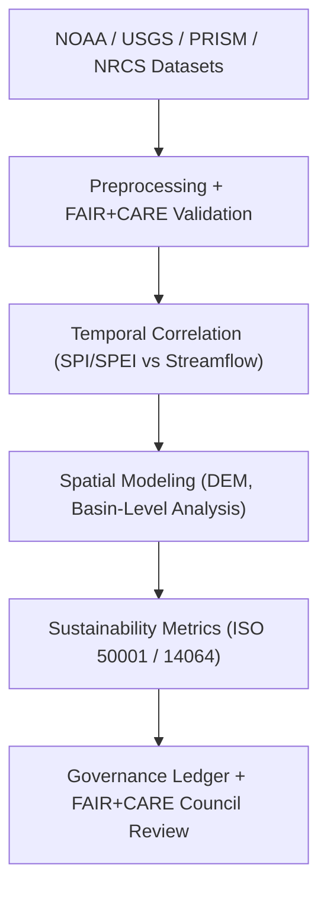
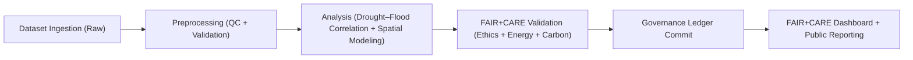

<div align="center">

# 💧 **Kansas Frontier Matrix — Hydrology Analyses Overview**
`docs/analyses/hydrology/README.md`

**Purpose:**  
Provide an integrated overview of all **hydrology-focused analytical frameworks**, **datasets**, and **validation mechanisms** within the Kansas Frontier Matrix (KFM).  
This document unifies **drought–flood correlation**, **spatial hydrology modeling**, and **telemetry governance** under **FAIR+CARE**, **ISO 19115**, and **MCP-DL v6.3** standards.

[](../../../README.md)
[](../../../../LICENSE)
[](../../../../docs/standards/README.md)
[](../../../../releases/)
</div>

---

## 📘 Overview

The **Hydrology Analysis Suite** integrates environmental datasets to measure hydrologic balance, drought–flood dynamics, and watershed resilience throughout Kansas.  
Each analysis follows **FAIR+CARE** data ethics, ISO-compliant sustainability tracking, and governance-linked telemetry logging.

**Core Objectives**
- Quantify drought–flood coupling using temporal and spatial analyses  
- Integrate FAIR+CARE and ISO ethics in every hydrologic model run  
- Maintain transparent provenance via the Governance Ledger and Telemetry Schema  

---

## 🗂️ Directory Layout

```plaintext
docs/analyses/hydrology/
├── README.md                                   # This overview
├── drought-flood-correlation/                  # Drought–flood correlation workflows
│   ├── README.md                               # Correlation module overview
│   └── methods/                                # Core hydrological methods
│       ├── README.md                           # Method suite introduction
│       ├── preprocessing.md                    # Data normalization and QC
│       ├── temporal-alignment.md               # Lag correction and synchronization
│       ├── correlation-analysis.md             # Correlation and coherence analysis
│       ├── spatial-modeling.md                 # Basin-level and raster spatial analysis
│       ├── validation.md                       # FAIR+CARE + ISO validation framework
│       └── datasets/                           # Data and metadata resources
│           ├── README.md
│           ├── raw/                            # NOAA / USGS / Daymet / PRISM inputs
│           ├── processed/                      # Standardized FAIR+CARE validated data
│           ├── derived/                        # Analytical outputs & correlation indices
│           └── metadata/                       # STAC/DCAT 3.0 + FAIR+CARE registry
└── reports/                                    # Summary dashboards and sustainability outputs
    ├── README.md
    ├── correlation_summary.json
    ├── sustainability_audit.json
    ├── faircare_validation.json
    └── visualization/                          # Maps, plots, and dashboards
        ├── drought_overlay_map.png
        ├── flood_risk_index_map.png
        └── hydrology_dashboard_snapshot.png
```

---

## 🧩 Analytical Framework



---

## ⚙️ Data Sources

| Source | Dataset | Format | FAIR+CARE Status |
|---------|----------|--------|------------------|
| **NOAA NCEI** | Historical precipitation and temperature | CSV / NetCDF | ✅ Pass |
| **USGS NWIS** | Streamflow and discharge records | CSV / GeoPackage | ✅ Pass |
| **PRISM** | Drought indices (SPI, SPEI) | NetCDF | ✅ Pass |
| **NRCS SSURGO / STATSGO** | Soil infiltration and hydrologic group | GeoPackage | ✅ Pass |
| **FAIR+CARE Ledger** | Provenance, energy, and ethical metadata | JSON-LD | ✅ Certified |

---

## ⚖️ FAIR+CARE Governance Matrix

| Principle | Implementation | Validation Source |
|------------|----------------|--------------------|
| **Findable** | STAC/DCAT 3.0 metadata with UUIDs, version tags | `datasets/metadata/` |
| **Accessible** | Public FAIR+CARE datasets and dashboards | Governance Ledger |
| **Interoperable** | Uses GeoPackage, NetCDF, GeoTIFF, CSV | `telemetry_schema` |
| **Reusable** | Metadata includes lineage, license, and parameters | `manifest_ref` |
| **Collective Benefit** | Hydrology results support climate adaptation policy | FAIR+CARE Audit |
| **Authority to Control** | FAIR+CARE Council approval before dataset release | Governance Charter |
| **Responsibility** | ISO 50001 telemetry ensures carbon & energy logging | `telemetry_ref` |
| **Ethics** | Sensitive site data generalized ≥1 km | FAIR+CARE Ethics Review |

---

## 🧮 Sustainability Metrics

| Metric | Description | Target | Unit |
|---------|-------------|---------|------|
| **Energy (J)** | Average analysis energy consumption | ≤ 15 | Joules |
| **Carbon (gCO₂e)** | CO₂ equivalent per complete run | ≤ 0.006 | gCO₂e |
| **Telemetry Coverage (%)** | FAIR+CARE trace coverage | ≥ 95 | % |
| **Audit Pass Rate (%)** | FAIR+CARE and ISO validation compliance | 100 | % |

---

## 🧾 Governance Ledger Example

```json
{
  "ledger_id": "hydrology-ledger-2025-11-09-0005",
  "component": "Hydrology Drought–Flood Correlation Module",
  "datasets": [
    "NOAA Precipitation",
    "USGS Streamflow",
    "PRISM Drought Index",
    "NRCS Soil Data"
  ],
  "energy_joules": 14.3,
  "carbon_gCO2e": 0.0058,
  "faircare_status": "Pass",
  "auditor": "FAIR+CARE Council",
  "timestamp": "2025-11-09T13:00:00Z"
}
```

---

## 🧠 FAIR+CARE Hydrology Lifecycle



---

## ⚙️ Validation Workflows

| Workflow | Function | Output |
|-----------|-----------|--------|
| `hydrology-ingest.yml` | Collects and normalizes hydrologic datasets | `reports/data_ingest_log.json` |
| `hydrology-validate.yml` | Runs FAIR+CARE + ISO validation routines | `reports/validation_audit.json` |
| `ledger-sync.yml` | Commits validated outputs to Governance Ledger | `governance/LEDGER/hydrology-ledger.json` |

---

## 🧾 FAIR+CARE Hydrology Validation Example

```json
{
  "validation_id": "hydrology-validation-2025-11-09-011",
  "modules": ["Preprocessing", "Temporal Alignment", "Correlation Analysis"],
  "energy_joules": 14.3,
  "carbon_gCO2e": 0.0058,
  "validation_status": "Pass",
  "auditor": "FAIR+CARE Council",
  "timestamp": "2025-11-09T13:15:00Z"
}
```

---

## 🕰️ Version History

| Version | Date | Author | Summary |
|----------|------|--------|----------|
| v10.2.2 | 2025-11-09 | FAIR+CARE Council | Fully aligned hydrology overview with v10.2 method standards, sustainability tracking, and governance schema. |
| v10.2.0 | 2025-11-09 | Hydrology Working Group | Refactored structure; added dashboards, FAIR+CARE lifecycle, and ISO metrics. |
| v10.1.0 | 2025-11-09 | KFM Data Team | Introduced baseline hydrology documentation under MCP-DL v6.3. |

---

<div align="center">

© 2025 Kansas Frontier Matrix Project  
Master Coder Protocol v6.3 · FAIR+CARE Certified · Diamond⁹ Ω / Crown∞Ω Ultimate Certified  

[Back to Analyses Index](../README.md) · [Governance Charter](../../../../docs/standards/governance/ROOT-GOVERNANCE.md)

</div>
