<div align="center">

# 💧 **Kansas Frontier Matrix — Hydrology Analyses Overview**
`docs/analyses/hydrology/README.md`

**Purpose:**  
Provide a structured overview of **hydrological analyses, datasets, and FAIR+CARE-governed workflows** within the Kansas Frontier Matrix (KFM).  
This section documents the complete workflow for studying **water systems**, **drought–flood interactions**, and **hydrological sustainability** across Kansas under MCP-DL v6.3 and ISO-aligned environmental ethics.

[](../../../README.md)
[](../../../../LICENSE)
[](../../../../docs/standards/README.md)
[](../../../../releases/)
</div>

---

## 📘 Overview

The **Hydrology module** in KFM integrates climate, soil, streamflow, and land-use data to analyze **drought–flood relationships** and **hydrological resilience** across Kansas.  
These analyses follow **FAIR+CARE** ethical standards, **ISO 19115** for metadata, and **ISO 14064/50001** for sustainability tracking.

Key objectives:
- Correlate drought and flood cycles using NOAA, USGS, and PRISM data  
- Apply FAIR+CARE audits to ensure ethical and sustainable hydrological modeling  
- Archive datasets with full provenance and reproducibility under Governance Ledger  

---

## 🗂️ Directory Layout

```plaintext
docs/analyses/hydrology/
├── README.md                                          # This overview
├── drought-flood-correlation/                         # Primary correlation analysis
│   ├── README.md                                      # Study overview
│   └── methods/                                       # Analysis methods
│       ├── README.md                                  # Methodology documentation
│       ├── datasets/                                  # Raw, processed, derived datasets
│       │   ├── README.md
│       │   ├── raw/                                   # Original input datasets
│       │   ├── processed/                             # Cleaned/standardized datasets
│       │   ├── derived/                               # Analytical and spatial outputs
│       │   └── metadata/                              # FAIR+CARE + DCAT/STAC metadata registry
│       └── validation/                                # Validation and telemetry reporting
│           ├── README.md
│           └── faircare_audit.json
└── reports/                                           # Hydrology analysis summaries
    ├── correlation_summary.json
    ├── sustainability_audit.json
    └── ledger_entry.json
```

---

## 🧩 Analytical Framework

```mermaid
flowchart TD
A["Hydrology Data Sources (NOAA, USGS, PRISM, NRCS)"] --> B["Data Preprocessing (Normalization + QC)"]
B --> C["Drought–Flood Correlation Analysis"]
C --> D["Spatial Modeling (DEM + Basin Overlays)"]
D --> E["FAIR+CARE Validation (Ethics + Sustainability)"]
E --> F["Governance Ledger Entry + Public Reporting"]
```



---

## ⚙️ Data Sources

| Source | Dataset | Format | FAIR+CARE Status |
|---------|----------|--------|------------------|
| **NOAA NCEI** | Precipitation & Temperature (1895–2025) | CSV / NetCDF | ✅ Pass |
| **USGS NWIS** | Streamflow & Basin Discharge (1900–2025) | CSV / GeoPackage | ✅ Pass |
| **PRISM** | Drought Indices (SPI, SPEI) | NetCDF | ✅ Pass |
| **NRCS SSURGO** | Soil & Infiltration Data | GeoPackage | ✅ Pass |
| **FAIR+CARE Ledger** | Provenance, Ethics, Telemetry Metadata | JSON-LD | ✅ Certified |

---

## 🧮 Sustainability & Telemetry Metrics

| Metric | Description | Target | Unit |
|---------|-------------|---------|------|
| **Energy Consumption (J)** | Power used during model runs | ≤ 15 | Joules |
| **Carbon Output (gCO₂e)** | CO₂ equivalent per analysis | ≤ 0.006 | gCO₂e |
| **Telemetry Coverage (%)** | % of analyses tracked with telemetry | ≥ 95 | % |
| **FAIR+CARE Validation (%)** | Ethics and sustainability compliance | 100 | % |

---

## ⚖️ FAIR+CARE Governance Matrix

| Principle | Implementation | Validation Source |
|------------|----------------|--------------------|
| **Findable** | STAC/DCAT metadata with persistent UUIDs | `datasets/metadata/` |
| **Accessible** | Open-access FAIR+CARE data publication | Governance Ledger |
| **Interoperable** | Data uses GeoPackage, Parquet, NetCDF, and GeoTIFF | `data-contracts.md` |
| **Reusable** | Lineage and processing steps logged in metadata | `manifest_ref` |
| **Collective Benefit** | Promotes sustainable hydrological research | FAIR+CARE Council Audit |
| **Authority to Control** | Council oversight for ethical data governance | `governance_ref` |
| **Responsibility** | Tracks energy, carbon, and ethics metrics | `telemetry_ref` |
| **Ethics** | Culturally sensitive or private site data masked | FAIR+CARE Validation Log |

---

## 🧾 Example Governance Ledger Record

```json
{
  "ledger_id": "hydrology-analysis-ledger-2025-11-09-0004",
  "component": "Drought–Flood Correlation Study",
  "datasets": [
    "NOAA Precipitation",
    "USGS Streamflow",
    "PRISM Drought Index",
    "NRCS SSURGO Soil"
  ],
  "energy_joules": 14.3,
  "carbon_gCO2e": 0.0058,
  "faircare_status": "Pass",
  "auditor": "FAIR+CARE Council",
  "timestamp": "2025-11-09T12:50:00Z"
}
```

---

## 🧠 Hydrology Validation Workflows

| Workflow | Function | Output |
|-----------|-----------|--------|
| `hydrology-ingest.yml` | ETL for NOAA, USGS, and PRISM datasets | `reports/data_ingest_log.json` |
| `hydrology-validate.yml` | FAIR+CARE and sustainability validation | `reports/validation_audit.json` |
| `ledger-sync.yml` | Governance Ledger update for hydrology datasets | `docs/standards/governance/LEDGER/hydrology-ledger.json` |

---

## 🕰️ Version History

| Version | Date | Author | Summary |
|----------|------|--------|----------|
| v10.0.0 | 2025-11-09 | Hydrology Working Group | Added full hydrology module index with FAIR+CARE governance integration |
| v9.8.0  | 2025-11-02 | FAIR+CARE Council | Established sustainability telemetry and dataset traceability |
| v9.5.0  | 2025-10-30 | KFM Data Governance Team | Linked hydrology pipelines to Governance Ledger |

---

<div align="center">

© 2025 Kansas Frontier Matrix Project  
Master Coder Protocol v6.3 · FAIR+CARE Certified · Diamond⁹ Ω / Crown∞Ω Ultimate Certified  

[Back to Analyses Index](../README.md) · [Governance Charter](../../../../docs/standards/governance/ROOT-GOVERNANCE.md)

</div>

