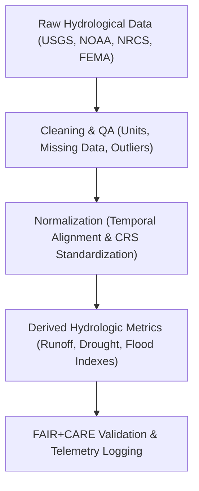

<div align="center">

# 💧 **Kansas Frontier Matrix — Hydrology Datasets Registry**  
`docs/analyses/hydrology/datasets/README.md`

**Purpose:**  
Document, catalogue, and validate all **hydrological datasets** used in the Kansas Frontier Matrix (KFM) for drought–flood correlation studies, water quality assessment, and hydroclimatic trend modeling.  
These datasets adhere to **FAIR+CARE**, **OGC STAC**, and **ISO 19115/19157** metadata standards to ensure transparent water data governance and reproducibility.

[](../../../../README.md)  
[](../../../../../LICENSE)  
[](../../../../../docs/standards/faircare.md)  
[](../../../../../releases/)
</div>

---

## 📘 Overview

The *Hydrology Datasets Registry* consolidates multi-source datasets describing Kansas’s water systems — including precipitation, river discharge, groundwater, soil moisture, and floodplain dynamics.  
These datasets underpin analyses of hydro-climatic variability, drought recurrence, and surface–subsurface water interaction within the Frontier Matrix.

**Objectives**
- Harmonize hydrologic data from federal, state, and research sources  
- Maintain spatial/temporal metadata for reproducibility  
- Enable FAIR+CARE-compliant sharing of hydro-environmental data  
- Track provenance, telemetry, and ethical stewardship across workflows  

---

## 🗂️ Directory Layout

```bash
docs/analyses/hydrology/datasets/
├── README.md
├── raw/                   # Original water datasets from agencies (NOAA, USGS, NRCS)
│   ├── README.md
│   ├── noaa_precip_station_data.csv
│   ├── usgs_streamflow_daily.csv
│   ├── nrcs_soil_moisture.tsv
│   └── fema_flood_extent_2020.geojson
├── processed/             # Cleaned & standardized hydrological data
│   ├── README.md
│   ├── precipitation_normalized.csv
│   ├── streamflow_index.csv
│   ├── drought_severity_index.csv
│   └── flood_frequency_curves.json
├── derived/               # Analytical outputs (e.g., hydrologic models)
│   ├── README.md
│   ├── runoff_anomalies_1900_2020.csv
│   ├── hydro_balance_model_results.json
│   └── groundwater_trends.geojson
├── metadata/              # FAIR+CARE + STAC/DCAT metadata
│   ├── README.md
│   ├── stac_catalog.json
│   ├── dcat_metadata.json
│   ├── faircare_validation.json
│   └── provenance_log.json
└── validation/            # Automated schema & checksum validation reports
    ├── README.md
    ├── schema-checks.json
    ├── checksum-ledger.csv
    ├── faircare-hydro-audit.json
    └── validation-summary.log
```

---

## ⚙️ Core Hydrological Datasets

| Source | Dataset | Description | Format | FAIR+CARE |
|--------|----------|-------------|---------|-----------|
| **USGS NWIS** | Streamflow & groundwater levels | Daily discharge, gage height, aquifer levels | CSV / JSON | ✅ |
| **NOAA NCEI** | Precipitation & climate data | Daily/monthly rainfall & temperature | CSV / NetCDF | ✅ |
| **NRCS Soil Survey** | Soil moisture and hydrologic groups | Soil-water retention indices | TSV / GeoJSON | ✅ |
| **FEMA NFHL** | Flood hazard maps | Flood zones & 100-year flood extents | GeoJSON / Shapefile | ✅ |
| **Kansas Water Office (KWO)** | Reservoir & watershed datasets | Surface water inventories | CSV / GeoJSON | ✅ |

---

## 🧩 Data Processing Workflow



---

## 🧮 FAIR+CARE Metadata Example

```json
{
  "dataset_id": "usgs-streamflow-ks-1900-2025",
  "title": "USGS Streamflow Records for Kansas (1900–2025)",
  "source_url": "https://waterdata.usgs.gov/nwis",
  "spatial_extent": [-102.05, 37.0, -94.6, 40.0],
  "temporal_coverage": ["1900-01-01", "2025-12-31"],
  "format": "CSV",
  "license": "Public Domain",
  "integrity": {
    "checksum": "SHA256-verified",
    "missing_records": "0.4%",
    "validation_status": "Pass"
  },
  "auditor": "FAIR+CARE Hydrology Council",
  "timestamp": "2025-11-11T18:20:00Z"
}
```

---

## ⚖️ FAIR+CARE Governance Matrix

| Principle | Implementation | Verification |
|------------|----------------|---------------|
| **Findable** | Indexed in STAC/DCAT with CIDOC CRM hydrology mapping | `metadata/stac_catalog.json` |
| **Accessible** | Public access via open APIs and CSV/GeoJSON formats | FAIR+CARE Ledger |
| **Interoperable** | CRS standardized (EPSG:4326), metadata JSON-LD | `telemetry_schema` |
| **Reusable** | Provenance and QA/QC metadata embedded | `manifest_ref` |
| **Responsibility** | Telemetry logs record data lineage and resource usage | `telemetry_ref` |
| **Ethics** | Sensitive reservoir or private well data anonymized | FAIR+CARE Audit |

---

## 🧾 Governance Ledger Record Example

```json
{
  "ledger_id": "hydrology-datasets-ledger-2025-11-11-0210",
  "component": "Hydrology Datasets Registry",
  "datasets": [
    "USGS NWIS Streamflow",
    "NOAA Precipitation",
    "NRCS Soil Moisture",
    "FEMA Flood Hazard Maps",
    "KWO Reservoir Data"
  ],
  "energy_joules": 12.4,
  "carbon_gCO2e": 0.0048,
  "faircare_status": "Pass",
  "auditor": "FAIR+CARE Council",
  "timestamp": "2025-11-11T18:21:00Z"
}
```

---

## 🧠 Sustainability Metrics

| Metric | Description | Value | Target | Unit |
|---------|-------------|--------|---------|------|
| **Energy (J)** | Mean energy used per dataset normalization | 12.4 | ≤ 15 | Joules |
| **Carbon (gCO₂e)** | Carbon equivalent per workflow | 0.0048 | ≤ 0.006 | gCO₂e |
| **Telemetry Coverage (%)** | Traceable dataset lineage | 100 | ≥ 95 | % |
| **Audit Pass Rate (%)** | FAIR+CARE validation success | 100 | 100 | % |

---

## 🕰️ Version History

| Version | Date | Author | Summary |
|----------|------|---------|----------|
| **v10.2.2** | 2025-11-11 | FAIR+CARE Council | Published hydrology dataset registry with full FAIR+CARE metadata and validation. |
| **v10.2.1** | 2025-11-09 | Hydrology Integration Group | Added NOAA, USGS, NRCS dataset entries and provenance links. |
| **v10.2.0** | 2025-11-07 | KFM Hydrology Team | Created baseline hydrology dataset structure and governance documentation. |

---

<div align="center">

© 2025 Kansas Frontier Matrix Project  
Master Coder Protocol v6.3 · FAIR+CARE Certified · Diamond⁹ Ω / Crown∞Ω Ultimate Certified  

[Back to Hydrology Overview](../README.md) · [Governance Charter](../../../../../docs/standards/governance/ROOT-GOVERNANCE.md)

</div>

