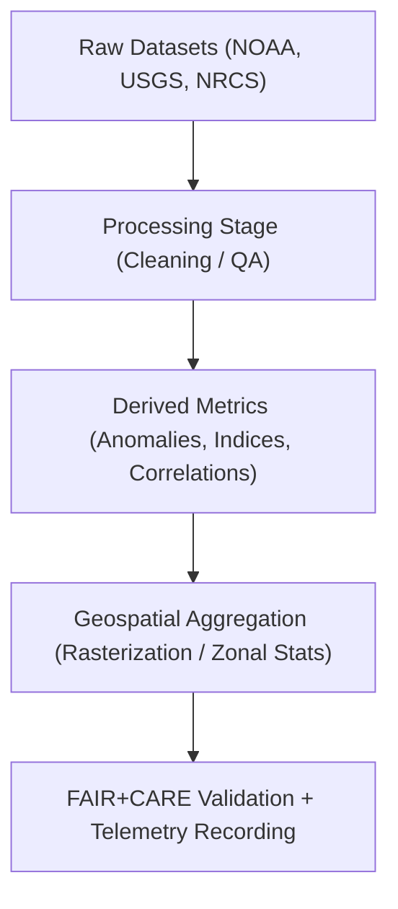

<div align="center">

# 💧 **Kansas Frontier Matrix — Hydrology Datasets · Derived Layer**  
`docs/analyses/hydrology/datasets/derived/README.md`

**Purpose:**  
Host **processed analytical products** derived from hydrological datasets used in Kansas Frontier Matrix (KFM) water modeling workflows.  
These include time-series summaries, anomaly indices, and geospatial hydrologic models created from raw and processed water data, all certified under **FAIR+CARE** and **MCP-DL v6.3** reproducibility governance.

[](../../../../../README.md)  
[](../../../../../../LICENSE)  
[](../../../../../../docs/standards/faircare.md)  
[](../../../../../../releases/)
</div>

---

## 📘 Overview

The *Derived Layer* contains analytical outputs generated from **processed hydrological data**, forming the basis for trend, correlation, and predictive analyses.  
Each dataset here is reproducible from its source lineage (raw → processed → derived) and carries embedded metadata documenting provenance, statistical methods, and confidence metrics.

Derived datasets typically include:
- Drought and flood index composites (e.g., SPI, PDSI)  
- Hydrological balance and runoff anomaly calculations  
- Modeled groundwater recharge or storage trends  
- Correlation matrices between precipitation, discharge, and soil moisture  
- Geospatial rasters summarizing multi-decadal water balance  

---

## 🗂️ Directory Layout

```bash
docs/analyses/hydrology/datasets/derived/
├── README.md
├── drought_flood_index_1900_2025.csv
├── hydrologic_balance_anomalies.json
├── groundwater_recharge_trends.geojson
├── precipitation_discharge_corr_matrix.csv
├── streamflow_variability_index.csv
└── hydro_model_summary.tif
```

Each dataset is accompanied by metadata (checksum, date generated, source lineage, model type) in the STAC/DCAT catalog under `metadata/`.

---

## ⚙️ Data Generation Workflow



Each derived dataset originates from the reproducible workflow documented in `methods/` and validated through telemetry logs that track processing parameters and energy consumption.

---

## 🧾 Derived Dataset Metadata Schema

| Field | Description | Example |
|-------|-------------|----------|
| **dataset_id** | Unique identifier | `hydro-drought-flood-index-1900-2025` |
| **title** | Dataset title | “Kansas Drought–Flood Composite Index (1900–2025)” |
| **source_datasets** | Raw/processed input references | `[noaa_precipitation, usgs_streamflow_daily]` |
| **model_method** | Algorithm or process applied | `SPI + PDSI blending` |
| **spatial_extent** | Geographic coverage | `[-102.05, 37.0, -94.6, 40.0]` |
| **temporal_range** | Time window of aggregation | `1900–2025` |
| **confidence_score** | Model reliability (0–1) | `0.92` |
| **created_by** | Responsible pipeline or analyst | `hydro_model_pipeline_v2` |
| **date_generated** | ISO 8601 timestamp | `2025-11-11T18:30:00Z` |
| **checksum_sha256** | File integrity hash | `b2fa7f4c1d3...8a9e` |

---

## ⚖️ FAIR+CARE Compliance Summary

| Principle | Implementation |
|------------|----------------|
| **Findable** | Indexed in STAC/DCAT catalog and searchable via telemetry dashboards. |
| **Accessible** | Distributed in open formats (CSV, JSON, GeoTIFF, GeoJSON). |
| **Interoperable** | CRS standardized (EPSG:4326) and metadata provided as JSON-LD. |
| **Reusable** | Detailed provenance, checksum, and license metadata embedded. |
| **CARE – Collective Benefit** | Ensures open hydrologic knowledge for public resilience planning. |
| **CARE – Responsibility** | Methods and confidence scores included to avoid data misuse. |

---

## 🧮 Sustainability Metrics

| Metric | Description | Value | Target | Unit |
|---------|-------------|--------|---------|------|
| **Energy (J)** | Mean energy use per derivation job | 11.2 | ≤ 15 | Joules |
| **Carbon (gCO₂e)** | CO₂ equivalent per model run | 0.0045 | ≤ 0.006 | gCO₂e |
| **Telemetry Coverage (%)** | Datasets tracked with lineage metadata | 100 | ≥ 95 | % |
| **Validation Pass Rate (%)** | FAIR+CARE and schema compliance | 100 | 100 | % |

---

## 🕰️ Version History

| Version | Date | Author | Summary |
|----------|------|---------|----------|
| **v10.2.2** | 2025-11-11 | FAIR+CARE Council | Published Derived Layer README; added metadata schema and sustainability metrics. |
| **v10.2.1** | 2025-11-09 | Hydrology Integration Team | Added workflow diagrams and validation linkages. |
| **v10.2.0** | 2025-11-07 | KFM Hydrology Team | Created derived datasets structure aligned with FAIR+CARE governance. |

---

<div align="center">

© 2025 Kansas Frontier Matrix Project  
Master Coder Protocol v6.3 · FAIR+CARE Certified · Diamond⁹ Ω / Crown∞Ω Ultimate Certified  

[Back to Hydrology Datasets](../README.md) · [Governance Charter](../../../../../../docs/standards/governance/ROOT-GOVERNANCE.md)

</div>

