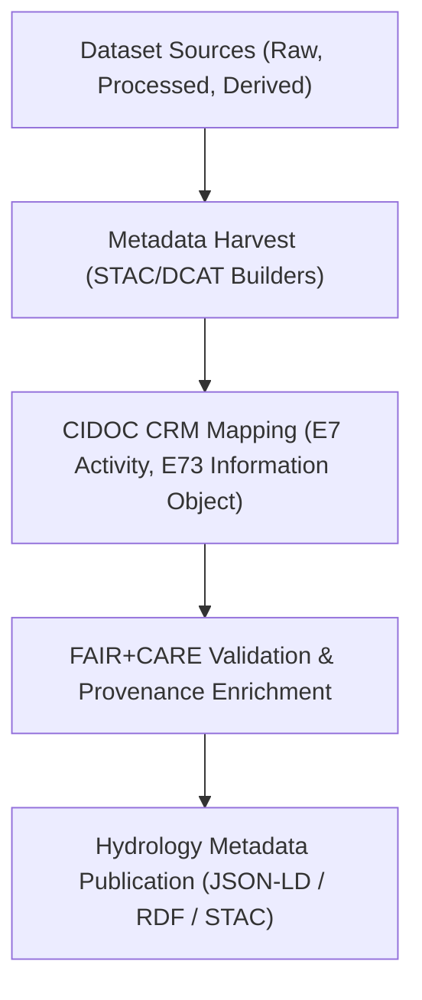

<div align="center">

# 💧 **Kansas Frontier Matrix — Hydrology Datasets · Metadata Directory**  
`docs/analyses/hydrology/datasets/metadata/README.md`

**Purpose:**  
Provide **structured metadata, provenance, and cataloging records** for all hydrological datasets within the Kansas Frontier Matrix (KFM).  
This directory implements interoperable schemas including **STAC 1.0**, **DCAT 3.0**, and **CIDOC CRM** mappings to ensure each dataset is findable, citable, and ethically governed under **FAIR+CARE** and **MCP-DL v6.3**.

[](../../../../../README.md)  
[](../../../../../../LICENSE)  
[](../../../../../../docs/standards/faircare.md)  
[](../../../../../../releases/)
</div>

---

## 📘 Overview

The *Metadata Directory* centralizes catalog records describing **raw**, **processed**, and **derived** hydrological datasets.  
Each metadata file includes:
- Provenance and citation information  
- Spatial and temporal coverage  
- Processing lineage and data quality indicators  
- FAIR+CARE ethical compliance annotations  
- Crosswalk fields linking to the CIDOC CRM and OGC-STAC standards  

These files ensure that every hydrological dataset can be independently located, interpreted, and reused within and beyond the KFM ecosystem.

---

## 🗂️ Directory Layout

```bash
docs/analyses/hydrology/datasets/metadata/
├── README.md
├── stac_catalog.json           # STAC 1.0 catalog of hydrology datasets
├── dcat_metadata.json          # DCAT 3.0 RDF-style metadata export
├── faircare_validation.json    # FAIR+CARE compliance audit for all hydrology datasets
├── provenance_log.json         # Provenance chain (input → process → output lineage)
└── citation_registry.json      # Persistent identifiers and citations for reuse
```

---

## ⚙️ Metadata Schema Integration



---

## 🧾 STAC Item Template Example

```json
{
  "stac_version": "1.0.0",
  "type": "Collection",
  "id": "hydrology-datasets-ks",
  "description": "Hydrological datasets for Kansas Frontier Matrix including precipitation, streamflow, and groundwater data.",
  "license": "CC-BY-4.0",
  "extent": {
    "spatial": { "bbox": [[-102.05, 37.0, -94.6, 40.0]] },
    "temporal": { "interval": [["1900-01-01T00:00:00Z", "2025-12-31T00:00:00Z"]] }
  },
  "links": [
    { "rel": "self", "href": "stac_catalog.json" },
    { "rel": "root", "href": "../../../../../data/stac/hydrology_v10.json" }
  ],
  "providers": [
    { "name": "USGS NWIS", "roles": ["producer", "licensor"], "url": "https://waterdata.usgs.gov" },
    { "name": "NOAA NCEI", "roles": ["producer"], "url": "https://www.ncei.noaa.gov" }
  ],
  "assets": {
    "streamflow": {
      "href": "https://example.com/data/usgs_streamflow_daily.csv",
      "type": "text/csv",
      "roles": ["data"],
      "title": "USGS Streamflow Daily Data"
    }
  },
  "summaries": {
    "themes": ["hydrology", "streamflow", "precipitation"]
  }
}
```

---

## ⚖️ FAIR+CARE Compliance Matrix

| Principle | Implementation | Verification |
|------------|----------------|---------------|
| **Findable** | Indexed under STAC & DCAT catalogs with unique DOIs | `stac_catalog.json`, `dcat_metadata.json` |
| **Accessible** | Metadata available as JSON-LD & RDF via repository and API | FAIR+CARE Audit |
| **Interoperable** | Aligns with CIDOC CRM, OGC STAC, and DCAT 3.0 | `telemetry_schema` |
| **Reusable** | Persistent identifiers, citation metadata, and provenance links | `manifest_ref` |
| **CARE – Collective Benefit** | Supports sustainable water management and community transparency | FAIR+CARE Validation |
| **CARE – Responsibility** | Metadata discloses limitations, uncertainty, and usage ethics | `faircare_validation.json` |

---

## 🧮 Metadata Sustainability Metrics

| Metric | Description | Value | Target | Unit |
|---------|-------------|--------|---------|------|
| **Metadata Completeness (%)** | Presence of required schema fields | 100 | ≥ 95 | % |
| **FAIR+CARE Validation Pass Rate (%)** | Metadata passing audit criteria | 100 | 100 | % |
| **Interoperability Score (%)** | Alignment with STAC/DCAT/CIDOC schemas | 98 | ≥ 95 | % |

---

## 🕰️ Version History

| Version | Date | Author | Summary |
|----------|------|---------|----------|
| **v10.2.2** | 2025-11-11 | FAIR+CARE Council | Published hydrology metadata registry README; added CIDOC CRM and STAC mapping templates. |
| **v10.2.1** | 2025-11-09 | Hydrology Data Governance Team | Integrated FAIR+CARE audit and DCAT metadata generation workflow. |
| **v10.2.0** | 2025-11-07 | KFM Hydrology Team | Established metadata directory with baseline JSON-LD schema alignment. |

---

<div align="center">

© 2025 Kansas Frontier Matrix Project  
Master Coder Protocol v6.3 · FAIR+CARE Certified · Diamond⁹ Ω / Crown∞Ω Ultimate Certified  

[Back to Hydrology Datasets](../README.md) · [Governance Charter](../../../../../../docs/standards/governance/ROOT-GOVERNANCE.md)

</div>

