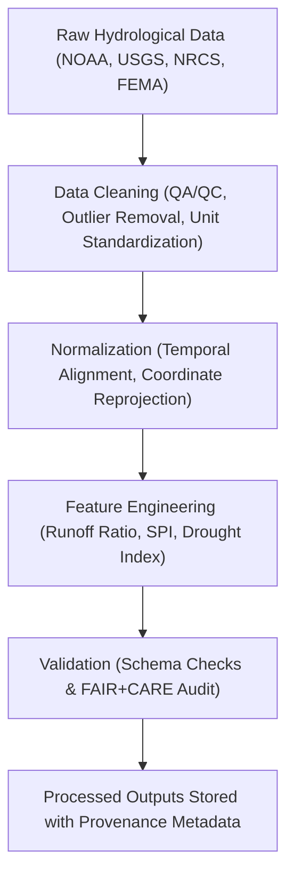

<div align="center">

# 💧 **Kansas Frontier Matrix — Hydrology Datasets · Processed Layer**  
`docs/analyses/hydrology/datasets/processed/README.md`

**Purpose:**  
Curate **cleaned, standardized, and quality-controlled hydrological datasets** derived from the raw data sources used in the Kansas Frontier Matrix (KFM).  
These processed datasets serve as the foundation for drought–flood correlation, water availability modeling, and hydroclimatic analyses under **FAIR+CARE** and **MCP-DL v6.3** reproducibility standards.

[](../../../../../README.md)  
[](../../../../../../LICENSE)  
[](../../../../../../docs/standards/faircare.md)  
[](../../../../../../releases/)
</div>

---

## 📘 Overview

The *Processed Layer* provides the intermediate hydrological datasets used to generate analytical models and derived hydrologic indices.  
Each dataset here has undergone **cleaning, quality assurance, unit harmonization, coordinate standardization (EPSG:4326)**, and metadata validation.  
These files are directly referenced in analytical notebooks located under `docs/analyses/hydrology/methods/` and linked to telemetry logs for traceability.

---

## 🗂️ Directory Layout

```bash
docs/analyses/hydrology/datasets/processed/
├── README.md
├── precipitation_normalized.csv
├── streamflow_index.csv
├── drought_severity_index.csv
├── flood_frequency_curves.json
├── water_balance_monthly.csv
└── processed_metadata.json
```

Each dataset contains embedded provenance and FAIR+CARE annotations, while `processed_metadata.json` aggregates metadata for the entire processed layer.

---

## ⚙️ Processing Workflow



Each processing stage logs telemetry (runtime, CPU, memory, energy) for reproducibility and sustainability metrics in accordance with **ISO 14064** and **MCP energy tracking**.

---

## 🧾 Processed Dataset Metadata Schema

| Field | Description | Example |
|-------|-------------|----------|
| **dataset_id** | Unique identifier | `hydro-processed-precipitation-1900-2025` |
| **title** | Human-readable name | “Normalized Precipitation Dataset for Kansas (1900–2025)” |
| **source_datasets** | Input data used | `[noaa_precip_raw, nrcs_soilmoisture_raw]` |
| **processing_steps** | Applied transformations | `unit_conversion, interpolation, normalization` |
| **temporal_coverage** | Data period | `1900–2025` |
| **spatial_extent** | Bounding box | `[-102.05, 37.0, -94.6, 40.0]` |
| **validation_status** | Pass / Warn / Fail | `Pass` |
| **created_by** | Processing pipeline ID | `hydro_etl_pipeline_v2.1` |
| **date_generated** | ISO 8601 timestamp | `2025-11-11T18:25:00Z` |
| **checksum_sha256** | SHA-256 hash | `2f7b3a5cd91...d89e` |

---

## ⚖️ FAIR+CARE Compliance Matrix

| Principle | Implementation |
|------------|----------------|
| **Findable** | Indexed in STAC/DCAT catalogs with metadata in `processed_metadata.json`. |
| **Accessible** | Released under CC-BY 4.0 and available via KFM data portal. |
| **Interoperable** | Data formatted in CSV, JSON, and GeoJSON with CRS standardization. |
| **Reusable** | Provenance metadata embedded and linked to processing notebooks. |
| **CARE – Collective Benefit** | Promotes open water data for community resilience and research. |
| **CARE – Responsibility** | Processing workflows minimize data bias and environmental footprint. |

---

## 🧮 Quality & Sustainability Metrics

| Metric | Description | Value | Target | Unit |
|---------|-------------|--------|---------|------|
| **QA/QC Pass Rate (%)** | Records passing data quality tests | 99.4 | ≥ 95 | % |
| **Energy (J)** | Average energy per processing run | 12.9 | ≤ 15 | Joules |
| **Carbon (gCO₂e)** | CO₂ emissions per processing job | 0.0047 | ≤ 0.006 | gCO₂e |
| **Telemetry Coverage (%)** | Files tracked with provenance | 100 | ≥ 95 | % |

---

## 🕰️ Version History

| Version | Date | Author | Summary |
|----------|------|---------|----------|
| **v10.2.2** | 2025-11-11 | FAIR+CARE Council | Published processed dataset registry; added sustainability metrics and schema definitions. |
| **v10.2.1** | 2025-11-09 | Hydrology Data Integration Team | Updated FAIR+CARE validation process and metadata linkage. |
| **v10.2.0** | 2025-11-07 | KFM Hydrology Team | Created processed datasets documentation with QA/QC protocols. |

---

<div align="center">

© 2025 Kansas Frontier Matrix Project  
Master Coder Protocol v6.3 · FAIR+CARE Certified · Diamond⁹ Ω / Crown∞Ω Ultimate Certified  

[Back to Hydrology Datasets](../README.md) · [Governance Charter](../../../../../../docs/standards/governance/ROOT-GOVERNANCE.md)

</div>

