<div align="center">

# 💧 **Kansas Frontier Matrix — Hydrology Datasets · Raw Layer**  
`docs/analyses/hydrology/datasets/raw/README.md`

**Purpose:**  
Serve as the **primary repository for unprocessed hydrological datasets** used in the Kansas Frontier Matrix (KFM).  
This directory stores the original data as obtained from authoritative sources (NOAA, USGS, NRCS, FEMA, KWO) before any transformations, ensuring provenance integrity and reproducibility under **FAIR+CARE** and **MCP-DL v6.3** data governance standards.

[](../../../../../README.md)  
[](../../../../../../LICENSE)  
[](../../../../../../docs/standards/faircare.md)  
[](../../../../../../releases/)
</div>

---

## 📘 Overview

The *Raw Layer* contains original hydrologic data files exactly as sourced from their respective data providers.  
These datasets represent the **source-of-truth** for all subsequent processing and analyses.  
They are **immutable**, version-controlled through checksum ledgers, and accompanied by FAIR+CARE metadata describing acquisition source, date, and licensing.

Included data types:
- Precipitation and temperature records from NOAA/NCEI  
- Streamflow and groundwater data from USGS NWIS  
- Soil moisture from NRCS SCAN or Soil Survey datasets  
- Floodplain boundaries and risk zones from FEMA NFHL  
- Reservoir and watershed data from the Kansas Water Office (KWO)

---

## 🗂️ Directory Layout

```bash
docs/analyses/hydrology/datasets/raw/
├── README.md
├── noaa_precip_station_data.csv
├── usgs_streamflow_daily.csv
├── nrcs_soil_moisture.tsv
├── fema_flood_extent_2020.geojson
├── kwo_reservoir_storage_2020.csv
├── checksum-ledger.csv
├── raw_metadata.json
└── faircare_raw_audit.json
```

---

## ⚙️ Raw Data Governance Workflow

```mermaid
flowchart TD
    A["External Data Providers (NOAA · USGS · NRCS · FEMA · KWO)"] --> B["Data Acquisition (API / Bulk Download)"]
    B --> C["Checksum Verification & Licensing Audit"]
    C --> D["Metadata Generation (STAC/DCAT + FAIR+CARE)"]
    D --> E["Immutable Archival Storage in Raw Layer"]
```



All downloads are logged with SHA-256 checksums and data acquisition timestamps.  
FAIR+CARE metadata and telemetry logs record provenance and environmental cost (energy, carbon footprint) for each acquisition event.

---

## 🧾 Raw Metadata Schema

| Field | Description | Example |
|-------|-------------|----------|
| **dataset_id** | Unique identifier for dataset | `usgs-streamflow-ks-1900-2025` |
| **source_agency** | Data provider name | `USGS NWIS` |
| **source_url** | API or repository link | `https://waterdata.usgs.gov/nwis` |
| **file_name** | Local filename | `usgs_streamflow_daily.csv` |
| **format** | File type | `CSV` |
| **acquisition_date** | Date/time of retrieval | `2025-11-10T21:40:00Z` |
| **license** | Usage license | `Public Domain` |
| **checksum_sha256** | File hash for immutability | `8b1a9953c4611296a827abf8c47804d7...` |
| **verified_by** | Person or system validating acquisition | `FAIR+CARE DataBot` |
| **notes** | Supplemental provenance or anomalies | `Dataset truncated for 2024 pending update.` |

---

## ⚖️ FAIR+CARE Compliance Matrix

| Principle | Implementation |
|------------|----------------|
| **Findable** | Catalogued with unique dataset IDs and linked STAC/DCAT metadata. |
| **Accessible** | Stored as open, non-proprietary formats (CSV, GeoJSON, TSV). |
| **Interoperable** | Metadata adheres to JSON-LD with CIDOC CRM and OGC alignment. |
| **Reusable** | Immutable checksum ledger guarantees provenance. |
| **CARE – Collective Benefit** | Supports transparent hydrologic science for Kansas communities. |
| **CARE – Responsibility** | Ensures attribution and ethical handling of environmental datasets. |

---

## 🧮 Data Integrity Metrics

| Metric | Description | Value | Target | Unit |
|---------|-------------|--------|---------|------|
| **Checksum Validation Rate (%)** | Files matching expected SHA-256 | 100 | ≥ 99 | % |
| **Metadata Completeness (%)** | Files with full metadata coverage | 100 | ≥ 95 | % |
| **Energy (J)** | Energy per dataset acquisition | 8.5 | ≤ 15 | Joules |
| **Carbon (gCO₂e)** | Carbon footprint per download | 0.0039 | ≤ 0.006 | gCO₂e |

---

## 🕰️ Version History

| Version | Date | Author | Summary |
|----------|------|---------|----------|
| **v10.2.2** | 2025-11-11 | FAIR+CARE Council | Created raw dataset registry README; added checksum and audit fields. |
| **v10.2.1** | 2025-11-09 | Hydrology Data Integration Team | Added provenance and FAIR+CARE audit schema for data acquisition. |
| **v10.2.0** | 2025-11-07 | KFM Hydrology Team | Established raw dataset directory and governance structure. |

---

<div align="center">

© 2025 Kansas Frontier Matrix Project  
Master Coder Protocol v6.3 · FAIR+CARE Certified · Diamond⁹ Ω / Crown∞Ω Ultimate Certified  

[Back to Hydrology Datasets](../README.md) · [Governance Charter](../../../../../../docs/standards/governance/ROOT-GOVERNANCE.md)

</div>

