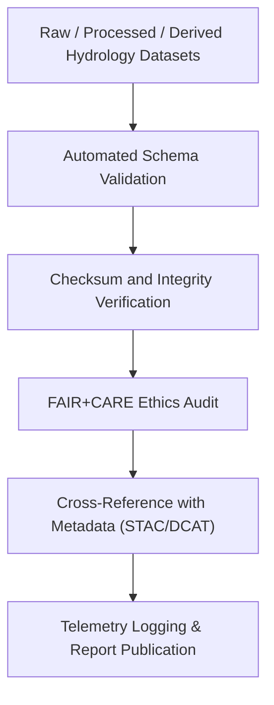

<div align="center">

# 💧 **Kansas Frontier Matrix — Hydrology Datasets · Validation Directory**  
`docs/analyses/hydrology/datasets/validation/README.md`

**Purpose:**  
Provide a **repository for schema validation, data integrity checks, and FAIR+CARE audits** for all hydrological datasets used in the Kansas Frontier Matrix (KFM).  
This directory ensures reproducibility, ethical stewardship, and compliance with **MCP-DL v6.3**, **ISO 19157 (Data Quality)**, and **FAIR+CARE** principles.

[](../../../../../README.md)  
[](../../../../../../LICENSE)  
[](../../../../../../docs/standards/faircare.md)  
[](../../../../../../releases/)
</div>

---

## 📘 Overview

The *Validation Directory* contains hydrological data quality assurance outputs that confirm the completeness, accuracy, and ethical compliance of datasets.  
All checks performed here are logged automatically through KFM’s CI/CD workflows (`analysis-validation.yml` and `faircare-audit.yml`).  
The validation process encompasses:
- **Schema validation** (field structure, data types, units, CRS)  
- **Checksum integrity verification** for immutability  
- **FAIR+CARE compliance audits** ensuring ethical data handling  
- **Cross-referencing with metadata catalogues** (STAC/DCAT)  
- **Telemetry linkage** for reproducibility and sustainability monitoring  

---

## 🗂️ Directory Layout

```bash
docs/analyses/hydrology/datasets/validation/
├── README.md
├── schema-checks.json
├── checksum-ledger.csv
├── faircare-hydrology-audit.json
├── data-quality-report.json
└── validation-summary.log
```

Each file corresponds to a validation step within the hydrology data pipeline.  
Reports are versioned, timestamped, and cryptographically signed to preserve data trustworthiness.

---

## ⚙️ Validation Workflow



---

## 🧾 Validation Report Schema

| Field | Description | Example |
|-------|-------------|----------|
| **dataset_id** | Unique dataset identifier | `usgs-streamflow-ks-1900-2025` |
| **schema_version** | Validation schema version | `v3.1.0` |
| **records_validated** | Number of records checked | `1,203,421` |
| **missing_values (%)** | Percent of missing data | `0.6` |
| **unit_conformance** | Unit standard compliance | `PASS` |
| **checksum_match** | SHA-256 validation result | `PASS` |
| **faircare_status** | FAIR+CARE audit outcome | `PASS` |
| **auditor** | Automated or manual reviewer | `Hydrology Validation CI` |
| **timestamp** | ISO 8601 date/time of validation | `2025-11-11T18:40:00Z` |

---

## ⚖️ FAIR+CARE Governance Matrix

| Principle | Implementation |
|------------|----------------|
| **Findable** | All validation outputs indexed in STAC/DCAT catalogues and linked to data sources. |
| **Accessible** | Reports are published as JSON/CSV under open CC-BY license. |
| **Interoperable** | Validation schemas use JSON-LD and ISO 19157 standard attributes. |
| **Reusable** | Logs include provenance, auditor identity, and run metadata. |
| **CARE – Collective Benefit** | Ensures hydrologic data integrity for community and environmental resilience. |
| **CARE – Responsibility** | Discloses limitations and confidence levels for every dataset. |

---

## 🧮 Data Quality Metrics

| Metric | Description | Value | Target | Unit |
|---------|-------------|--------|---------|------|
| **Schema Compliance (%)** | Fields conforming to schema definition | 100 | ≥ 98 | % |
| **Checksum Validation (%)** | Files passing integrity checks | 100 | ≥ 99 | % |
| **FAIR+CARE Pass Rate (%)** | Datasets meeting ethical governance | 100 | 100 | % |
| **Telemetry Coverage (%)** | Validations linked to telemetry pipeline | 100 | ≥ 95 | % |

---

## 🕰️ Version History

| Version | Date | Author | Summary |
|----------|------|---------|----------|
| **v10.2.2** | 2025-11-11 | FAIR+CARE Council | Published hydrology datasets validation README; added audit schema and governance mapping. |
| **v10.2.1** | 2025-11-09 | Hydrology QA/QC Team | Integrated automated schema and FAIR+CARE validation reports. |
| **v10.2.0** | 2025-11-07 | KFM Hydrology Team | Established validation directory with checksum and telemetry integration. |

---

<div align="center">

© 2025 Kansas Frontier Matrix Project  
Master Coder Protocol v6.3 · FAIR+CARE Certified · Diamond⁹ Ω / Crown∞Ω Ultimate Certified  

[Back to Hydrology Datasets](../README.md) · [Governance Charter](../../../../../../docs/standards/governance/ROOT-GOVERNANCE.md)

</div>

