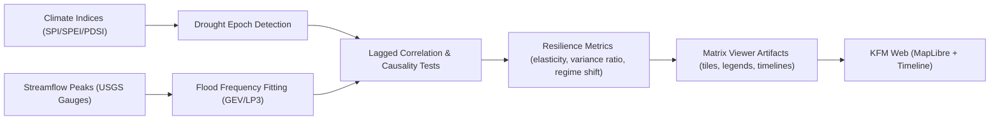

<div align="center">

# 💧 **Kansas Frontier Matrix — Drought–Flood Correlation Analysis (Hydrologic Resilience Pilot)**
`docs/analyses/hydrology/drought-flood-correlation/README.md`

**Purpose:** Establish a reproducible workflow to explore how **drought epochs** (multi-month to multi-year dry periods) correlate with **flood recurrence** (e.g., 2‑, 5‑, 10‑, 25‑, 50‑, 100‑year events) across Kansas basins. Results feed the **Matrix Viewer** to visualize anomalies and infer **historic hydrologic resilience** patterns.

[](../../..)
[](../../../LICENSE)
[](../../../docs/standards/governance/ROOT-GOVERNANCE.md)
[](#)

</div>

---

## 📘 Overview

This pilot links climate‑scale dryness (e.g., **SPI**, **SPEI**, **PDSI**) to **flood frequency** and **peak discharge** metrics from gauged stations. We (1) define **drought epochs**, (2) compute **flood recurrence intervals** per basin/decade, (3) quantify **lagged/conditional relationships**, and (4) publish **map/timeline anomalies** in the Matrix Viewer to surface resilience/threshold behaviors.

**Key questions**
- Do prolonged droughts concentrate antecedent conditions that increase **post‑drought flood severity**?
- Which basins exhibit **stable** vs **sensitive** response to drought–flood sequencing?
- How do **land cover change** and **soil moisture memory** modulate that response?

---

## 🗂️ Directory Layout

```text
docs/analyses/hydrology/drought-flood-correlation/
├── README.md                               # This document
├── methods/                                 # Methods & formulas (with citations)
│   ├── drought_epochs.md                    # Epoch detection (SPI/SPEI/PDSI thresholds)
│   ├── flood_recurrence.md                  # GEV/LP3, AMS/PDS, index-flood notes
│   └── resilience_metrics.md                # Elasticity, variance ratios, regime shifts
├── pipelines/                               # Reproducible ETL/analytics
│   ├── etl_flow.md                          # Data ingestion & harmonization steps
│   ├── compute_epochs.py                    # Markov/peak picking & run-length encoding
│   ├── fit_flood_freq.py                    # Distribution fit & return-period curves
│   ├── correlate_lags.py                    # Cross-corr, Granger, transfer entropy
│   └── export_viewer_artifacts.py           # Tiles, JSON layers, summaries
├── data/                                    # References to KFM catalog items (no raw data)
│   ├── inputs.catalog.json                  # STAC/DCAT references (SPI, gauges, landcover)
│   └── outputs.manifest.json                # Checksums for derived layers/artifacts
├── results/
│   ├── basin_summaries.parquet              # Metrics by HUC8/HUC10 & decade
│   ├── anomalies/                           # Geo/PMTiles, vector tiles, legend specs
│   └── reports/                             # HTML/PDF result packs (auto-generated)
├── governance/
│   ├── provenance.json                      # PROV-O lineage for each artifact
│   ├── ethics_impact.md                     # CARE impacts, community review log
│   └── validations/                         # FAIR+CARE, schema, QA checks
└── viewer/
    ├── layers.json                          # Matrix Viewer layer config (MapLibre)
    └── timelines.json                       # Timeline channels & legend ramps
```

---

## 🧩 Components & Flow



---

## 🧾 Methods (Plain Language)

| Step | What we compute | Why it matters |
|---|---|---|
| Drought epochs | Continuous runs where dryness index ≤ threshold for ≥ N months (tunable by basin) | Captures **multi-season stress** periods rather than single-month blips |
| Flood recurrence | Fit **GEV** or **Log-Pearson III** to annual maxima or peaks-over-threshold | Standardizes **2–100‑year** return levels for fair cross-basin comparison |
| Lagged links | Cross-correlation & **Granger** with lags (0–60 months) | Detects **post‑drought flood risk windows** |
| Resilience metrics | Elasticity (Δflood/Δdryness), variance ratios, regime-shift flags | Distinguishes **robust vs sensitive** basins over decades |
| Anomaly mapping | Z‑scores vs 30‑yr normals per decade | Puts results into **intuitive color ramps** for the Viewer |

---

## 🧾 Data Contracts (Inputs → Outputs)

| IO | Schema/Contract | Notes |
|---|---|---|
| Climate indices | `schemas/climate/indices-v2.json` | SPI/SPEI monthly, basin‑aggregated with uncertainty |
| Gauged peaks | `schemas/hydro/gauge-peaks-v1.json` | Gauge metadata, drainage area, quality flags |
| Land cover | `schemas/land/landcover-v1.json` | Optional covariate for sensitivity analyses |
| Viewer layers | `schemas/viewer/layer-config-v2.json` | Tilesets, legends, timelines, accessibility metadata |
| Provenance | `schemas/provenance/prov-v1.json` | Deterministic lineage & checksums for reproducibility |

---

## ⚙️ Reproducible Run (Pseudo‑Bash)

```bash
# 1) Sync catalog items (no raw data here; uses STAC/DCAT refs)
kfm cli catalog pull --spec data/inputs.catalog.json

# 2) Mark drought epochs
python pipelines/compute_epochs.py --index SPI --huc HUC8 --min-run 6 --thr -1.0

# 3) Fit flood frequency
python pipelines/fit_flood_freq.py --method GEV --ams --min-years 15

# 4) Correlate with lags and compute resilience metrics
python pipelines/correlate_lags.py --max-lag-months 60 --tests granger,xcor,te

# 5) Export Matrix Viewer artifacts
python pipelines/export_viewer_artifacts.py --tiles results/anomalies --viewer viewer/
```

---

## 🧩 Matrix Viewer Configuration Notes

- **Layers:** `drought_epochs` (hatch), `flood_return_levels` (continuous ramp), `resilience_flags` (binary/tri-state).
- **Timelines:** Decadal channels with **playhead scrub** to compare epochs vs flood levels.
- **Legends:** Color‑blind‑safe ramps; numeric tick labels; units and period annotated.
- **Accessibility:** Alt text for each layer; keyboard controls; WCAG 2.1 AA contrast.

---

## 🧪 Validation & QA

| Check | Tooling | Pass Criteria |
|---|---|---|
| Schema | `jsonschema` CI | All inputs/outputs conform |
| Hydrology fit | QQ plots & L‑moments | < 5% extreme outlier rate or flagged |
| Spatial joins | Topology tests | No orphan basins; coverage ≥ 99% |
| Reproducibility | Checksums + seeds | Byte‑stable artifacts; lineage recorded |
| FAIR+CARE | Governance lints | Consent/ethics notes logged for sensitive overlays |

---

## ⚖️ FAIR+CARE & Governance

- **FAIR:** Findable via STAC/DCAT entries; Accessible with open licenses; Interoperable (schemas above); Reusable with clear provenance.
- **CARE:** Community context in `ethics_impact.md`; avoid harm via cautious interpretation of flood risk maps; document uncertainties and non-stationarity caveats.
- **Ledger:** All steps emit PROV‑O events to `governance/provenance.json`.

---

## 🕰️ Version History

| Version | Date | Author | Summary |
|---|---|---|---|
| v9.7.0 | 2025-11-09 | KFM AI | Initial pilot spec, pipelines, viewer exports |

---

<div align="center">

© Kansas Frontier Matrix — Master Coder Protocol v6.3 · FAIR+CARE Certified · Diamond⁹ Ω / Crown∞Ω Ultimate Certified  
[Back to Analyses Index](../../README.md) · [Governance Charter](../../../docs/standards/governance/ROOT-GOVERNANCE.md)

</div>
