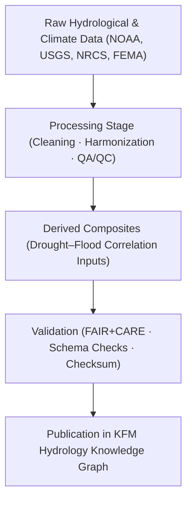

<div align="center">

# 💧 **Kansas Frontier Matrix — Drought–Flood Correlation Data Directory**  
`docs/analyses/hydrology/drought-flood-correlation/data/README.md`

**Purpose:**  
Store and describe all **data inputs, processed files, and derived datasets** used in the Drought–Flood Correlation (DFC) analyses of the Kansas Frontier Matrix (KFM).  
These datasets quantify the temporal and spatial interactions between drought indices (SPI, SPEI) and flood occurrence metrics (streamflow peaks, frequency curves, flood extents) while maintaining compliance with **FAIR+CARE** and **MCP-DL v6.3** governance standards.

[](../../../../../README.md)  
[](../../../../../../LICENSE)  
[](../../../../../../docs/standards/faircare.md)  
[](../../../../../../releases/)
</div>

---

## 📘 Overview

The *Drought–Flood Correlation Data Directory* consolidates hydrological and climate datasets used to model and analyze interactions between dry and wet extremes.  
All datasets follow FAIR+CARE principles—ensuring transparency, accessibility, and reproducibility across every step of the analytical process.  
Files are version-controlled, checksum-verified, and linked to provenance metadata.

---

## 🗂️ Directory Layout

```bash
docs/analyses/hydrology/drought-flood-correlation/data/
├── README.md
├── raw/                               # Original hydrological and climate data
│   ├── README.md
│   ├── noaa_precipitation_monthly.csv
│   ├── usgs_streamflow_peaks.csv
│   ├── nrcs_soil_moisture.tsv
│   └── fema_flood_zones.geojson
├── processed/                         # Cleaned, formatted, and synchronized datasets
│   ├── README.md
│   ├── drought_index_spi.csv
│   ├── flood_frequency_curves.csv
│   ├── precipitation_runoff_ratio.csv
│   └── basin_hydro_metadata.json
├── derived/                           # Analytical composites (correlation-ready data)
│   ├── README.md
│   ├── drought_flood_composite.csv
│   ├── correlation_matrix.json
│   ├── drought_lag_analysis.csv
│   └── flood_recurrence_probabilities.json
├── metadata/                          # STAC/DCAT + FAIR+CARE metadata
│   ├── README.md
│   ├── stac_catalog.json
│   ├── dcat_metadata.json
│   ├── provenance_log.json
│   └── faircare_validation.json
└── validation/                        # QA/QC, schema validation, checksum ledgers
    ├── README.md
    ├── schema_checks.json
    ├── checksum_ledger.csv
    └── faircare_audit.json
```

---

## ⚙️ Data Integration Workflow



Each subfolder represents a step in the data life cycle: raw ingestion, transformation, derived analysis, metadata enrichment, and validation.

---

## 🧩 Primary Datasets and Descriptions

| Source | Dataset | Description | Format | FAIR+CARE |
|---------|----------|-------------|---------|-----------|
| **NOAA NCEI** | Precipitation & Temperature Data | Monthly climate records for SPI/SPEI computation | CSV | ✅ |
| **USGS NWIS** | Streamflow Peaks and Daily Flow | Hydrological time-series for flood event analysis | CSV | ✅ |
| **NRCS Soil Survey** | Soil Moisture Observations | Soil-water retention data for drought correlation | TSV | ✅ |
| **FEMA NFHL** | Flood Hazard Maps | Floodplain and inundation zone boundaries | GeoJSON | ✅ |
| **KWO** | Reservoir and Basin Data | Surface-water storage and watershed metadata | CSV / JSON | ✅ |

---

## 🧾 Example Metadata Record

```json
{
  "dataset_id": "dfc_composite_ks_v10_2025",
  "title": "Kansas Drought–Flood Composite Dataset (1900–2025)",
  "spatial_extent": [-102.05, 37.0, -94.6, 40.0],
  "temporal_range": ["1900-01-01", "2025-12-31"],
  "source_datasets": [
    "noaa_precipitation_monthly",
    "usgs_streamflow_peaks",
    "nrcs_soil_moisture"
  ],
  "format": "CSV / JSON",
  "checksum": "SHA256-verified",
  "faircare_status": "PASS",
  "auditor": "FAIR+CARE Hydrology Council",
  "timestamp": "2025-11-11T19:15:00Z"
}
```

---

## ⚖️ FAIR+CARE Governance Matrix

| Principle | Implementation |
|------------|----------------|
| **Findable** | Indexed under STAC/DCAT metadata with DOIs and manifest links. |
| **Accessible** | Open data formats (CSV, JSON, GeoJSON) under CC-BY 4.0. |
| **Interoperable** | Standardized CRS (EPSG:4326), schema conformity, JSON-LD metadata. |
| **Reusable** | Provenance, checksum, and FAIR+CARE validation logs included. |
| **CARE – Collective Benefit** | Enhances transparency and equity in water resource modeling. |
| **CARE – Responsibility** | Ensures ethical treatment of environmental and community data. |

---

## 🧮 Data Quality Metrics

| Metric | Description | Value | Target | Unit |
|---------|-------------|--------|---------|------|
| **Completeness (%)** | Data coverage across study period | 98.5 | ≥ 95 | % |
| **Checksum Pass Rate (%)** | Files passing integrity verification | 100 | ≥ 99 | % |
| **Telemetry Coverage (%)** | Datasets linked to provenance records | 100 | ≥ 95 | % |
| **FAIR+CARE Validation (%)** | Ethical compliance and accessibility audit | 100 | 100 | % |

---

## 🕰️ Version History

| Version | Date | Author | Summary |
|----------|------|---------|----------|
| **v10.2.2** | 2025-11-11 | FAIR+CARE Hydrology Council | Published drought–flood correlation data directory with full FAIR+CARE metadata schema. |
| **v10.2.1** | 2025-11-09 | Hydrology Integration Group | Added provenance logs and validation subdirectory structure. |
| **v10.2.0** | 2025-11-07 | KFM Hydrology Team | Established drought–flood correlation data directory and file layout. |

---

<div align="center">

© 2025 Kansas Frontier Matrix Project  
Master Coder Protocol v6.3 · FAIR+CARE Certified · Diamond⁹ Ω / Crown∞Ω Ultimate Certified  

[⬅ Back to Drought–Flood Correlation Index](../README.md) · [Governance Charter](../../../../../../docs/standards/governance/ROOT-GOVERNANCE.md)

</div>

