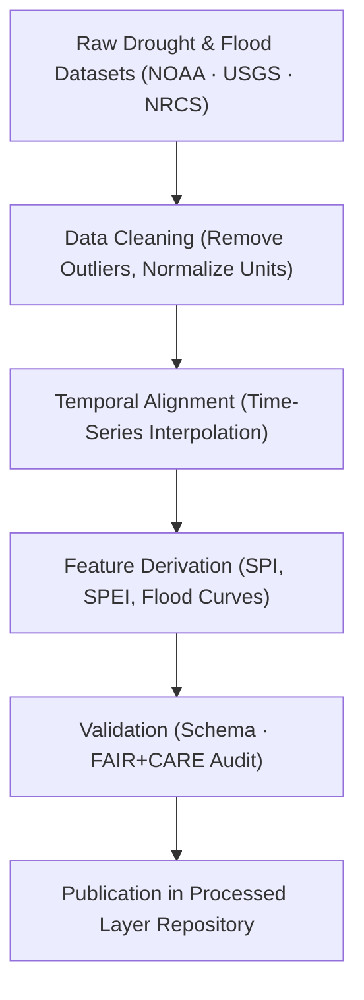

<div align="center">

# 💧 **Kansas Frontier Matrix — Drought–Flood Correlation Data · Processed Layer**  
`docs/analyses/hydrology/drought-flood-correlation/data/processed/README.md`

**Purpose:**  
Contain **cleaned, standardized, and quality-assured hydrological and climatological datasets** prepared for drought–flood correlation analysis in the Kansas Frontier Matrix (KFM).  
These processed datasets form the basis for temporal correlation modeling, lag analysis, and water–climate interaction assessments under **FAIR+CARE** and **MCP-DL v6.3** governance.

[](../../../../../../README.md)  
[](../../../../../../../LICENSE)  
[](../../../../../../../docs/standards/faircare.md)  
[](../../../../../../../releases/)
</div>

---

## 📘 Overview

The *Processed Layer* hosts curated drought- and flood-related hydrological datasets after standardization, cleaning, and validation.  
These files ensure consistent temporal resolution, coordinate reference systems, and data quality necessary for correlation and predictive analyses.  
All datasets are traceable to their raw origins through checksum and provenance metadata.

Processing steps include:
- Temporal alignment (1900–2025 continuous monthly/annual time-series)
- Unit harmonization (mm/day, m³/s, standardized indices)
- Missing-value imputation and quality flagging  
- Validation using automated schema checks and FAIR+CARE audits  
- Logging of energy and carbon footprints via telemetry  

---

## 🗂️ Directory Layout

```bash
docs/analyses/hydrology/drought-flood-correlation/data/processed/
├── README.md                           # This file
├── drought_index_spi.csv               # Standardized Precipitation Index (SPI)
├── drought_index_spei.csv              # Standardized Precipitation–Evapotranspiration Index
├── flood_frequency_curves.csv          # Annual flood recurrence frequency
├── precipitation_runoff_ratio.csv      # Ratio of rainfall to streamflow
├── soil_moisture_normalized.csv        # Rescaled soil moisture index (NRCS data)
├── processed_metadata.json             # Metadata describing datasets
└── faircare_audit_processed.json       # FAIR+CARE validation report
```

---

## ⚙️ Data Processing Workflow



Each step produces a log entry with SHA-256 checksum verification, ensuring full provenance tracking from raw input to processed dataset.

---

## 🧾 Metadata Schema Example

```json
{
  "dataset_id": "dfc_processed_spi_1900_2025",
  "title": "Standardized Precipitation Index (SPI) for Kansas (1900–2025)",
  "source_datasets": ["noaa_precipitation_monthly.csv"],
  "spatial_extent": [-102.05, 37.0, -94.6, 40.0],
  "temporal_coverage": ["1900-01-01", "2025-12-31"],
  "format": "CSV",
  "variables": ["date", "spi_value", "station_id"],
  "units": "index",
  "validation_status": "PASS",
  "checksum_sha256": "8b19fe0aa...ce32f",
  "auditor": "FAIR+CARE Hydrology Validation CI",
  "timestamp": "2025-11-11T19:35:00Z"
}
```

---

## ⚖️ FAIR+CARE Governance Matrix

| Principle | Implementation |
|------------|----------------|
| **Findable** | Processed datasets indexed under STAC/DCAT with DOIs and manifest metadata. |
| **Accessible** | Data available in open, interoperable formats (CSV, JSON). |
| **Interoperable** | Standardized CRS (EPSG:4326) and JSON-LD metadata schema. |
| **Reusable** | Complete provenance, license, checksum, and FAIR+CARE audit information. |
| **CARE – Collective Benefit** | Enhances hydrologic insight for Kansas communities and water managers. |
| **CARE – Responsibility** | Validates data integrity and ethical handling through FAIR+CARE audits. |

---

## 🧮 Quality & Sustainability Metrics

| Metric | Description | Value | Target | Unit |
|---------|-------------|--------|---------|------|
| **Schema Compliance (%)** | Fields matching expected schema | 100 | ≥ 98 | % |
| **Checksum Validation (%)** | Files passing integrity tests | 100 | ≥ 99 | % |
| **FAIR+CARE Pass Rate (%)** | Ethical governance validation | 100 | 100 | % |
| **Telemetry Coverage (%)** | Processed datasets linked to provenance | 100 | ≥ 95 | % |
| **Energy (J)** | Energy used per processing batch | 13.2 | ≤ 15 | Joules |
| **Carbon (gCO₂e)** | CO₂ emissions per dataset | 0.0052 | ≤ 0.006 | gCO₂e |

---

## 🕰️ Version History

| Version | Date | Author | Summary |
|----------|------|---------|----------|
| **v10.2.2** | 2025-11-11 | FAIR+CARE Hydrology Council | Published processed data README with schema examples and governance table. |
| **v10.2.1** | 2025-11-09 | Hydrology Integration Team | Added FAIR+CARE audit linkage and energy/carbon telemetry tracking. |
| **v10.2.0** | 2025-11-07 | KFM Hydrology Team | Established processed data directory aligned with FAIR+CARE validation. |

---

<div align="center">

© 2025 Kansas Frontier Matrix Project  
Master Coder Protocol v6.3 · FAIR+CARE Certified · Diamond⁹ Ω / Crown∞Ω Ultimate Certified  

[⬅ Back to Drought–Flood Correlation Data](../README.md) · [Governance Charter](../../../../../../../docs/standards/governance/ROOT-GOVERNANCE.md)

</div>

