<div align="center">

# 💧 **Kansas Frontier Matrix — Drought–Flood Correlation Data · Raw Layer**  
`docs/analyses/hydrology/drought-flood-correlation/data/raw/README.md`

**Purpose:**  
Serve as the authoritative repository of **unprocessed hydrological and climatic datasets** that form the foundation of the Drought–Flood Correlation (DFC) analyses within the Kansas Frontier Matrix (KFM).  
All raw files are immutable, checksum-verified, and ethically governed under **FAIR+CARE** and **MCP-DL v6.3** standards to guarantee transparency, reproducibility, and provenance integrity.

[](../../../../../../README.md)  
[](../../../../../../../LICENSE)  
[](../../../../../../../docs/standards/faircare.md)  
[](../../../../../../../releases/)
</div>

---

## 📘 Overview

The *Raw Layer* stores original, unaltered data sources acquired directly from open hydrological and meteorological providers such as **NOAA NCEI**, **USGS NWIS**, **NRCS SCAN**, and **FEMA NFHL**.  
These datasets serve as input for all preprocessing and correlation modeling workflows, ensuring analytical traceability and compliance with the Kansas Frontier Matrix’s FAIR+CARE governance framework.

**Raw layer objectives:**
- Preserve pristine copies of all drought- and flood-related hydrological data  
- Guarantee dataset immutability using cryptographic checksums  
- Record provenance, acquisition date, and licensing metadata  
- Support downstream reproducibility for all derived datasets and models  

---

## 🗂️ Directory Layout

```bash
docs/analyses/hydrology/drought-flood-correlation/data/raw/
├── README.md                          # This file
├── noaa_precipitation_monthly.csv     # Raw precipitation data from NOAA NCEI
├── usgs_streamflow_peaks.csv          # Streamflow and flood peak data from USGS
├── nrcs_soil_moisture.tsv             # Soil moisture data from NRCS SCAN network
├── fema_flood_zones.geojson           # Flood hazard boundaries from FEMA NFHL
├── kwr_reservoir_levels_1900_2025.csv # Reservoir level data from Kansas Water Resources
├── checksum_ledger.csv                # SHA-256 checksums for all raw datasets
├── raw_metadata.json                  # Provenance metadata for each file
└── faircare_raw_audit.json            # FAIR+CARE ethical validation report
```

---

## ⚙️ Data Acquisition Workflow

```mermaid
flowchart TD
    A["Data Providers (NOAA, USGS, NRCS, FEMA, KWR)"]
    --> B["Acquisition (API / FTP / Web Download)"]
    B --> C["Checksum Generation & Verification (SHA-256)"]
    C --> D["FAIR+CARE Metadata Creation (Provenance · License · Source)"]
    D --> E["Immutable Archival in Raw Layer Directory"]
```



Each dataset acquisition event is logged in telemetry and cross-referenced with the **Hydrology FAIR+CARE Governance Ledger**.

---

## 🧾 Metadata Schema Example

```json
{
  "dataset_id": "dfc_raw_usgs_streamflow_2025",
  "source": "USGS National Water Information System (NWIS)",
  "source_url": "https://waterdata.usgs.gov/nwis",
  "temporal_coverage": ["1900-01-01", "2025-12-31"],
  "spatial_extent": [-102.05, 37.0, -94.6, 40.0],
  "format": "CSV",
  "license": "Public Domain",
  "checksum_sha256": "8a4c7e0bdf2a...b19f",
  "acquisition_date": "2025-11-11T17:00:00Z",
  "verified_by": "FAIR+CARE Hydrology Validation CI",
  "status": "Immutable / Verified"
}
```

---

## ⚖️ FAIR+CARE Governance Matrix

| Principle | Implementation |
|------------|----------------|
| **Findable** | Raw files indexed under STAC/DCAT catalog with unique dataset IDs. |
| **Accessible** | Public data stored in open formats (CSV, TSV, GeoJSON) with documented license. |
| **Interoperable** | CRS standardized to EPSG:4326; metadata follows JSON-LD schema. |
| **Reusable** | Provenance, audit, and checksum data ensure reusability. |
| **CARE – Collective Benefit** | Contributes to transparent hydrologic science supporting Kansas communities. |
| **CARE – Responsibility** | Ethical stewardship enforced through FAIR+CARE audit validation. |

---

## 🧮 Data Integrity Metrics

| Metric | Description | Value | Target | Unit |
|---------|-------------|--------|---------|------|
| **Checksum Validation (%)** | Datasets matching registered SHA-256 hashes | 100 | ≥ 99 | % |
| **Metadata Completeness (%)** | Files with complete provenance metadata | 100 | ≥ 95 | % |
| **FAIR+CARE Pass Rate (%)** | Ethical and governance audit compliance | 100 | 100 | % |
| **Telemetry Coverage (%)** | Datasets linked to telemetry logs | 100 | ≥ 95 | % |

---

## 🕰️ Version History

| Version | Date | Author | Summary |
|----------|------|---------|----------|
| **v10.2.2** | 2025-11-11 | FAIR+CARE Hydrology Council | Published drought–flood raw data directory with metadata and validation schema. |
| **v10.2.1** | 2025-11-09 | Hydrology Integration Team | Added provenance and FAIR+CARE audit tracking. |
| **v10.2.0** | 2025-11-07 | KFM Hydrology Team | Created raw dataset repository aligned with FAIR+CARE and MCP-DL governance. |

---

<div align="center">

© 2025 Kansas Frontier Matrix Project  
Master Coder Protocol v6.3 · FAIR+CARE Certified · Diamond⁹ Ω / Crown∞Ω Ultimate Certified  

[⬅ Back to Drought–Flood Correlation Data](../README.md) · [Governance Charter](../../../../../../../docs/standards/governance/ROOT-GOVERNANCE.md)

</div>

