<div align="center">

# 💧 **Kansas Frontier Matrix — Drought–Flood Correlation Data · Validation Directory**  
`docs/analyses/hydrology/drought-flood-correlation/data/validation/README.md`

**Purpose:**  
Ensure **data integrity, schema conformance, and FAIR+CARE ethical compliance** for all drought–flood correlation datasets used in the Kansas Frontier Matrix (KFM).  
This directory contains quality assurance (QA/QC) reports, checksum ledgers, schema validation outputs, and FAIR+CARE audits verifying that all hydrologic and climate datasets meet reproducibility and governance standards under **MCP-DL v6.3**.

[](../../../../../../README.md)  
[](../../../../../../../LICENSE)  
[](../../../../../../../docs/standards/faircare.md)  
[](../../../../../../../releases/)
</div>

---

## 📘 Overview

The *Validation Directory* serves as the final verification layer for the drought–flood correlation datasets.  
It ensures that every dataset—from raw to derived—has been validated for completeness, accuracy, consistency, and ethical compliance.  
All validation reports are automatically generated via continuous integration (CI) workflows and stored here with detailed provenance.

Validation checks include:
- Schema structure and field data-type conformance  
- Spatial and temporal extent validation  
- Metadata completeness and FAIR+CARE compliance  
- Checksum verification for data immutability  
- Telemetry-linked audit reporting for reproducibility assurance  

---

## 🗂️ Directory Layout

```bash
docs/analyses/hydrology/drought-flood-correlation/data/validation/
├── README.md                         # This file
├── schema_checks.json                 # Schema conformance report
├── checksum_ledger.csv                # SHA-256 file integrity hashes
├── data_quality_summary.json          # Validation summary for data coverage and completeness
├── faircare_audit.json                # FAIR+CARE governance validation
└── validation_log.txt                 # Combined log from CI validation pipeline
```

---

## ⚙️ Validation Workflow

```mermaid
flowchart TD
    A["Raw + Processed + Derived DFC Datasets"]
    --> B["Automated Schema Validation (JSON/CSV Checks)"]
    B --> C["Checksum & Integrity Verification"]
    C --> D["FAIR+CARE Audit (Ethics · Provenance)"]
    D --> E["Telemetry Logging & Governance Ledger Commit"]
```



Validation scripts are executed through the KFM GitHub Actions workflows:
- `data-validation.yml` — checks structural integrity  
- `faircare-audit.yml` — verifies ethical and provenance compliance  
- `telemetry-export.yml` — logs sustainability and performance data  

---

## 🧾 Validation Report Schema

| Field | Description | Example |
|-------|-------------|----------|
| **dataset_id** | Unique dataset identifier | `dfc_composite_ks_v10_2025` |
| **records_checked** | Number of records validated | `1,203,421` |
| **missing_values (%)** | Missing data ratio | `0.6` |
| **schema_status** | PASS / WARN / FAIL | `PASS` |
| **checksum_status** | File integrity verification result | `PASS` |
| **faircare_status** | FAIR+CARE audit result | `PASS` |
| **validation_date** | ISO 8601 timestamp | `2025-11-11T19:30:00Z` |
| **auditor** | Automated or manual reviewer | `FAIR+CARE Hydrology Validation CI` |

---

## ⚖️ FAIR+CARE Governance Matrix

| Principle | Implementation |
|------------|----------------|
| **Findable** | Validation reports and checksum records indexed in STAC/DCAT catalogs. |
| **Accessible** | Results stored as open JSON/CSV logs under CC-BY 4.0 license. |
| **Interoperable** | Validation schema uses JSON-LD and ISO 19157 data-quality elements. |
| **Reusable** | Reports contain provenance, script hashes, and audit metadata. |
| **CARE – Collective Benefit** | Promotes transparent, ethical hydrology data management. |
| **CARE – Responsibility** | Ensures accuracy and prevents misinterpretation of sensitive hydrologic data. |

---

## 🧮 Data Quality Metrics

| Metric | Description | Value | Target | Unit |
|---------|-------------|--------|---------|------|
| **Schema Compliance (%)** | Fields meeting validation schema | 100 | ≥ 98 | % |
| **Checksum Pass Rate (%)** | Files matching integrity hashes | 100 | ≥ 99 | % |
| **FAIR+CARE Pass Rate (%)** | Datasets meeting ethical validation | 100 | 100 | % |
| **Telemetry Coverage (%)** | Validation reports linked to telemetry | 100 | ≥ 95 | % |

---

## 🕰️ Version History

| Version | Date | Author | Summary |
|----------|------|---------|----------|
| **v10.2.2** | 2025-11-11 | FAIR+CARE Hydrology Council | Published drought–flood data validation README with schema fields and governance matrix. |
| **v10.2.1** | 2025-11-09 | Hydrology QA Team | Added checksum ledger and FAIR+CARE audit schema integration. |
| **v10.2.0** | 2025-11-07 | KFM Hydrology Team | Created base validation directory for drought–flood correlation datasets. |

---

<div align="center">

© 2025 Kansas Frontier Matrix Project  
Master Coder Protocol v6.3 · FAIR+CARE Certified · Diamond⁹ Ω / Crown∞Ω Ultimate Certified  

[⬅ Back to Drought–Flood Correlation Data](../README.md) · [Governance Charter](../../../../../../../docs/standards/governance/ROOT-GOVERNANCE.md)

</div>

