<div align="center">

# ⚖️ **Kansas Frontier Matrix — Drought–Flood Correlation Governance Framework**  
`docs/analyses/hydrology/drought-flood-correlation/governance/README.md`

**Purpose:**  
Establish the **ethical, procedural, and compliance governance** structure for the Drought–Flood Correlation (DFC) domain of the Kansas Frontier Matrix (KFM).  
This framework defines FAIR+CARE accountability mechanisms, validation pipelines, and sustainability metrics to ensure responsible, transparent, and reproducible hydrology analyses under **MCP-DL v6.3** standards.

[](../../../../../README.md)  
[](../../../../../../docs/standards/faircare.md)  
[](../../../../../../LICENSE)  
[](../../../../../../releases/)
</div>

---

## 📘 Overview

The *Drought–Flood Correlation Governance Framework* ensures that all data, models, and outputs comply with the **FAIR+CARE ethical data principles**, ISO 14064 energy reporting, and MCP reproducibility policies.  
It governs decision-making, audit cycles, provenance verification, and energy accountability across all analytical layers — from data ingestion to result dissemination.

This governance model integrates:
- Ethical data-use validation through FAIR+CARE audits  
- Transparency in model provenance and energy use (telemetry-linked)  
- Community benefit and accountability through public reporting  
- Multi-level governance alignment with Kansas Frontier Matrix Root Governance  

---

## 🗂️ Directory Layout

```bash
docs/analyses/hydrology/drought-flood-correlation/governance/
├── README.md                              # This file
├── governance_audit_log.json              # FAIR+CARE audit results and council sign-off
├── energy_sustainability_report.csv       # Energy and carbon tracking for DFC workflows
├── provenance_chain_ledger.json           # Provenance and lineage mapping for datasets and models
├── compliance_matrix.json                 # FAIR+CARE compliance evaluation record
└── council_minutes_2025Q4.md              # Governance Council quarterly report
```

---

## ⚙️ Governance Workflow Integration

```mermaid
flowchart TD
    A["Raw Data Acquisition"] --> B["FAIR+CARE Pre-Audit (Licensing · Ethics · Provenance)"]
    B --> C["Analytical Workflows (Correlation · Temporal Models)"]
    C --> D["Post-Processing Audit (Integrity · Telemetry · Validation)"]
    D --> E["Governance Review & Ledger Commit (Council Verification)"]
```



The governance process operates cyclically, ensuring continuous improvement and compliance with the FAIR+CARE Charter and Root Governance guidelines.

---

## 🧩 Governance Roles & Responsibilities

| Role | Responsibility | Reporting Frequency |
|------|----------------|----------------------|
| **FAIR+CARE Council** | Oversight of ethical data handling, energy accountability, and transparency. | Quarterly |
| **Hydrology Domain Stewards** | Ensure adherence to FAIR+CARE and MCP-DL documentation standards. | Continuous |
| **Validation Lead (QA/QC)** | Conducts data and model validation audits and logs reports. | Each release |
| **Telemetry Officer** | Manages sustainability reporting (energy & carbon). | Continuous |
| **Root Governance Committee** | Cross-domain ethical oversight and certification authority. | Annually |

---

## ⚖️ FAIR+CARE Compliance Summary

| Principle | Implementation | Verification |
|------------|----------------|--------------|
| **Findable** | All datasets, models, and results indexed with persistent identifiers in STAC/DCAT. | STAC Catalog Audit |
| **Accessible** | Open-access under CC-BY; audit logs published for transparency. | Governance Ledger |
| **Interoperable** | Standardized metadata across hydrology and climate modules. | Schema Validation |
| **Reusable** | Full provenance chain maintained for reproducibility. | Telemetry Logs |
| **CARE – Collective Benefit** | Prioritizes sustainable and community-benefiting research outcomes. | FAIR+CARE Review |
| **CARE – Responsibility** | Continuous audit of energy, carbon, and social ethics metrics. | Sustainability Report |

---

## 🌱 Sustainability and Energy Metrics

| Metric | Description | Target | Unit |
|---------|-------------|---------|------|
| **Energy per Workflow** | Average energy consumed by DFC pipeline | ≤ 15 | Joules |
| **Carbon Emissions** | CO₂ equivalent per pipeline run | ≤ 0.006 | gCO₂e |
| **Audit Pass Rate** | FAIR+CARE governance success rate | 100 | % |
| **Telemetry Coverage** | Workflows logged and verified | 100 | % |

---

## 🧾 Governance Ledger Example

```json
{
  "ledger_id": "dfc_governance_ledger_2025_Q4",
  "component": "Hydrology – Drought–Flood Correlation Module",
  "auditors": ["FAIR+CARE Council", "Root Governance Committee"],
  "datasets_validated": 42,
  "models_reviewed": 6,
  "issues_flagged": 0,
  "status": "Compliant",
  "energy_joules_avg": 13.9,
  "carbon_gCO2e_avg": 0.0054,
  "timestamp": "2025-11-11T19:45:00Z"
}
```

---

## 🕰️ Version History

| Version | Date | Author | Summary |
|----------|------|---------|----------|
| **v10.2.2** | 2025-11-11 | FAIR+CARE Hydrology Council | Published drought–flood correlation governance README with audit schema and ledger example. |
| **v10.2.1** | 2025-11-09 | Hydrology Integration Team | Added governance roles and sustainability reporting. |
| **v10.2.0** | 2025-11-07 | KFM Hydrology Team | Created governance documentation for DFC module aligned with Root Governance Charter. |

---

<div align="center">

© 2025 Kansas Frontier Matrix Project  
Master Coder Protocol v6.3 · FAIR+CARE Certified · Diamond⁹ Ω / Crown∞Ω Ultimate Certified  

[⬅ Back to Drought–Flood Correlation Overview](../README.md) · [Governance Charter](../../../../../../docs/standards/governance/ROOT-GOVERNANCE.md)

</div>

