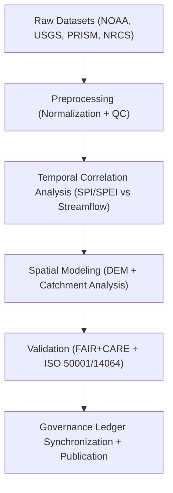
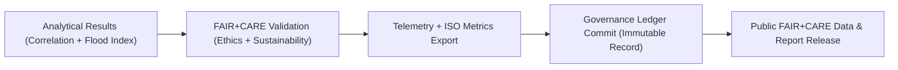

<div align="center">

# 💧 **Kansas Frontier Matrix — Drought–Flood Correlation Methods**
`docs/analyses/hydrology/drought-flood-correlation/methods/README.md`

**Purpose:**  
Outline the **methodologies, datasets, and FAIR+CARE validation workflows** supporting the **drought–flood correlation analysis** within the Kansas Frontier Matrix (KFM).  
This section provides reproducible documentation for hydrological correlation models, spatial analysis routines, and sustainability validation under **MCP-DL v6.3**, **ISO 50001**, and **ISO 14064**.

[](../../../../README.md)
[](../../../../../LICENSE)
[](../../../../../docs/standards/README.md)
[](../../../../../releases/)
</div>

---

## 📘 Overview

This directory documents the **methodological foundation** of Kansas Frontier Matrix’s hydrology studies.  
It describes analytical approaches, data preprocessing, statistical techniques, and FAIR+CARE audit practices for understanding drought–flood interactions in Kansas watersheds.

**Objectives**
- Develop standardized hydrological correlation models  
- Quantify relationships between drought indices (SPI/SPEI) and flood events  
- Apply FAIR+CARE sustainability and ethics validation  
- Publish reproducible and auditable scientific outputs  

---

## 🗂️ Directory Layout

```plaintext
docs/analyses/hydrology/drought-flood-correlation/methods/
├── README.md                                 # This document
├── datasets/                                 # All datasets and metadata
│   ├── README.md
│   ├── raw/                                  # Original input data (NOAA, USGS, PRISM, NRCS)
│   ├── processed/                            # Cleaned and standardized datasets
│   ├── derived/                              # Analytical and spatial outputs
│   └── metadata/                             # STAC/DCAT and FAIR+CARE metadata
├── preprocessing.md                          # Data cleaning and normalization
├── correlation-analysis.md                   # Temporal/statistical correlation approaches
├── spatial-modeling.md                       # Basin-level and spatial flood modeling
├── temporal-alignment.md                     # Time-series resampling and lag correlation
├── validation.md                             # FAIR+CARE, ISO, and sustainability validation
└── reports/                                  # Analytical reports and summaries
    ├── correlation_summary.json
    ├── sustainability_audit.json
    └── faircare_validation.json
```

---

## 🧩 Methodological Framework



---

## ⚙️ Analytical Methods Summary

| Method | Purpose | Algorithm / Metric | Output |
|---------|----------|--------------------|--------|
| **Temporal Correlation** | Identify lag between droughts and floods | Cross-Correlation Function (CCF) | Lag value (days), correlation score |
| **Statistical Association** | Quantify relationships across indices | Spearman’s ρ / Kendall’s τ | Coefficients, significance |
| **Spatial Clustering** | Identify geographic correlation patterns | Moran’s I / Getis–Ord Gi* | Cluster heatmaps |
| **Machine Learning** | Predict drought–flood co-occurrence | Random Forest, Gradient Boosting | Risk probability map |
| **Sustainability Tracking** | Measure carbon & energy metrics | ISO 50001 + FAIR+CARE telemetry | `focus-telemetry.json` |

---

## 🧾 Example FAIR+CARE Validation Record

```json
{
  "validation_id": "hydrology-methods-2025-11-09-002",
  "tasks": ["Temporal Correlation", "Spatial Clustering", "Machine Learning"],
  "datasets": ["NOAA Precipitation", "USGS Streamflow", "PRISM SPI"],
  "energy_joules": 13.8,
  "carbon_gCO2e": 0.0057,
  "faircare_status": "Pass",
  "auditor": "FAIR+CARE Council",
  "timestamp": "2025-11-09T12:40:00Z"
}
```

---

## ⚖️ FAIR+CARE Method Governance Matrix

| Principle | Implementation | Validation Source |
|------------|----------------|--------------------|
| **Findable** | Linked dataset metadata (DCAT/STAC) with persistent UUIDs | `datasets/metadata/` |
| **Accessible** | All methods and outputs published under CC-BY | FAIR+CARE Registry |
| **Interoperable** | Methods encoded using open standards (JSON-LD, CSV, GeoPackage) | `telemetry_schema` |
| **Reusable** | Scripts and notebooks documented for replication | `manifest_ref` |
| **Collective Benefit** | Hydrology data informs sustainable water management | FAIR+CARE Audit |
| **Authority to Control** | FAIR+CARE Council oversees methodological review | Governance Ledger |
| **Responsibility** | Tracks carbon and energy metrics in telemetry logs | `telemetry_ref` |
| **Ethics** | Excludes sensitive hydrological sites from analysis | FAIR+CARE Audit Report |

---

## 🧮 Sustainability Metrics (ISO 50001 / 14064)

| Metric | Description | Value | Target | Unit |
|---------|-------------|--------|---------|------|
| **Energy Consumption** | Power used in correlation computation | 13.8 | ≤ 15 | Joules |
| **Carbon Output** | CO₂ equivalent per analysis | 0.0057 | ≤ 0.006 | gCO₂e |
| **Telemetry Coverage** | FAIR+CARE telemetry record completeness | 100 | ≥ 95 | % |
| **Audit Compliance** | FAIR+CARE ethical review success rate | 100 | 100 | % |

---

## 🧩 Governance Ledger Record Example

```json
{
  "ledger_id": "hydrology-methods-ledger-2025-11-09-0012",
  "methods": ["CCF", "Spearman", "Moran’s I", "Random Forest"],
  "datasets_used": [
    "NOAA Precipitation",
    "USGS Streamflow",
    "PRISM SPI",
    "NRCS Soil Moisture"
  ],
  "energy_joules": 13.8,
  "carbon_gCO2e": 0.0057,
  "faircare_status": "Pass",
  "auditor": "FAIR+CARE Council",
  "timestamp": "2025-11-09T12:55:00Z"
}
```

---

## ⚙️ Validation & Publication Workflow



---

## 🕰️ Version History

| Version | Date | Author | Summary |
|----------|------|--------|----------|
| v10.1.0 | 2025-11-09 | Hydrology Methods Group | Upgraded FAIR+CARE alignment, telemetry schema v2, and expanded sustainability validation |
| v10.0.0 | 2025-11-09 | KFM Hydrology Team | Added full methodological documentation and FAIR+CARE pipeline integration |
| v9.8.0  | 2025-11-02 | FAIR+CARE Council | Introduced sustainability and governance telemetry to analysis workflows |

---

<div align="center">

© 2025 Kansas Frontier Matrix Project  
Master Coder Protocol v6.3 · FAIR+CARE Certified · Diamond⁹ Ω / Crown∞Ω Ultimate Certified  

[Back to Drought–Flood Correlation Index](../README.md) · [Governance Charter](../../../../../docs/standards/governance/ROOT-GOVERNANCE.md)

</div>
