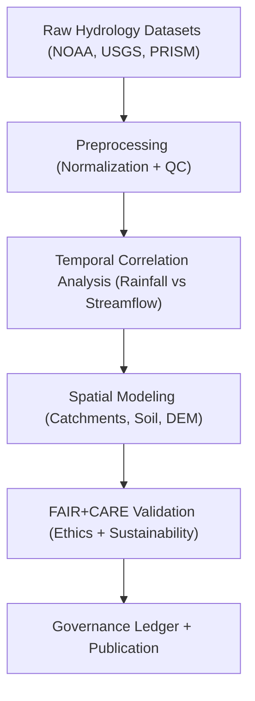
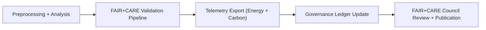

<div align="center">

# 💧 **Kansas Frontier Matrix — Hydrology Drought–Flood Correlation Methods**
`docs/analyses/hydrology/drought-flood-correlation/methods/README.md`

**Purpose:**  
Document the methodologies, datasets, and FAIR+CARE-aligned analytical pipelines used in the **drought–flood correlation study** for the Kansas Frontier Matrix (KFM).  
Ensures that hydrological analyses are **reproducible**, **ethically governed**, and **sustainably validated** under **MCP-DL v6.3**.

[](../../../README.md)
[](../../../../../LICENSE)
[](../../../../../docs/standards/README.md)
[](../../../../../releases/)
</div>

---

## 📘 Overview

This document outlines the methods for analyzing **drought–flood correlations** across Kansas hydrological basins.  
It defines datasets, statistical procedures, and FAIR+CARE sustainability integrations used to link **precipitation variability**, **soil moisture**, and **flow accumulation** over historical and contemporary periods.

**Core Objectives**
- Identify temporal overlap between drought and flood events  
- Quantify spatial and statistical correlation across basins  
- Integrate sustainability and ethics through FAIR+CARE validation  
- Support provenance, reproducibility, and governance traceability  

---

## 🗂️ Directory Context

```plaintext
docs/analyses/hydrology/drought-flood-correlation/
├── README.md                       # Study overview
├── datasets/                       # Source and derived data references
├── methods/                        # This directory (methodology details)
│   ├── README.md                   # Methodology documentation (this file)
│   ├── preprocessing.md            # Data cleaning and normalization steps
│   ├── correlation-analysis.md     # Pearson/Spearman/Kendall methods
│   ├── temporal-alignment.md       # Time series alignment and resampling
│   ├── spatial-modeling.md         # GeoTIFF/DEM and catchment-level modeling
│   └── validation.md               # FAIR+CARE and ISO workflow verification
└── results/                        # Analytical outputs and visualizations
```

---

## 🧩 Methodological Framework



---

## ⚙️ Data Sources

| Source | Dataset | Description | Format |
|---------|----------|--------------|---------|
| **NOAA** | Precipitation & Temperature (1895–2025) | Long-term climate records for Kansas | NetCDF, CSV |
| **USGS** | Streamflow & Hydrologic Unit Boundaries | Water discharge and basin delineations | GeoPackage, GeoTIFF |
| **PRISM** | Drought Indices (SPI, SPEI) | Monthly drought severity metrics | NetCDF |
| **Soil Survey** | KS SSURGO Dataset | Soil moisture and infiltration rates | GeoPackage |
| **FAIR+CARE** | Provenance Metadata | Ethical and governance validation records | JSON-LD |

---

## 🧮 Analytical Methods

| Method | Purpose | Algorithm / Metric | Output |
|---------|----------|--------------------|--------|
| **Temporal Correlation** | Measure lag between drought and flood signals | Cross-Correlation Function (CCF) | Lag (days), correlation coefficient |
| **Statistical Association** | Quantify monotonic relationships | Spearman’s ρ, Kendall’s τ | ρ/τ values and p-values |
| **Spatial Clustering** | Detect drought–flood spatial co-occurrence | Moran’s I, Getis–Ord Gi* | Clustered significance maps |
| **Machine Learning** | Predictive modeling of co-dependence | Random Forest / XGBoost | Predicted correlation probabilities |
| **Governance Validation** | Verify ethics and sustainability alignment | FAIR+CARE + ISO Audit | Validation report and ledger hash |

---

## 🧾 Example FAIR+CARE Validation Log

```json
{
  "validation_id": "hydrology-methods-2025-11-09-001",
  "datasets": ["NOAA Precipitation", "USGS Streamflow"],
  "methods_used": ["Spearman", "Cross-Correlation", "Moran’s I"],
  "energy_joules": 13.2,
  "carbon_gCO2e": 0.0058,
  "faircare_status": "Pass",
  "auditor": "FAIR+CARE Council",
  "timestamp": "2025-11-09T12:30:00Z"
}
```

---

## ⚖️ FAIR+CARE Integration

| Principle | Implementation | Validation Source |
|------------|----------------|-------------------|
| **Findable** | Metadata and provenance recorded in Governance Ledger | `governance-ledger.yml` |
| **Accessible** | Datasets documented and publicly accessible | `datasets/README.md` |
| **Interoperable** | Data aligned with STAC/DCAT schema | `data-contracts.md` |
| **Reusable** | Reproducible scripts and JSON notebooks archived | `methods/` |
| **Collective Benefit** | Contributes to sustainable water resource policy | FAIR+CARE Audit |
| **Authority to Control** | Oversight from hydrology ethics committee | Governance Ledger |
| **Responsibility** | Tracks sustainability impact via telemetry | `focus-telemetry.json` |
| **Ethics** | Community-sensitive water resource data masked where needed | FAIR+CARE Review |

---

## 🧠 Computational Environment

| Component | Version | Purpose |
|------------|----------|----------|
| Python | 3.11 | Statistical and ML analysis |
| GDAL | 3.12 | Raster and vector operations |
| Pandas / Xarray | 2.x | Data wrangling and correlation analysis |
| GeoPandas | 0.14 | Spatial dataset integration |
| Scikit-learn | 1.4 | Predictive correlation modeling |
| FAIR+CARE SDK | 2.1 | Validation, ledger sync, telemetry |

---

## 🧩 Governance Ledger Record Example

```json
{
  "ledger_id": "hydrology-dfc-ledger-2025-11-09-0003",
  "analysis_component": "Drought–Flood Correlation",
  "methods": ["Spearman", "CCF", "Moran’s I"],
  "datasets_used": ["NOAA Precipitation", "USGS Streamflow", "PRISM SPI"],
  "energy_joules": 15.1,
  "carbon_gCO2e": 0.0064,
  "faircare_status": "Pass",
  "auditor": "FAIR+CARE Council",
  "timestamp": "2025-11-09T12:45:00Z"
}
```

---

## ⚙️ Validation & Governance Workflow



---

## 🕰️ Version History

| Version | Date | Author | Summary |
|----------|------|--------|----------|
| v10.0.0 | 2025-11-09 | Core Team | Established full drought–flood correlation methodology and FAIR+CARE validation schema |
| v9.8.0 | 2025-11-02 | Hydrology Working Group | Added spatial and temporal correlation analysis procedures |

---

<div align="center">

© 2025 Kansas Frontier Matrix Project  
Master Coder Protocol v6.3 · FAIR+CARE Certified · Diamond⁹ Ω / Crown∞Ω Ultimate Certified  

[Back to Hydrology Analyses](../README.md) · [Governance Charter](../../../../../docs/standards/governance/ROOT-GOVERNANCE.md)

</div>

