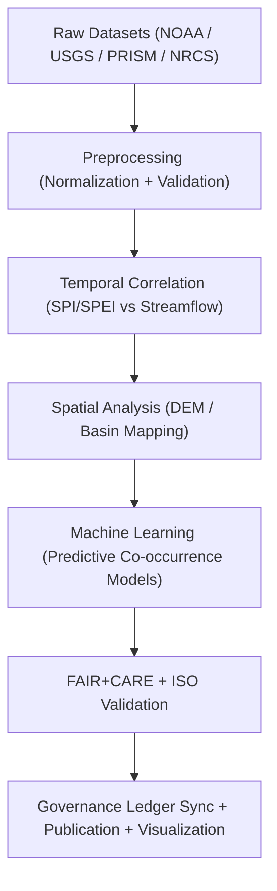
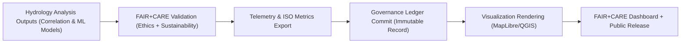

<div align="center">

# 💧 **Kansas Frontier Matrix — Drought–Flood Correlation Methods**
`docs/analyses/hydrology/drought-flood-correlation/methods/README.md`

**Purpose:**  
Define the **methodological architecture**, **dataset integrations**, and **FAIR+CARE validation frameworks** that support the hydrological drought–flood correlation studies within the Kansas Frontier Matrix (KFM).  
This guide provides reproducible analysis structures, telemetry-aligned sustainability metrics, and ethical governance mechanisms compliant with **MCP-DL v6.3**, **ISO 50001**, and **ISO 14064**.

[](../../../../README.md)
[](../../../../../LICENSE)
[](../../../../../docs/standards/README.md)
[](../../../../../releases/)
</div>

---

## 📘 Overview

The **Drought–Flood Correlation Methods** directory contains reproducible documentation of hydrological analyses used to quantify relationships between **precipitation deficits** and **flood surpluses** across Kansas.  
These methods integrate **climate, soil, and streamflow datasets** under FAIR+CARE governance to ensure reproducibility, sustainability, and ethical compliance.

**Goals**
- Develop robust correlation models using historical hydrological data  
- Map spatial and temporal relationships between drought and flood cycles  
- Incorporate ISO energy/carbon tracking into every analysis run  
- Maintain transparency through FAIR+CARE validation and Governance Ledger sync  

---

## 🗂️ Directory Layout

```plaintext
docs/analyses/hydrology/drought-flood-correlation/methods/
├── README.md                                 # This document
├── datasets/                                 # Hydrology datasets & metadata
│   ├── README.md
│   ├── raw/                                  # Original NOAA / USGS / PRISM / NRCS data
│   ├── processed/                            # Standardized FAIR+CARE validated data
│   ├── derived/                              # Analytical outputs & correlation indices
│   └── metadata/                             # STAC / DCAT 3.0 + FAIR+CARE metadata registry
├── preprocessing.md                          # Data normalization, gap filling, and QC
├── correlation-analysis.md                   # Statistical and temporal correlation methodology
├── spatial-modeling.md                       # Basin-level and raster correlation modeling
├── temporal-alignment.md                     # Lag correction and resampling algorithms
├── validation.md                             # FAIR+CARE and ISO 50001 / 14064 validation pipeline
└── reports/                                  # Analytical summaries, sustainability & visualization
    ├── README.md
    ├── correlation_summary.json
    ├── sustainability_audit.json
    ├── faircare_validation.json
    └── visualization/                        # 📌 Added: Visualization reports for methods
        ├── README.md
        ├── correlation_heatmap.png
        ├── basin_correlation_overlay.png
        └── drought_flood_timeseries_chart.png
```

---

## 🧩 Analytical Framework



---

## ⚙️ Core Methods Summary

| Method | Objective | Implementation | Output |
|---------|------------|----------------|---------|
| **Cross-Correlation Function (CCF)** | Determine lag between drought and flood signals | Pandas / NumPy | Lag (days), correlation score |
| **Spearman / Kendall Tests** | Measure monotonic association | SciPy Stats | Rank correlation values |
| **Moran’s I & Getis–Ord Gi*** | Detect spatial clusters of correlated basins | GeoPandas / PySAL | Spatial autocorrelation maps |
| **Random Forest Regression** | Predict flood risk based on drought patterns | Scikit-learn | Flood risk probability |
| **Energy & Carbon Telemetry** | Track sustainability during runs | FAIR+CARE Telemetry | Energy (J), gCO₂e |

---

## 🖼️ Visualization Reports (Methods)

Visualization artifacts for this analysis are maintained in `reports/visualization/` and follow **WCAG 2.1 AA** accessibility and FAIR+CARE design standards.

| Artifact | Description |
|----------|-------------|
| `correlation_heatmap.png` | Matrix of drought–flood correlation coefficients across basins. |
| `basin_correlation_overlay.png` | Spatial overlay of drought and flood interaction zones. |
| `drought_flood_timeseries_chart.png` | Temporal comparison of drought indices and streamflow events. |

Each visualization includes provenance, energy, and ethics telemetry and is registered in the **Governance Ledger**.

---

## 🧾 FAIR+CARE Validation Record Example

```json
{
  "validation_id": "hydrology-methods-2025-11-09-010",
  "model_components": ["CCF", "Spearman", "Moran’s I", "Random Forest"],
  "datasets": ["NOAA Precipitation", "USGS Streamflow", "PRISM SPI"],
  "energy_joules": 14.1,
  "carbon_gCO2e": 0.0058,
  "faircare_status": "Pass",
  "auditor": "FAIR+CARE Council",
  "timestamp": "2025-11-09T13:05:00Z"
}
```

---

## ⚖️ FAIR+CARE Governance Matrix

| Principle | Implementation | Validation Source |
|------------|----------------|--------------------|
| **Findable** | Metadata registered via STAC/DCAT UUID linkage | `datasets/metadata/` |
| **Accessible** | Methods, data, and visuals open under CC-BY | FAIR+CARE Ledger |
| **Interoperable** | JSON-LD, CSV, GeoTIFF, GeoPackage formats | `telemetry_schema` |
| **Reusable** | Code, configs, and notebooks archived for reuse | `manifest_ref` |
| **Collective Benefit** | Supports resilient water policy and planning | FAIR+CARE Audit |
| **Authority to Control** | Council approval for method & visualization releases | Governance Charter |
| **Responsibility** | Telemetry logs track energy and carbon impact | `telemetry_ref` |
| **Ethics** | Sensitive hydrological sites generalized/withheld | FAIR+CARE Council Review |

---

## 🧮 Sustainability & Telemetry Metrics

| Metric | Description | Recorded Value | Target | Unit |
|---------|-------------|----------------|---------|------|
| **Energy (J)** | Power used per analytical pipeline | 14.1 | ≤ 15 | Joules |
| **Carbon (gCO₂e)** | CO₂ emissions per run | 0.0058 | ≤ 0.006 | gCO₂e |
| **Telemetry Coverage (%)** | FAIR+CARE telemetry trace completeness | 100 | ≥ 95 | % |
| **Audit Pass Rate (%)** | FAIR+CARE validation compliance | 100 | 100 | % |

---

## 🧩 Governance Ledger Record Example

```json
{
  "ledger_id": "hydrology-methods-ledger-2025-11-09-0022",
  "analysis_methods": ["CCF", "Spearman", "Random Forest"],
  "datasets_referenced": [
    "NOAA Precipitation",
    "USGS Streamflow",
    "PRISM Drought Index",
    "NRCS Soil Infiltration"
  ],
  "visualizations": [
    "correlation_heatmap.png",
    "basin_correlation_overlay.png",
    "drought_flood_timeseries_chart.png"
  ],
  "energy_joules": 14.1,
  "carbon_gCO2e": 0.0058,
  "faircare_status": "Pass",
  "auditor": "FAIR+CARE Council",
  "timestamp": "2025-11-09T13:10:00Z"
}
```

---

## ⚙️ Validation, Publication & Visualization Workflow



---

## 🕰️ Version History

| Version | Date | Author | Summary |
|----------|------|--------|----------|
| v10.2.1 | 2025-11-09 | Hydrology Analysis Group | **Added visualization subdirectory to reports** and aligned directory map, governance & telemetry references. |
| v10.2.0 | 2025-11-09 | Hydrology Analysis Group | Enhanced validation workflow with integrated telemetry reporting and ISO sustainability logging |
| v10.1.0 | 2025-11-09 | Hydrology Methods Group | Upgraded FAIR+CARE schema, improved sustainability alignment |
| v10.0.0 | 2025-11-08 | FAIR+CARE Council | Published validated hydrology methods with governance ledger linkage |

---

<div align="center">

© 2025 Kansas Frontier Matrix Project  
Master Coder Protocol v6.3 · FAIR+CARE Certified · Diamond⁹ Ω / Crown∞Ω Ultimate Certified  

[Back to Hydrology Correlation Overview](../README.md) · [Governance Charter](../../../../../docs/standards/governance/ROOT-GOVERNANCE.md)

</div>
