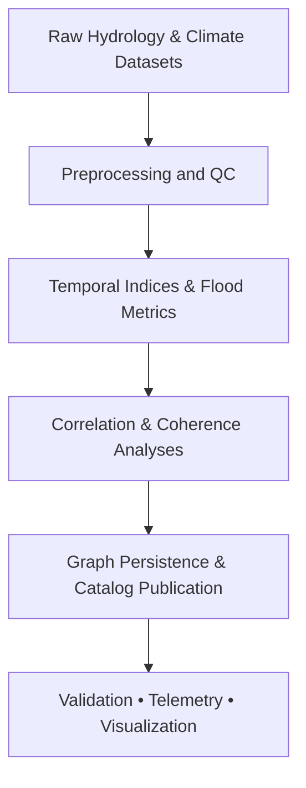
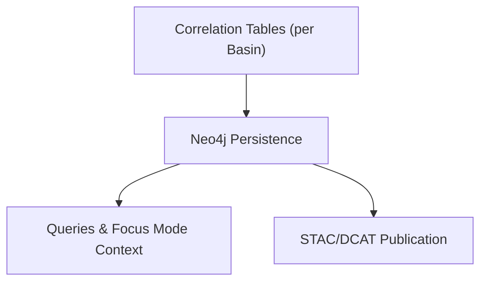

<div align="center">

# 💧 **Kansas Frontier Matrix — Drought–Flood Correlation Analysis Methods**
`docs/analyses/hydrology/drought-flood-correlation/methods/correlation-analysis.md`

**Purpose:**  
Define the **statistical**, **time–frequency**, and **graph-integrated** procedures used to quantify relationships between drought conditions and flood responses across Kansas watersheds, with full FAIR+CARE governance and MCP reproducibility.

[](../../../../README.md)
[](../../../../../LICENSE)
[](../../../../../docs/standards/README.md)
[](../../../../../releases/)
</div>

---

## 📘 Overview

The **Correlation Analysis** module operationalizes methods that connect **drought indices** (SPI, SPEI, PDSI) to **flood metrics** (peak discharge, duration, volume) at station, basin, and raster scales.  
It integrates NOAA, USGS, and NASA sources; aligns to water years; and persists results to Neo4j with STAC/DCAT cataloging for discoverability and reuse.

---

## 🗂️ Directory Layout

```plaintext
docs/analyses/hydrology/drought-flood-correlation/methods/
├── README.md                                 # Methods overview (sibling example reference)
├── correlation-analysis.md                   # This document (detailed correlation procedures)
├── preprocessing.md                          # QC, normalization, resampling, gap-fill
├── temporal-alignment.md                     # Lag detection & alignment rules
├── spatial-modeling.md                       # Basin/raster mapping & spatial stats
├── validation.md                             # FAIR+CARE + ISO validation procedures
├── datasets/                                 # Dataset and metadata registry
│   ├── README.md
│   ├── raw/                                  # NOAA/USGS/Daymet subsets (small, versioned)
│   ├── processed/                            # Standardized inputs (CSV/NetCDF/COG)
│   ├── derived/                              # Indices, peaks, correlation tables
│   └── metadata/                             # STAC/DCAT 3.0 + JSON-LD provenance
└── reports/                                  # Summaries & visualization products
    ├── README.md
    ├── correlation_summary.json
    ├── sustainability_audit.json
    ├── faircare_validation.json
    └── visualization/
        ├── README.md
        ├── correlation_heatmap.png
        ├── basin_correlation_overlay.png
        └── drought_flood_timeseries_chart.png
```

---

## 🧩 Analytical Pipeline (Correlation Focus)



**Notes**
- *Preprocessing* = station screening, unit harmonization, outlier rules, water-year alignment.  
- *Temporal Indices* = SPI/SPEI (1–12 mo), PDSI monthly; *Flood Metrics* = AMDF, POT, duration, volume.  
- *Graph Persistence* = Neo4j relationships with statistics; *Catalog* = STAC Items with GeoJSON/COG.

---

## ⚙️ Datasets & Standardization

| Source | Variable(s) | Resolution | Role |
|---|---|---|---|
| **NOAA NCEI GHCN-Daily** | P, Tmin/Tmax | Daily / station | SPI/SPEI inputs, climatologies |
| **USGS NWIS** | Q (discharge) | Daily / gage | Flood metrics (AMDF, POT, duration) |
| **NASA Daymet V4** | P, Tmean, VP | 1 km grid (1980–present) | Gridded SPEI inputs |
| **NOAA Climate Normals (1991–2020)** | Baselines | Monthly / station | Standardization targets |

**Temporal Alignment**
- All series aligned to **Water Year (Oct–Sep)**; missing values imputed under documented thresholds.  
- Aggregations computed at station → **HUC-8**; optional rasterization for map products.

---

## 🧪 Correlation & Coherence Methods

| Method | Purpose | Implementation / Parameters | Output |
|---|---|---|---|
| **Pearson / Spearman** | Linear / monotonic association | `scipy.stats`; per-basin | r / ρ, p-value |
| **Cross-Correlation Function (CCF)** | Lead–lag structure (months) | `statsmodels` CCF; max lag = 24 mo | lag_mo, r_ccf |
| **Mutual Information (MI)** | Nonlinear dependence | `sklearn` MI (k-NN estimator) | MI score |
| **Copula Modeling** | Joint tails for extremes | `copulas` (Gaussian/t/EVC); MLE fit | tail dependence, joint exceedance |
| **Wavelet Coherence** | Time–frequency co-variability | `pycwt` Morlet; significance via surrogates | coherence, phase (lead/lag) |
| **Dynamic Bayesian Networks** | Directionality hypotheses | `pgmpy`; monthly state series | edges with confidence |

**Index ↔ Flood Pairings (typical)**
- {SPI1, SPI3, SPEI3, SPEI6, PDSI} × {AMDF, POT95, Duration, Volume}

**Multiple Testing**
- False discovery rate (Benjamini–Hochberg) across basins/time-scales; significance persisted.

---

## 🧠 Temporal Alignment & Lag Rules (summary)

1. Detect lags via **CCF** (SPI/SPEI → Flood) per basin; candidate lags ∈ [−12, +12] months.  
2. Validate lag with **phase** in significant wavelet-coherence regions.  
3. Apply lag during regression/MI/case–control pairing for final correlation estimates.  
4. Record `{lag_mo}` with method and confidence into graph and reports.

See `temporal-alignment.md` for complete algorithms and edge-case handling.

---

## 🗺️ Spatial Modeling (summary)

- Basin-level maps for `r`, `p`, `lag_mo`, and method flags.  
- Spatial autocorrelation diagnostics (Moran’s I, Getis–Ord Gi\*) for clusters of significant correlation.  
- Optional raster products (COG GeoTIFF) for UI overlay via MapLibre.

See `spatial-modeling.md` for detailed procedures and thresholds.

---

## 🧷 Graph Integration & Cataloging



**Neo4j Relationships (examples)**
- `(:DroughtIndex)-[:CORRELATES_WITH {r, p, method, lag_mo, scale}]->(:FloodEvent)`
- `(:DroughtIndex)-[:LEADS_TO {lag_mo, conf}]->(:FloodEvent)`

**Artifacts**
- GeoJSON layers and COG rasters published as **STAC Items** under `data/processed/hydrology/correlation/` with JSON-LD provenance and DCAT crosswalk.

---

## 📊 Visualization & Reports

- **Timeseries Panels** — drought index vs. discharge with shaded lags.  
- **Correlation Heatmaps** — basin × scale matrices of r / p.  
- **Spatial Overlays** — lag and significance choropleths.  
- **Wavelet Spectra** — coherence power with phase arrows.

Artifacts live in `reports/visualization/` and are referenced by the Governance Ledger.

---

## ⚖️ FAIR+CARE & Sustainability

| Pillar | Implementation |
|---|---|
| **Findable** | STAC/DCAT entries with UUID/DOI; indexes in catalogs. |
| **Accessible** | Open endpoints for data/figures; CC-BY licensing. |
| **Interoperable** | GeoJSON, NetCDF, CSV, COG; DCAT 3.0 metadata. |
| **Reusable** | JSON-LD provenance, parameter logs, notebooks. |
| **CARE** | Council review; sensitive sites generalized; transparent assumptions. |
| **Sustainability** | Energy (J) & gCO₂e captured in telemetry on each run. |

---

## ✅ Validation Checklist (excerpt)

- [ ] Station QC & gap-fill thresholds satisfied  
- [ ] Water-year alignment verified  
- [ ] Lag estimates corroborated by wavelet phase  
- [ ] FDR applied; significance persisted  
- [ ] STAC/DCAT metadata generated & validated  
- [ ] Telemetry and Governance Ledger updated

---

## 🕰️ Version History

| Version | Date | Author | Summary |
|---|---|---|---|
| v10.2.2 | 2025-11-09 | Hydrology Analysis Group | Align formatting with methods README; fix Mermaid and directory layout to KFM standards. |
| v10.2.1 | 2025-11-09 | Hydrology Analysis Group | Mermaid syntax hardened; added graph relations & catalog details. |
| v10.2.0 | 2025-11-09 | Hydrology Methods Group | Initial certified correlation methods under FAIR+CARE v3 schema. |

---

<div align="center">

© 2025 Kansas Frontier Matrix Project  
Master Coder Protocol v6.3 · FAIR+CARE Certified · Diamond⁹ Ω / Crown∞Ω Ultimate Certified  

[Back to Hydrology Correlation Methods](./README.md) · [Governance Charter](../../../../../docs/standards/governance/ROOT-GOVERNANCE.md)

</div>
