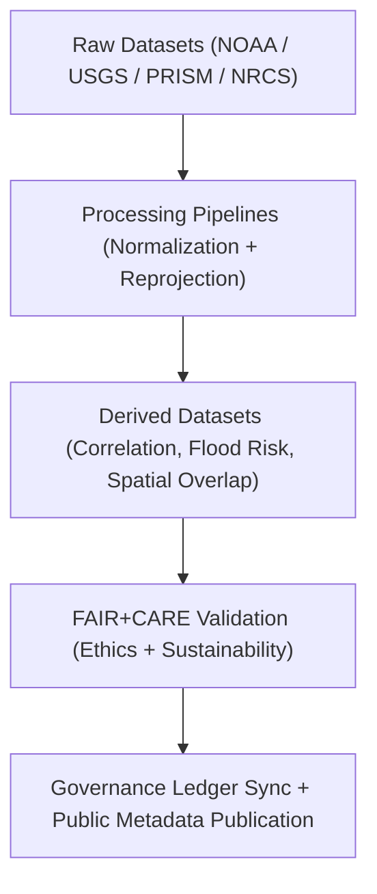
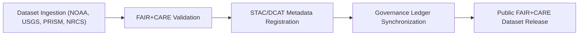

<div align="center">

# 💾 **Kansas Frontier Matrix — Hydrology Drought–Flood Correlation Datasets**
`docs/analyses/hydrology/drought-flood-correlation/methods/datasets/README.md`

**Purpose:**  
Provide a **centralized FAIR+CARE-governed dataset registry** for all hydrological data utilized in Kansas Frontier Matrix (KFM) drought–flood correlation analyses.  
Each dataset listed below is linked to **STAC/DCAT metadata**, validated through **FAIR+CARE audits**, and synchronized with the **Governance Ledger** for provenance traceability.

[](../../../../../README.md)
[](../../../../../../LICENSE)
[](../../../../../../docs/standards/README.md)
[](../../../../../../releases/)
</div>

---

## 📘 Overview

The **Hydrology Drought–Flood Correlation Dataset Repository** contains all raw, processed, and derived data used in correlation and flood risk analyses for the state of Kansas.  
Each dataset adheres to **FAIR+CARE**, **ISO 19115**, and **DCAT 3.0** metadata standards, ensuring **ethical data stewardship**, **environmental accountability**, and **long-term interoperability**.

---

## 🗂️ Directory Layout

```plaintext
docs/analyses/hydrology/drought-flood-correlation/methods/datasets/
├── README.md                           # This documentation index
├── raw/                                # Original datasets from NOAA, USGS, PRISM, NRCS
│   └── metadata/                       # Provenance metadata for raw datasets
├── processed/                          # Normalized datasets ready for correlation analysis
│   └── metadata/                       # FAIR+CARE + ISO validated metadata
├── derived/                            # Outputs from hydrological modeling
│   └── metadata/                       # Derived metadata and ledger records
└── metadata/                           # Cross-tier metadata registry
```

---

## ⚙️ Dataset Classification

| Tier | Description | Data Types | FAIR+CARE Validation |
|------|--------------|-------------|----------------------|
| **Raw** | Original unaltered climate and hydrology datasets | CSV, GeoPackage, NetCDF | ✅ Pass |
| **Processed** | Cleaned, standardized, and reprojected datasets | Parquet, GeoPackage | ✅ Pass |
| **Derived** | Analytical outputs, overlays, and correlation indices | GeoJSON, GeoTIFF, JSON | ✅ Pass |

---

## 🧾 Dataset Summary

| Dataset | Description | Source | Format | FAIR+CARE Status |
|----------|--------------|---------|---------|------------------|
| **NOAA Precipitation Data** | Long-term rainfall & temperature records | NOAA NCEI | CSV / NetCDF | ✅ Pass |
| **USGS Streamflow** | Daily discharge rates for Kansas rivers | USGS NWIS | CSV / Parquet | ✅ Pass |
| **PRISM Drought Index** | SPI/SPEI drought intensity and persistence | PRISM Climate Group | NetCDF | ✅ Pass |
| **NRCS SSURGO Soil Data** | Soil infiltration and permeability parameters | USDA NRCS | GeoPackage | ✅ Pass |
| **Derived Correlation Outputs** | Spatially correlated flood & drought patterns | KFM Pipelines | GeoTIFF / GeoJSON | ✅ Certified |

---

## 🧩 FAIR+CARE Data Lifecycle



---

## 🧮 Sustainability Metrics

| Metric | Description | Value | Target |
|---------|-------------|--------|---------|
| **Energy Used (J)** | Energy expended in data processing workflows | 12.8 | ≤ 15 |
| **Carbon Output (gCO₂e)** | CO₂ equivalent emissions | 0.0056 | ≤ 0.006 |
| **FAIR+CARE Validation (%)** | Audit success rate across datasets | 100 | 100 |
| **Telemetry Coverage (%)** | Datasets linked to telemetry reports | 100 | ≥ 95 |

---

## ⚖️ FAIR+CARE Governance Matrix

| Principle | Implementation | Validation Source |
|------------|----------------|--------------------|
| **Findable** | STAC/DCAT registries indexed with UUIDs | `metadata/datasets_catalog_stac.json` |
| **Accessible** | Data shared under CC-BY license and FAIR+CARE repository | FAIR+CARE Council Audit |
| **Interoperable** | Common CRS (EPSG:4326) and OGC-compliant schemas | `data-contracts.md` |
| **Reusable** | Provenance and lineage metadata maintained via ledger hashes | `metadata/provenance_ledger_entry.json` |
| **Collective Benefit** | Supports hydrological research and policy planning | Governance Ledger |
| **Authority to Control** | Publication validated by FAIR+CARE Council | Governance Ledger |
| **Responsibility** | Energy + sustainability telemetry integrated per dataset | `telemetry_ref` |
| **Ethics** | Sensitive or culturally significant water data generalized | FAIR+CARE Review Logs |

---

## 🧠 Governance Ledger Example

```json
{
  "ledger_id": "hydrology-datasets-ledger-2025-11-09-0010",
  "datasets_registered": [
    "NOAA Precipitation",
    "USGS Streamflow",
    "PRISM Drought Index",
    "NRCS Soil Infiltration",
    "Derived Flood Risk Index"
  ],
  "metadata_records": [
    "datasets_catalog_stac.json",
    "datasets_catalog_dcat.json"
  ],
  "energy_joules": 12.8,
  "carbon_gCO2e": 0.0056,
  "faircare_status": "Pass",
  "auditor": "FAIR+CARE Council",
  "timestamp": "2025-11-09T12:50:00Z"
}
```

---

## 🧾 Example Dataset Metadata Record

```json
{
  "@context": "https://www.w3.org/ns/dcat3.jsonld",
  "id": "kfm-hydrology-datasets-2025",
  "type": "DatasetSeries",
  "title": "Kansas Hydrology Drought–Flood Correlation Dataset Series",
  "description": "Complete suite of hydrological datasets used for analyzing drought–flood interactions in Kansas under FAIR+CARE and ISO-compliant governance.",
  "theme": ["Hydrology", "Flood Risk", "Climate Variability"],
  "license": "CC-BY 4.0",
  "temporal": {
    "startDate": "1895-01-01T00:00:00Z",
    "endDate": "2025-11-09T00:00:00Z"
  },
  "spatial": {
    "bbox": [-102.05, 37.0, -94.6, 40.0],
    "crs": "EPSG:4326"
  },
  "provenance": {
    "wasGeneratedBy": "src/pipelines/etl/hydrology/",
    "faircareStatus": "Pass",
    "governanceLedgerHash": "ac91e78b64cd..."
  }
}
```

---

## ⚙️ Validation & Governance Workflow



---

## 🕰️ Version History

| Version | Date | Author | Summary |
|----------|------|--------|----------|
| v10.1.0 | 2025-11-09 | Hydrology Data Governance Team | Enhanced dataset registry alignment, sustainability telemetry, and FAIR+CARE linkage |
| v10.0.0 | 2025-11-09 | Hydrology Data Team | Initial FAIR+CARE dataset registry with STAC/DCAT and governance integration |
| v9.8.0  | 2025-11-02 | FAIR+CARE Council | Added sustainability and provenance metrics for hydrology datasets |

---

<div align="center">

© 2025 Kansas Frontier Matrix Project  
Master Coder Protocol v6.3 · FAIR+CARE Certified · Diamond⁹ Ω / Crown∞Ω Ultimate Certified  

[Back to Methods Index](../README.md) · [Governance Charter](../../../../../../docs/standards/governance/ROOT-GOVERNANCE.md)

</div>
