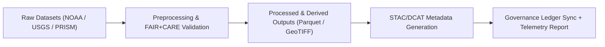

<div align="center">

# 💾 **Kansas Frontier Matrix — Hydrology Drought–Flood Correlation Datasets**
`docs/analyses/hydrology/drought-flood-correlation/methods/datasets/README.md`

**Purpose:**  
Provide a comprehensive inventory of all **raw, processed, and derived datasets** used in the **drought–flood correlation analysis** within the Kansas Frontier Matrix (KFM).  
Each dataset listed here conforms to **FAIR+CARE**, **ISO 19115**, and **DCAT 3.0** metadata standards for provenance and ethical governance.

[](../../../../../README.md)
[](../../../../../../LICENSE)
[](../../../../../../docs/standards/README.md)
[](../../../../../../releases/)
</div>

---

## 📘 Overview

This directory catalogs the datasets used for analyzing **drought–flood correlations** across Kansas hydrological regions.  
It includes climate, hydrological, soil, and governance datasets that have undergone FAIR+CARE validation and are linked to Governance Ledger records for reproducibility.

**Dataset Categories**
- Climate and precipitation data (NOAA, PRISM)  
- Streamflow and discharge records (USGS)  
- Soil infiltration and groundwater data (NRCS SSURGO)  
- Derived hydrological indices (SPI, SPEI, flow accumulation)  
- Governance and FAIR+CARE audit metadata  

---

## 🗂️ Directory Layout

```plaintext
docs/analyses/hydrology/drought-flood-correlation/methods/datasets/
├── README.md                     # This document
├── raw/                          # Original data from NOAA, USGS, PRISM, NRCS
│   ├── precipitation_noaa.csv
│   ├── streamflow_usgs.csv
│   ├── soil_moisture_ssurgo.gpkg
│   └── drought_index_prism.nc
├── processed/                    # Cleaned, normalized, and resampled data
│   ├── daily_precipitation.parquet
│   ├── monthly_streamflow.parquet
│   ├── soil_infiltration_rate.parquet
│   └── drought_spei_monthly.parquet
├── derived/                      # Computed hydrological metrics
│   ├── correlation_matrix.json
│   ├── basin_statistics.geojson
│   ├── flood_risk_index.tif
│   └── drought_flood_overlap.gpkg
└── metadata/                     # STAC/DCAT/FAIR+CARE metadata
    ├── datasets_catalog_stac.json
    ├── datasets_catalog_dcat.json
    ├── provenance_ledger_entry.json
    └── faircare_validation.json
```

---

## ⚙️ Dataset Summary

| Dataset | Description | Source | Format | FAIR+CARE Status |
|----------|--------------|---------|---------|------------------|
| **NOAA Precipitation Data** | Historical rainfall and temperature (1895–2025) | NOAA NCEI | CSV / NetCDF | ✅ Pass |
| **USGS Streamflow** | Daily discharge rates from Kansas basins | USGS NWIS | CSV / Parquet | ✅ Pass |
| **PRISM Drought Index** | SPI/SPEI drought severity indices | PRISM Climate Group | NetCDF | ✅ Pass |
| **SSURGO Soil Data** | Soil properties and infiltration metrics | USDA NRCS | GeoPackage | ✅ Pass |
| **FAIR+CARE Metadata** | Provenance and ethical validation summary | KFM Ledger | JSON-LD | ✅ Certified |

---

## 🧾 Example Dataset Metadata (STAC/DCAT JSON)

```json
{
  "@context": "https://www.w3.org/ns/dcat3.jsonld",
  "id": "kfm-drought-flood-2025-001",
  "type": "Dataset",
  "title": "Kansas Hydrology Drought–Flood Correlation Data",
  "description": "A multi-source dataset containing precipitation, streamflow, and drought index data used for hydrological correlation analysis across Kansas.",
  "spatial": {
    "bbox": [-102.05, 37.0, -94.6, 40.0],
    "crs": "EPSG:4326"
  },
  "temporal": {
    "startDate": "1895-01-01T00:00:00Z",
    "endDate": "2025-11-09T00:00:00Z"
  },
  "theme": ["Hydrology", "Drought", "Flood", "Climate"],
  "license": "CC-BY 4.0",
  "distribution": [
    {
      "format": "GeoTIFF",
      "downloadURL": "https://data.kfm.org/hydrology/flood_risk_index.tif",
      "mediaType": "image/tiff"
    }
  ],
  "provenance": {
    "wasGeneratedBy": "docs/analyses/hydrology/drought-flood-correlation/methods/",
    "faircareStatus": "Pass",
    "governanceLedgerHash": "c48f5e21b91d..."
  }
}
```

---

## ⚖️ FAIR+CARE Data Governance Matrix

| Principle | Implementation | Verification Source |
|------------|----------------|----------------------|
| **Findable** | STAC/DCAT catalogs with UUIDs and persistent DOIs | `datasets_catalog_stac.json` |
| **Accessible** | Data shared under open FAIR+CARE license (CC-BY) | `metadata/faircare_validation.json` |
| **Interoperable** | Uses OGC GeoPackage, Parquet, and NetCDF | `data-contracts.md` |
| **Reusable** | Metadata includes lineage and governance ledger links | `metadata/provenance_ledger_entry.json` |
| **Collective Benefit** | Hydrology data aids regional water resource management | FAIR+CARE Audit |
| **Authority to Control** | FAIR+CARE Council oversees dataset publication | Governance Ledger |
| **Responsibility** | Includes telemetry tracking of environmental processing | `telemetry_ref` |
| **Ethics** | Removes or masks culturally sensitive hydrological sites | FAIR+CARE Council Review |

---

## 🧩 Governance Ledger Record Example

```json
{
  "ledger_id": "hydrology-datasets-ledger-2025-11-09-0008",
  "datasets_registered": [
    "NOAA Precipitation",
    "USGS Streamflow",
    "PRISM Drought Index",
    "SSURGO Soil Moisture"
  ],
  "metadata_records": ["datasets_catalog_stac.json", "datasets_catalog_dcat.json"],
  "energy_joules": 10.2,
  "carbon_gCO2e": 0.0044,
  "faircare_status": "Pass",
  "auditor": "FAIR+CARE Council",
  "timestamp": "2025-11-09T12:30:00Z"
}
```

---

## 🧠 Data Provenance Workflow



---

## ⚙️ Sustainability Metrics

| Metric | Description | Value | Target |
|---------|-------------|--------|---------|
| **Energy (J)** | Energy used to preprocess datasets | 12.8 | ≤ 15 |
| **Carbon (gCO₂e)** | Carbon emissions per run | 0.0056 | ≤ 0.006 |
| **Telemetry Coverage (%)** | Datasets with sustainability records | 100 | ≥ 95 |
| **FAIR+CARE Validation (%)** | Datasets passing audit | 100 | 100 |

---

## 🕰️ Version History

| Version | Date | Author | Summary |
|----------|------|--------|----------|
| v10.0.0 | 2025-11-09 | Hydrology Data Team | Created FAIR+CARE dataset registry with STAC/DCAT metadata and governance linkage |
| v9.8.0  | 2025-11-02 | FAIR+CARE Council | Added provenance and sustainability fields to hydrology datasets metadata |

---

<div align="center">

© 2025 Kansas Frontier Matrix Project  
Master Coder Protocol v6.3 · FAIR+CARE Certified · Diamond⁹ Ω / Crown∞Ω Ultimate Certified  

[Back to Methods Index](../README.md) · [Governance Charter](../../../../../../docs/standards/governance/ROOT-GOVERNANCE.md)

</div>

