<div align="center">

# 🌊 **Kansas Frontier Matrix — Derived Hydrology Datasets for Drought–Flood Correlation Analysis**
`docs/analyses/hydrology/drought-flood-correlation/methods/datasets/derived/README.md`

**Purpose:**  
Describe all **derived datasets** produced from the Kansas Frontier Matrix (KFM) hydrology workflows analyzing drought–flood correlations.  
These datasets represent **computed hydrological metrics**, **spatial overlays**, and **correlation outputs** validated under **FAIR+CARE** and **ISO 19115 / 14064** frameworks.

[](../../../../../../README.md)
[](../../../../../../../LICENSE)
[](../../../../../../../docs/standards/README.md)
[](../../../../../../../releases/)
</div>

---

## 📘 Overview

This directory contains the **analytically derived hydrology datasets** generated during the drought–flood correlation analysis process.  
These outputs result from multi-step pipelines combining **climate**, **streamflow**, and **soil** data into geospatially harmonized layers, ready for **statistical and machine learning modeling**.

**Dataset Characteristics**
- Derived from NOAA, USGS, PRISM, and NRCS-processed data  
- Computed metrics include correlation coefficients, clustering indices, and flood risk maps  
- FAIR+CARE-validated and stored with telemetry metadata for sustainability audits  

---

## 🗂️ Directory Layout

```plaintext
docs/analyses/hydrology/drought-flood-correlation/methods/datasets/derived/
├── README.md                           # This document
├── correlation_matrix.json              # Correlation values between drought and flood indices
├── basin_statistics.geojson             # Catchment-level hydrology metrics
├── flood_risk_index.tif                 # Rasterized flood risk map
├── drought_flood_overlap.gpkg           # Spatial overlay of drought and flood areas
└── metadata/                            # Provenance and FAIR+CARE metadata
    ├── derived_datasets_meta.json
    ├── faircare_validation.json
    ├── provenance_hash.json
    └── ledger_entry.json
```

---

## ⚙️ Dataset Summary

| Dataset | Description | Format | FAIR+CARE Status |
|----------|-------------|---------|------------------|
| **correlation_matrix.json** | Statistical correlation results (Pearson, Spearman) | JSON | ✅ Pass |
| **basin_statistics.geojson** | Catchment-level drought/flood attributes | GeoJSON | ✅ Pass |
| **flood_risk_index.tif** | Raster flood risk derived from terrain & hydrology | GeoTIFF | ✅ Pass |
| **drought_flood_overlap.gpkg** | Combined spatial representation of drought/flood | GeoPackage | ✅ Pass |

---

## 🧩 Derivation Workflow

```mermaid
flowchart TD
A["Processed Hydrology Data (NOAA / USGS / PRISM / NRCS)"] --> B["Statistical Correlation Engine (Python/Pandas)"]
B --> C["Spatial Modeling (GeoPandas / GDAL / Rasterio)"]
C --> D["Overlay Analysis (Flood–Drought Co-occurrence)"]
D --> E["FAIR+CARE Validation + Governance Ledger Commit"]
```



---

## 🧾 Example Metadata Record (Excerpt)

```json
{
  "dataset_id": "kfm-hydro-derived-2025-001",
  "title": "Drought–Flood Correlation Outputs for Kansas Hydrology",
  "description": "Derived geospatial datasets containing drought–flood correlations, flood risk maps, and basin-level statistical summaries validated under FAIR+CARE.",
  "methods": ["Spearman Correlation", "Getis–Ord Gi*", "Overlay Intersection"],
  "spatial": {
    "bbox": [-102.05, 37.0, -94.6, 40.0],
    "crs": "EPSG:4326"
  },
  "temporal": {
    "startDate": "1895-01-01T00:00:00Z",
    "endDate": "2025-11-09T00:00:00Z"
  },
  "license": "CC-BY 4.0",
  "provenance": {
    "wasDerivedFrom": [
      "hydrology-processed-streamflow-2025",
      "hydrology-processed-precipitation-2025"
    ],
    "processingPipeline": "src/pipelines/analysis/hydrology/drought_flood_correlation.py",
    "energy_joules": 14.2,
    "carbon_gCO2e": 0.0059,
    "faircareStatus": "Pass",
    "governanceLedgerHash": "7c8a9b27de41..."
  }
}
```

---

## ⚖️ FAIR+CARE Validation Matrix

| Principle | Implementation | Validation Artifact |
|------------|----------------|--------------------|
| **Findable** | Indexed in DCAT 3.0 + Governance Ledger with UUIDs | `derived_datasets_meta.json` |
| **Accessible** | Public metadata and GeoTIFF/GeoJSON downloads | FAIR+CARE Registry |
| **Interoperable** | Harmonized formats (GeoPackage, GeoTIFF, JSON-LD) | `telemetry_schema` |
| **Reusable** | Includes provenance and energy/carbon telemetry | `manifest_ref` |
| **Collective Benefit** | Supports sustainable watershed management | FAIR+CARE Council Audit |
| **Authority to Control** | FAIR+CARE Council approves all derivative data | Governance Ledger |
| **Responsibility** | Energy and emissions tracked through telemetry | `telemetry_ref` |
| **Ethics** | Removes culturally sensitive locations in overlays | `faircare_validation.json` |

---

## 🧮 Sustainability Metrics

| Metric | Description | Value | Target |
|---------|-------------|--------|---------|
| **Energy (J)** | Power consumption during derivation | 14.2 | ≤ 15 |
| **Carbon (gCO₂e)** | CO₂ equivalent emissions | 0.0059 | ≤ 0.006 |
| **Telemetry Coverage (%)** | Entries with telemetry records | 100 | ≥ 95 |
| **FAIR+CARE Compliance (%)** | Datasets passing audits | 100 | 100 |

---

## 🧩 Governance Ledger Record Example

```json
{
  "ledger_id": "hydrology-derived-ledger-2025-11-09-0009",
  "derived_datasets": [
    "correlation_matrix.json",
    "basin_statistics.geojson",
    "flood_risk_index.tif",
    "drought_flood_overlap.gpkg"
  ],
  "energy_joules": 14.2,
  "carbon_gCO2e": 0.0059,
  "faircare_status": "Pass",
  "auditor": "FAIR+CARE Council",
  "timestamp": "2025-11-09T12:45:00Z"
}
```

---

## ⚙️ FAIR+CARE Validation Workflow


---

## 🕰️ Version History

| Version | Date | Author | Summary |
|----------|------|--------|----------|
| v10.0.0 | 2025-11-09 | Hydrology Analysis Team | Added complete derived dataset documentation with FAIR+CARE validation and governance linkage |
| v9.8.0  | 2025-11-02 | FAIR+CARE Council | Integrated telemetry-based sustainability reporting for derived outputs |

---

<div align="center">

© 2025 Kansas Frontier Matrix Project  
Master Coder Protocol v6.3 · FAIR+CARE Certified · Diamond⁹ Ω / Crown∞Ω Ultimate Certified  

[Back to Datasets Index](../README.md) · [Governance Charter](../../../../../../../docs/standards/governance/ROOT-GOVERNANCE.md)

</div>

