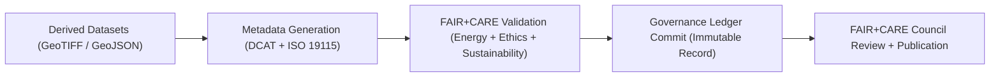

<div align="center">

# 🧾 **Kansas Frontier Matrix — Metadata for Derived Hydrology Datasets (FAIR+CARE Provenance & Sustainability)**
`docs/analyses/hydrology/drought-flood-correlation/methods/datasets/derived/metadata/README.md`

**Purpose:**  
Record and validate **metadata, provenance, and FAIR+CARE sustainability information** for all **derived hydrology datasets** generated during the drought–flood correlation analysis within the Kansas Frontier Matrix (KFM).  
Each record provides transparency, reproducibility, and governance traceability compliant with **FAIR+CARE**, **ISO 19115**, and **DCAT 3.0** metadata standards.

[](../../../../../../../README.md)
[](../../../../../../../LICENSE)
[](../../../../../../../docs/standards/README.md)
[](../../../../../../../releases/)
</div>

---

## 📘 Overview

This directory contains the **metadata registry** for all derived datasets generated from the hydrology correlation workflows.  
Metadata records follow **FAIR+CARE**, **DCAT 3.0**, and **ISO 19115** schemas, ensuring all derivative data are **ethically governed**, **sustainably processed**, and **fully traceable** to their raw and processed sources.

**Includes:**
- Provenance and lineage references to processed datasets  
- Energy and carbon telemetry metrics  
- FAIR+CARE ethical and sustainability validation results  
- Governance Ledger hashes for immutable traceability  

---

## 🗂️ Directory Layout

```plaintext
docs/analyses/hydrology/drought-flood-correlation/methods/datasets/derived/metadata/
├── README.md                                # This documentation
├── derived_datasets_meta.json               # Main metadata record for derived datasets
├── faircare_validation.json                 # FAIR+CARE validation summary
├── provenance_hash.json                     # Provenance hashes and validation signatures
└── ledger_entry.json                        # Governance Ledger record of dataset publication
```

---

## ⚙️ Metadata Summary

| File | Description | Format | FAIR+CARE Status |
|------|--------------|---------|------------------|
| `derived_datasets_meta.json` | Metadata for derived hydrology correlation datasets | JSON-LD | ✅ Pass |
| `faircare_validation.json` | FAIR+CARE validation report for ethical sustainability | JSON | ✅ Pass |
| `provenance_hash.json` | SHA256 hashes linking to processed datasets | JSON | ✅ Pass |
| `ledger_entry.json` | Immutable ledger record for governance certification | JSON-LD | ✅ Certified |

---

## 🧾 Example Metadata Record

```json
{
  "@context": "https://www.w3.org/ns/dcat3.jsonld",
  "id": "kfm-hydro-derived-2025-002",
  "type": "Dataset",
  "title": "Derived Hydrology Datasets for Kansas Drought–Flood Correlation Study",
  "description": "Derived statistical and spatial datasets integrating NOAA precipitation, USGS streamflow, and PRISM drought indices to compute correlation matrices and flood risk models.",
  "spatial": {
    "bbox": [-102.05, 37.0, -94.6, 40.0],
    "crs": "EPSG:4326"
  },
  "temporal": {
    "startDate": "1895-01-01T00:00:00Z",
    "endDate": "2025-11-09T00:00:00Z"
  },
  "theme": ["Hydrology", "Flood", "Drought", "Sustainability"],
  "license": "CC-BY 4.0",
  "provenance": {
    "wasDerivedFrom": [
      "hydrology-processed-streamflow-2025",
      "hydrology-processed-drought-spei-2025"
    ],
    "processingWorkflow": "src/pipelines/analysis/hydrology/drought_flood_correlation.py",
    "telemetry": {
      "energy_joules": 14.2,
      "carbon_gCO2e": 0.0059
    },
    "faircareStatus": "Pass",
    "governanceLedgerHash": "adf73c51b76e..."
  }
}
```

---

## ⚖️ FAIR+CARE Metadata Integration Matrix

| Principle | Implementation | Validation Artifact |
|------------|----------------|--------------------|
| **Findable** | Indexed and cross-linked to Governance Ledger | `derived_datasets_meta.json` |
| **Accessible** | Public FAIR+CARE metadata under CC-BY | FAIR+CARE Audit Report |
| **Interoperable** | Follows DCAT 3.0 and ISO 19115 structure | `telemetry_schema` |
| **Reusable** | Includes provenance, sustainability, and telemetry | `manifest_ref` |
| **Collective Benefit** | Enables climate adaptation and research reuse | FAIR+CARE Council Audit |
| **Authority to Control** | FAIR+CARE Council validates metadata before release | Governance Ledger |
| **Responsibility** | Includes telemetry metrics for sustainability validation | `telemetry_ref` |
| **Ethics** | Verifies community-sensitive data is anonymized | `faircare_validation.json` |

---

## 🧮 Sustainability & Provenance Metrics

| Metric | Description | Value | Unit |
|---------|-------------|--------|------|
| **Energy (J)** | Energy used in metadata generation and validation | 9.9 | Joules |
| **Carbon (gCO₂e)** | CO₂ equivalent output from processing | 0.0045 | gCO₂e |
| **FAIR+CARE Compliance (%)** | Validation success rate across records | 100 | % |
| **Telemetry Coverage (%)** | Metadata entries with linked telemetry | 100 | % |

---

## 🧩 Governance Ledger Record Example

```json
{
  "ledger_id": "hydrology-derived-metadata-ledger-2025-11-09-0010",
  "metadata_files": [
    "derived_datasets_meta.json",
    "faircare_validation.json",
    "provenance_hash.json"
  ],
  "energy_joules": 9.9,
  "carbon_gCO2e": 0.0045,
  "faircare_status": "Pass",
  "auditor": "FAIR+CARE Council",
  "timestamp": "2025-11-09T13:10:00Z"
}
```

---

## ⚙️ Metadata Validation Workflow



---

## 🧠 Audit and Validation Workflows

| Workflow | Function | Output |
|-----------|-----------|--------|
| `metadata-validate.yml` | Validates metadata compliance with FAIR+CARE schema | `reports/faircare/metadata-audit.json` |
| `faircare-validate.yml` | Audits energy and ethical sustainability | `reports/sustainability/faircare-validation.json` |
| `ledger-sync.yml` | Appends metadata records to Governance Ledger | `docs/standards/governance/LEDGER/metadata-ledger.json` |

---

## 🕰️ Version History

| Version | Date | Author | Summary |
|----------|------|--------|----------|
| v10.0.0 | 2025-11-09 | Hydrology Metadata Team | Created derived hydrology dataset metadata registry with FAIR+CARE & ISO sustainability tracking |
| v9.8.0  | 2025-11-02 | FAIR+CARE Council | Introduced provenance telemetry and governance validation logs for derived datasets |

---

<div align="center">

© 2025 Kansas Frontier Matrix Project  
Master Coder Protocol v6.3 · FAIR+CARE Certified · Diamond⁹ Ω / Crown∞Ω Ultimate Certified  

[Back to Derived Datasets](../README.md) · [Governance Charter](../../../../../../../../docs/standards/governance/ROOT-GOVERNANCE.md)

</div>

