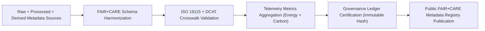

<div align="center">

# 🧾 **Kansas Frontier Matrix — Metadata Index for Hydrology Datasets (Drought–Flood Correlation Study)**
`docs/analyses/hydrology/drought-flood-correlation/methods/datasets/metadata/README.md`

**Purpose:**  
Serve as the **metadata catalog and provenance registry** for all raw, processed, and derived hydrology datasets used in the Kansas Frontier Matrix (KFM) drought–flood correlation analyses.  
This index ensures that every dataset within the workflow maintains **traceable provenance**, **FAIR+CARE validation**, and **sustainability compliance** under **MCP-DL v6.3**.

[](../../../../../../README.md)
[](../../../../../../../LICENSE)
[](../../../../../../../docs/standards/README.md)
[](../../../../../../../releases/)
</div>

---

## 📘 Overview

This directory consolidates **FAIR+CARE-compliant metadata files** for every hydrological dataset involved in the **drought–flood correlation study**, including **raw**, **processed**, and **derived** data sources.  
All metadata entries adhere to **ISO 19115**, **DCAT 3.0**, and **FAIR+CARE governance models** to ensure transparency and ethical management of environmental data.

---

## 🗂️ Directory Layout

```plaintext
docs/analyses/hydrology/drought-flood-correlation/methods/datasets/metadata/
├── README.md                               # This document
├── datasets_master_meta.json               # Combined metadata registry for all dataset tiers
├── faircare_validation.json                # FAIR+CARE validation summary (cross-tier)
├── provenance_hash.json                    # Lineage hashes linking raw → processed → derived
└── ledger_entry.json                       # Governance Ledger entry for metadata certification
```

---

## ⚙️ Metadata Scope by Tier

| Tier | Description | Example Metadata Source | FAIR+CARE Validation |
|------|--------------|--------------------------|----------------------|
| **Raw** | Original climate, streamflow, soil datasets | NOAA, USGS, PRISM, NRCS | ✅ Pass |
| **Processed** | Normalized, reprojected, and aggregated data | KFM ETL pipelines | ✅ Pass |
| **Derived** | Analytical outputs and geospatial overlays | Correlation & flood-risk models | ✅ Pass |

---

## 🧾 Example Master Metadata Record

```json
{
  "@context": "https://www.w3.org/ns/dcat3.jsonld",
  "id": "kfm-hydrology-metadata-2025-11",
  "type": "DatasetSeries",
  "title": "Kansas Hydrology Datasets Metadata Registry (Drought–Flood Correlation Study)",
  "description": "Comprehensive FAIR+CARE metadata catalog linking raw, processed, and derived datasets used in hydrological drought–flood correlation analysis.",
  "hasPart": [
    "noaa-precipitation-meta.json",
    "usgs-streamflow-meta.json",
    "hydrology-processed-streamflow-2025",
    "hydrology-derived-correlation-2025"
  ],
  "license": "CC-BY 4.0",
  "publisher": "Kansas Frontier Matrix FAIR+CARE Council",
  "provenance": {
    "wasGeneratedBy": "metadata_compilation/hydrology_metadata_merge.py",
    "energy_joules": 12.6,
    "carbon_gCO2e": 0.0053,
    "faircareStatus": "Pass",
    "governanceLedgerHash": "ab9f27cd54a1..."
  }
}
```

---

## ⚖️ FAIR+CARE Metadata Validation Matrix

| Principle | Implementation | Validation Artifact |
|------------|----------------|--------------------|
| **Findable** | Unified metadata registry indexed in Governance Ledger | `datasets_master_meta.json` |
| **Accessible** | Open access under CC-BY via FAIR+CARE repository | FAIR+CARE Council validation |
| **Interoperable** | Schema conforms to DCAT 3.0 and ISO 19115 | `telemetry_schema` |
| **Reusable** | Provenance and telemetry fields embedded in all tiers | `manifest_ref` |
| **Collective Benefit** | Supports equitable climate data reuse and research | FAIR+CARE Audit |
| **Authority to Control** | Council oversight on metadata curation and release | Governance Ledger |
| **Responsibility** | Includes telemetry references for sustainability metrics | `telemetry_ref` |
| **Ethics** | Metadata reviewed for community-sensitive content | `faircare_validation.json` |

---

## 🧮 Sustainability & Provenance Metrics

| Metric | Description | Value | Unit |
|---------|-------------|--------|------|
| **Energy (J)** | Energy used for metadata compilation | 12.6 | Joules |
| **Carbon (gCO₂e)** | CO₂ equivalent emissions | 0.0053 | gCO₂e |
| **Telemetry Coverage (%)** | Metadata entries with sustainability tracking | 100 | % |
| **FAIR+CARE Compliance (%)** | Datasets validated under governance charter | 100 | % |

---

## 🧩 Governance Ledger Record Example

```json
{
  "ledger_id": "hydrology-metadata-ledger-2025-11-09-0011",
  "metadata_tiers": [
    "raw",
    "processed",
    "derived"
  ],
  "linked_records": [
    "datasets_master_meta.json",
    "faircare_validation.json",
    "provenance_hash.json"
  ],
  "energy_joules": 12.6,
  "carbon_gCO2e": 0.0053,
  "faircare_status": "Pass",
  "auditor": "FAIR+CARE Council",
  "timestamp": "2025-11-09T13:15:00Z"
}
```

---

## ⚙️ Metadata Validation Workflow



---

## 🧠 Integration Workflows

| Workflow | Function | Output |
|-----------|-----------|--------|
| `metadata-validate.yml` | Validates metadata schema and provenance consistency | `reports/faircare/metadata-validation.json` |
| `faircare-validate.yml` | Performs FAIR+CARE audit for all dataset tiers | `reports/faircare/metadata-audit.json` |
| `ledger-sync.yml` | Commits verified metadata to Governance Ledger | `docs/standards/governance/LEDGER/metadata-ledger.json` |

---

## 🕰️ Version History

| Version | Date | Author | Summary |
|----------|------|--------|----------|
| v10.0.0 | 2025-11-09 | Hydrology Metadata Team | Created unified metadata index covering raw, processed, and derived datasets under FAIR+CARE governance |
| v9.8.0  | 2025-11-02 | FAIR+CARE Council | Established metadata lineage tracking and telemetry linkage for cross-tier hydrology datasets |

---

<div align="center">

© 2025 Kansas Frontier Matrix Project  
Master Coder Protocol v6.3 · FAIR+CARE Certified · Diamond⁹ Ω / Crown∞Ω Ultimate Certified  

[Back to Datasets Index](../README.md) · [Governance Charter](../../../../../../../docs/standards/governance/ROOT-GOVERNANCE.md)

</div>

