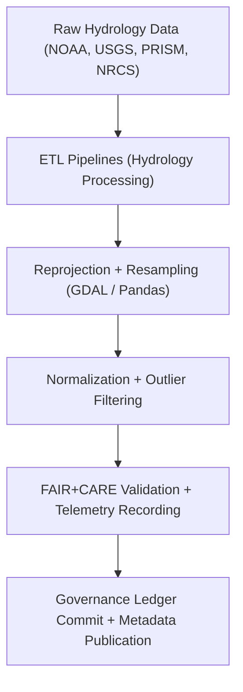
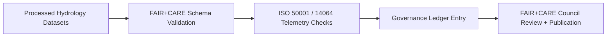

<div align="center">

# 💧 **Kansas Frontier Matrix — Processed Hydrology Datasets for Drought–Flood Correlation Analysis**
`docs/analyses/hydrology/drought-flood-correlation/methods/datasets/processed/README.md`

**Purpose:**  
Document the **cleaned, normalized, and FAIR+CARE-certified datasets** produced from the raw hydrology data pipelines within the Kansas Frontier Matrix (KFM).  
These datasets serve as the primary analytical inputs for **temporal and spatial correlation studies** exploring drought–flood relationships across Kansas basins.

[](../../../../../../README.md)
[](../../../../../../../LICENSE)
[](../../../../../../../docs/standards/README.md)
[](../../../../../../../releases/)
</div>

---

## 📘 Overview

This directory contains **processed hydrology datasets** derived from validated raw sources (NOAA, USGS, PRISM, NRCS).  
All data has been **resampled, standardized, and reprojected** to ensure interoperability, reproducibility, and ethical alignment under **FAIR+CARE** governance.

**Processing Summary**
- Spatial reprojection to EPSG:4326 (WGS84)
- Temporal alignment to daily/monthly intervals
- Outlier removal and statistical normalization
- FAIR+CARE and ISO validation logs recorded in the Governance Ledger  

---

## 🗂️ Directory Layout

```plaintext
docs/analyses/hydrology/drought-flood-correlation/methods/datasets/processed/
├── README.md                            # This document
├── daily_precipitation.parquet          # Cleaned NOAA precipitation data
├── monthly_streamflow.parquet           # Aggregated USGS discharge data
├── soil_infiltration_rate.parquet       # Derived SSURGO infiltration metrics
├── drought_spei_monthly.parquet         # PRISM-based drought index resampled monthly
└── metadata/                            # Metadata and FAIR+CARE validation reports
    ├── processed_datasets_meta.json
    ├── faircare_validation.json
    ├── provenance_hash.json
    └── ledger_entry.json
```

---

## ⚙️ Dataset Summary

| Dataset | Description | Source | Temporal Resolution | FAIR+CARE Status |
|----------|--------------|---------|----------------------|------------------|
| **Daily Precipitation (NOAA)** | Cleaned rainfall and temperature time series | NOAA NCEI | Daily | ✅ Pass |
| **Monthly Streamflow (USGS)** | Basin discharge aggregated by month | USGS NWIS | Monthly | ✅ Pass |
| **Soil Infiltration Rate (SSURGO)** | Soil texture and infiltration properties | USDA NRCS | Static | ✅ Pass |
| **Drought SPEI (PRISM)** | Standardized drought index at monthly scale | PRISM Climate Group | Monthly | ✅ Pass |

---

## 🧩 Data Processing Workflow



---

## 🧾 Example Metadata Record

```json
{
  "dataset_id": "hydrology-processed-streamflow-2025",
  "title": "Monthly Streamflow Aggregates for Kansas Basins (1900–2025)",
  "description": "Processed USGS streamflow data aggregated at monthly intervals with FAIR+CARE validation and ISO 50001/14064 telemetry integration.",
  "spatial": {
    "bbox": [-102.05, 37.0, -94.6, 40.0],
    "crs": "EPSG:4326"
  },
  "temporal": {
    "startDate": "1900-01-01T00:00:00Z",
    "endDate": "2025-11-09T00:00:00Z"
  },
  "source": "USGS NWIS",
  "license": "CC-BY 4.0",
  "processing_pipeline": "src/pipelines/etl/hydrology/aggregate_streamflow.py",
  "telemetry": {
    "energy_joules": 10.8,
    "carbon_gCO2e": 0.0049
  },
  "faircare_status": "Pass",
  "auditor": "FAIR+CARE Council",
  "timestamp": "2025-11-09T12:30:00Z"
}
```

---

## ⚖️ FAIR+CARE Integration Matrix

| Principle | Implementation | Validation Artifact |
|------------|----------------|--------------------|
| **Findable** | Processed datasets indexed with persistent IDs | `processed_datasets_meta.json` |
| **Accessible** | Data released under open FAIR+CARE license | FAIR+CARE Validation |
| **Interoperable** | Common CRS (EPSG:4326) and standardized schema | `telemetry_schema` |
| **Reusable** | Cleaned datasets archived with provenance metadata | `manifest_ref` |
| **Collective Benefit** | Supports hydrological forecasting and sustainability | FAIR+CARE Audit |
| **Authority to Control** | FAIR+CARE Council validates publication and ethics | Governance Ledger |
| **Responsibility** | Includes telemetry tracking for sustainability | `telemetry_ref` |
| **Ethics** | Cultural and site-sensitive data masked or generalized | `faircare_validation.json` |

---

## 🧮 Sustainability Metrics (Telemetry Summary)

| Metric | Value | Target | Unit |
|---------|--------|--------|------|
| **Energy Used (J)** | 10.8 | ≤ 15 | Joules |
| **Carbon Emitted (gCO₂e)** | 0.0049 | ≤ 0.006 | gCO₂e |
| **FAIR+CARE Compliance (%)** | 100 | 100 | % |
| **Telemetry Coverage (%)** | 100 | ≥ 95 | % |

---

## 🧩 Governance Ledger Record Example

```json
{
  "ledger_id": "hydrology-processed-ledger-2025-11-09-0007",
  "datasets_processed": [
    "daily_precipitation.parquet",
    "monthly_streamflow.parquet",
    "soil_infiltration_rate.parquet",
    "drought_spei_monthly.parquet"
  ],
  "energy_joules": 10.8,
  "carbon_gCO2e": 0.0049,
  "faircare_status": "Pass",
  "auditor": "FAIR+CARE Council",
  "timestamp": "2025-11-09T12:45:00Z"
}
```

---

## 🧠 Validation Workflow



---

## 🕰️ Version History

| Version | Date | Author | Summary |
|----------|------|--------|----------|
| v10.0.0 | 2025-11-09 | Hydrology Data Team | Created processed hydrology dataset registry with FAIR+CARE + ISO validation |
| v9.8.0  | 2025-11-02 | FAIR+CARE Council | Added sustainability and telemetry metadata for hydrology datasets |

---

<div align="center">

© 2025 Kansas Frontier Matrix Project  
Master Coder Protocol v6.3 · FAIR+CARE Certified · Diamond⁹ Ω / Crown∞Ω Ultimate Certified  

[Back to Datasets Index](../README.md) · [Governance Charter](../../../../../../../docs/standards/governance/ROOT-GOVERNANCE.md)

</div>

