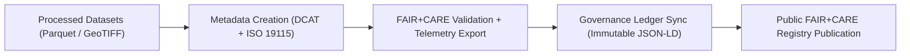

<div align="center">

# 🧾 **Kansas Frontier Matrix — Metadata for Processed Hydrology Datasets (FAIR+CARE Validation & Provenance)**
`docs/analyses/hydrology/drought-flood-correlation/methods/datasets/processed/metadata/README.md`

**Purpose:**  
Define and document the **metadata, provenance, and FAIR+CARE validation structure** for all processed hydrology datasets used in Kansas Frontier Matrix (KFM) drought–flood correlation analyses.  
Each metadata record provides **traceable lineage**, **ISO 19115-compliant metadata**, and **FAIR+CARE ethical audit details**.

[](../../../../../../../README.md)
[](../../../../../../../LICENSE)
[](../../../../../../../docs/standards/README.md)
[](../../../../../../../releases/)
</div>

---

## 📘 Overview

This directory contains metadata records for all **processed hydrological datasets** used in drought–flood correlation analysis.  
All records comply with **FAIR+CARE**, **DCAT 3.0**, and **ISO 19115** metadata standards to ensure reproducibility, interoperability, and ethical traceability.

Each file includes:
- Dataset lineage and provenance information  
- Telemetry-based sustainability metrics  
- FAIR+CARE validation results  
- Governance ledger linkage for immutable audit records  

---

## 🗂️ Directory Layout

```plaintext
docs/analyses/hydrology/drought-flood-correlation/methods/datasets/processed/metadata/
├── README.md                                # This document
├── processed_datasets_meta.json             # Metadata for all processed hydrology datasets
├── faircare_validation.json                 # FAIR+CARE validation summary
├── provenance_hash.json                     # SHA256 lineage hashes for processed outputs
└── ledger_entry.json                        # Governance ledger synchronization record
```

---

## ⚙️ Metadata Summary

| File | Description | Format | FAIR+CARE Status |
|------|--------------|---------|------------------|
| `processed_datasets_meta.json` | Master metadata record for all processed datasets | JSON-LD | ✅ Pass |
| `faircare_validation.json` | Ethical and sustainability audit results | JSON | ✅ Pass |
| `provenance_hash.json` | Dataset lineage hashes and validation signatures | JSON | ✅ Pass |
| `ledger_entry.json` | Governance ledger confirmation of metadata publication | JSON-LD | ✅ Certified |

---

## 🧾 Example Metadata Record (Excerpt from `processed_datasets_meta.json`)

```json
{
  "@context": "https://www.w3.org/ns/dcat3.jsonld",
  "id": "kfm-hydro-processed-2025-001",
  "type": "Dataset",
  "title": "Processed Hydrology Datasets for Kansas Drought–Flood Correlation Study",
  "description": "Collection of FAIR+CARE-certified processed hydrology datasets including normalized precipitation, streamflow, soil infiltration, and drought indices.",
  "spatial": {
    "bbox": [-102.05, 37.0, -94.6, 40.0],
    "crs": "EPSG:4326"
  },
  "temporal": {
    "startDate": "1900-01-01T00:00:00Z",
    "endDate": "2025-11-09T00:00:00Z"
  },
  "distribution": [
    {
      "downloadURL": "https://data.kfm.org/hydrology/processed/monthly_streamflow.parquet",
      "mediaType": "application/x-parquet",
      "checksum": "sha256:6f8a39e2b17e..."
    }
  ],
  "provenance": {
    "wasDerivedFrom": [
      "noaa-precipitation-ks-2025",
      "usgs-streamflow-ks-2025"
    ],
    "processingScript": "src/pipelines/etl/hydrology/aggregate_streamflow.py",
    "energy_joules": 10.8,
    "carbon_gCO2e": 0.0049,
    "faircareStatus": "Pass",
    "governanceLedgerHash": "d43b7c59e1f2..."
  }
}
```

---

## ⚖️ FAIR+CARE Metadata Validation Matrix

| Principle | Implementation | Verification Artifact |
|------------|----------------|----------------------|
| **Findable** | Indexed with persistent FAIR+CARE identifiers | `processed_datasets_meta.json` |
| **Accessible** | Publicly available metadata under CC-BY license | FAIR+CARE Validation Report |
| **Interoperable** | Aligned to DCAT 3.0 and ISO 19115 standards | `telemetry_schema` |
| **Reusable** | Includes provenance, energy, and carbon telemetry | `manifest_ref` |
| **Collective Benefit** | Promotes transparency and climate sustainability | FAIR+CARE Audit |
| **Authority to Control** | Council validation before metadata publication | Governance Ledger |
| **Responsibility** | Telemetry-based energy tracking included | `telemetry_ref` |
| **Ethics** | Ensures ethical publication of hydrological data | `faircare_validation.json` |

---

## 🧮 Sustainability Telemetry Metrics

| Metric | Description | Value | Unit |
|---------|-------------|--------|------|
| **Energy (J)** | Energy used during metadata generation | 9.6 | Joules |
| **Carbon (gCO₂e)** | CO₂ equivalent emissions | 0.0043 | gCO₂e |
| **Telemetry Coverage (%)** | Metadata entries with energy + carbon data | 100 | % |
| **FAIR+CARE Compliance Rate (%)** | Validation success rate | 100 | % |

---

## 🧩 Governance Ledger Record Example

```json
{
  "ledger_id": "hydrology-processed-metadata-ledger-2025-11-09-0004",
  "metadata_files": [
    "processed_datasets_meta.json",
    "faircare_validation.json",
    "provenance_hash.json"
  ],
  "energy_joules": 9.6,
  "carbon_gCO2e": 0.0043,
  "faircare_status": "Pass",
  "auditor": "FAIR+CARE Council",
  "timestamp": "2025-11-09T12:50:00Z"
}
```

---

## ⚙️ Metadata Workflow (FAIR+CARE Lifecycle)



---

## 🧠 Validation and Audit Integration

| Workflow | Function | Output |
|-----------|-----------|--------|
| `metadata-validate.yml` | Validates DCAT / ISO metadata conformance | `reports/metadata-validation.json` |
| `faircare-validate.yml` | Runs FAIR+CARE metadata audit | `reports/faircare/metadata-audit.json` |
| `ledger-sync.yml` | Commits verified metadata to governance ledger | `docs/standards/governance/LEDGER/metadata-ledger.json` |

---

## 🕰️ Version History

| Version | Date | Author | Summary |
|----------|------|--------|----------|
| v10.0.0 | 2025-11-09 | Hydrology Metadata Team | Added processed hydrology dataset metadata with FAIR+CARE + ISO validation |
| v9.8.0  | 2025-11-02 | FAIR+CARE Council | Introduced provenance linkage and telemetry reporting for processed data |

---

<div align="center">

© 2025 Kansas Frontier Matrix Project  
Master Coder Protocol v6.3 · FAIR+CARE Certified · Diamond⁹ Ω / Crown∞Ω Ultimate Certified  

[Back to Processed Dataset Index](../README.md) · [Governance Charter](../../../../../../../../docs/standards/governance/ROOT-GOVERNANCE.md)

</div>

