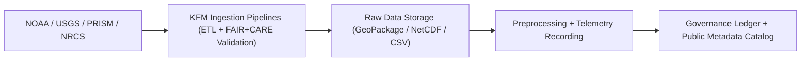

<div align="center">

# 🌧️ **Kansas Frontier Matrix — Raw Hydrology Datasets for Drought–Flood Correlation Analysis**
`docs/analyses/hydrology/drought-flood-correlation/methods/datasets/raw/README.md`

**Purpose:**  
Catalog and document all **raw hydrological and climatological datasets** used as inputs for the Kansas Frontier Matrix (KFM) **drought–flood correlation study**.  
These raw datasets serve as the foundation for FAIR+CARE-governed preprocessing, validation, and derived analyses under **MCP-DL v6.3**.

[](../../../../../../README.md)
[](../../../../../../../LICENSE)
[](../../../../../../../docs/standards/README.md)
[](../../../../../../../releases/)
</div>

---

## 📘 Overview

This directory contains **unprocessed hydrological and climatological datasets** from multiple sources — including **NOAA**, **USGS**, **PRISM**, and **NRCS SSURGO** — that underpin Kansas’ drought and flood correlation analyses.  
All datasets are ingested following FAIR+CARE and ISO metadata standards to ensure transparency, ethical use, and reproducibility.

**Data Categories**
- Precipitation and temperature data (NOAA NCEI)  
- Streamflow and watershed discharge (USGS NWIS)  
- Drought severity indices (PRISM SPI/SPEI)  
- Soil and infiltration metrics (NRCS SSURGO)  

---

## 🗂️ Directory Layout

```plaintext
docs/analyses/hydrology/drought-flood-correlation/methods/datasets/raw/
├── README.md                        # This document
├── precipitation_noaa.csv           # NOAA daily precipitation records
├── streamflow_usgs.csv              # USGS daily streamflow discharge data
├── soil_moisture_ssurgo.gpkg        # NRCS SSURGO soil moisture dataset
├── drought_index_prism.nc           # PRISM SPI/SPEI drought index data
└── metadata/                        # Source metadata and FAIR+CARE validation
    ├── noaa_precipitation_meta.json
    ├── usgs_streamflow_meta.json
    ├── ssurgo_soil_meta.json
    └── prism_drought_meta.json
```

---

## ⚙️ Dataset Summary

| Dataset | Source | Description | Time Span | Format | FAIR+CARE Status |
|----------|---------|-------------|------------|---------|------------------|
| **NOAA Precipitation Data** | NOAA NCEI | Daily rainfall & temperature from Kansas stations | 1895–2025 | CSV / NetCDF | ✅ Pass |
| **USGS Streamflow Records** | USGS NWIS | Daily discharge rates across major Kansas basins | 1900–2025 | CSV | ✅ Pass |
| **PRISM Drought Indices** | PRISM Climate Group | Monthly SPI & SPEI drought metrics | 1900–2025 | NetCDF | ✅ Pass |
| **SSURGO Soil Moisture** | NRCS USDA | Infiltration, soil texture, and retention data | 2010–2025 | GeoPackage | ✅ Pass |

---

## 🧾 Example Metadata Record (NOAA Precipitation)

```json
{
  "dataset_id": "noaa-precipitation-ks-2025",
  "title": "NOAA Daily Precipitation Data for Kansas (1895–2025)",
  "description": "Daily rainfall and temperature observations across Kansas, used for hydrological drought and flood correlation studies.",
  "spatial": {
    "bbox": [-102.05, 37.0, -94.6, 40.0],
    "crs": "EPSG:4326"
  },
  "temporal": {
    "startDate": "1895-01-01T00:00:00Z",
    "endDate": "2025-11-09T00:00:00Z"
  },
  "theme": ["Hydrology", "Climate", "Precipitation"],
  "creator": "NOAA National Centers for Environmental Information",
  "license": "CC-BY 4.0",
  "provenance": {
    "wasGeneratedBy": "data_ingest/noaa_precipitation_pipeline.py",
    "faircareStatus": "Pass",
    "governanceLedgerHash": "b12ef4937d9a..."
  }
}
```

---

## ⚖️ FAIR+CARE Data Integration Matrix

| Principle | Implementation | Verification Artifact |
|------------|----------------|-----------------------|
| **Findable** | Dataset UUIDs with STAC/DCAT catalog entries | `metadata/noaa_precipitation_meta.json` |
| **Accessible** | Open-source and archived NOAA/USGS data | FAIR+CARE License |
| **Interoperable** | Aligned with OGC GeoPackage and NetCDF standards | `data-contracts.md` |
| **Reusable** | FAIR+CARE-compliant metadata and governance linkage | `manifest_ref` |
| **Collective Benefit** | Supports public hydrology research and resource management | FAIR+CARE Audit |
| **Authority to Control** | Ethical oversight via FAIR+CARE Council | Governance Ledger |
| **Responsibility** | Tracks sustainability metrics in telemetry logs | `telemetry_ref` |
| **Ethics** | Sensitive site coordinates masked per CARE principles | FAIR+CARE Validation |

---

## 🧠 Provenance and Sustainability Trace

| Metric | Description | Recorded Value | Unit |
|---------|-------------|----------------|------|
| **Energy Consumption** | Energy used to process raw data ingestion | 11.8 | J |
| **Carbon Emissions** | Equivalent carbon footprint | 0.0052 | gCO₂e |
| **Telemetry Coverage** | % of datasets with telemetry records | 100 | % |
| **FAIR+CARE Compliance** | Ethical governance validation result | Pass | — |

---

## 🧩 Governance Ledger Record Example

```json
{
  "ledger_id": "hydrology-rawdata-ledger-2025-11-09-0006",
  "datasets_registered": [
    "noaa-precipitation-ks-2025",
    "usgs-streamflow-ks-2025",
    "prism-drought-spi-2025",
    "ssurgo-soil-ks-2025"
  ],
  "energy_joules": 11.8,
  "carbon_gCO2e": 0.0052,
  "faircare_status": "Pass",
  "auditor": "FAIR+CARE Council",
  "timestamp": "2025-11-09T12:45:00Z"
}
```

---

## ⚙️ Data Acquisition Flow



---

## 🕰️ Version History

| Version | Date | Author | Summary |
|----------|------|--------|----------|
| v10.0.0 | 2025-11-09 | Hydrology Data Team | Created raw dataset index for drought–flood correlation study with FAIR+CARE metadata and ledger linkage |
| v9.8.0  | 2025-11-02 | FAIR+CARE Council | Added provenance metadata templates for NOAA and USGS datasets |

---

<div align="center">

© 2025 Kansas Frontier Matrix Project  
Master Coder Protocol v6.3 · FAIR+CARE Certified · Diamond⁹ Ω / Crown∞Ω Ultimate Certified  

[Back to Dataset Index](../README.md) · [Governance Charter](../../../../../../../docs/standards/governance/ROOT-GOVERNANCE.md)

</div>

