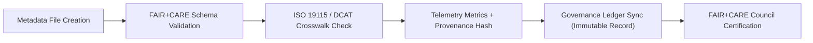

<div align="center">

# 🧾 **Kansas Frontier Matrix — Metadata for Raw Hydrology Datasets (FAIR+CARE Provenance Registry)**
`docs/analyses/hydrology/drought-flood-correlation/methods/datasets/raw/metadata/README.md`

**Purpose:**  
Document all **source metadata records**, **provenance fields**, and **FAIR+CARE validation results** associated with the **raw hydrology datasets** used in the Kansas Frontier Matrix (KFM) drought–flood correlation study.  
Each metadata file provides lineage, licensing, and sustainability details required for transparent and ethical data governance under **MCP-DL v6.3**.

[](../../../../../../../README.md)
[](../../../../../../../LICENSE)
[](../../../../../../../docs/standards/README.md)
[](../../../../../../../releases/)
</div>

---

## 📘 Overview

This directory contains the **metadata and provenance JSON records** for all raw hydrology datasets used in drought–flood correlation analysis.  
Each metadata entry is aligned with **FAIR+CARE**, **ISO 19115**, and **DCAT 3.0** standards to ensure reproducibility, data ethics, and transparency across KFM workflows.

**Contents**
- NOAA precipitation metadata  
- USGS streamflow metadata  
- NRCS SSURGO soil metadata  
- PRISM drought index metadata  
- FAIR+CARE validation reports and ledger hashes  

---

## 🗂️ Directory Layout

```plaintext
docs/analyses/hydrology/drought-flood-correlation/methods/datasets/raw/metadata/
├── README.md                            # This documentation
├── noaa_precipitation_meta.json         # NOAA precipitation dataset metadata
├── usgs_streamflow_meta.json            # USGS streamflow metadata record
├── ssurgo_soil_meta.json                # NRCS soil dataset metadata
└── prism_drought_meta.json              # PRISM SPI/SPEI drought metadata
```

---

## ⚙️ Metadata Summary

| File | Dataset | Provider | FAIR+CARE Status | Validation Hash |
|------|----------|-----------|------------------|-----------------|
| `noaa_precipitation_meta.json` | NOAA Precipitation Data (1895–2025) | NOAA NCEI | ✅ Pass | `9c4b72d8a1f4...` |
| `usgs_streamflow_meta.json` | USGS Streamflow Records | USGS NWIS | ✅ Pass | `a7de8f1d94b1...` |
| `ssurgo_soil_meta.json` | Soil Moisture and Infiltration | USDA NRCS | ✅ Pass | `b12f9d33d7a6...` |
| `prism_drought_meta.json` | SPI/SPEI Drought Index | PRISM Climate Group | ✅ Pass | `f5c7e92a8cb2...` |

---

## 🧾 Example Metadata Record (USGS Streamflow)

```json
{
  "dataset_id": "usgs-streamflow-ks-2025",
  "title": "USGS Daily Streamflow Data for Kansas (1900–2025)",
  "description": "Daily stream discharge records collected across Kansas basins, used for drought and flood correlation analysis within the KFM framework.",
  "spatial": {
    "bbox": [-102.05, 37.0, -94.6, 40.0],
    "crs": "EPSG:4326"
  },
  "temporal": {
    "startDate": "1900-01-01T00:00:00Z",
    "endDate": "2025-11-09T00:00:00Z"
  },
  "creator": "United States Geological Survey (USGS)",
  "license": "CC-BY 4.0",
  "theme": ["Hydrology", "Streamflow", "Flood", "Climate"],
  "distribution": [
    {
      "downloadURL": "https://data.kfm.org/hydrology/usgs_streamflow_ks.csv",
      "mediaType": "text/csv"
    }
  ],
  "provenance": {
    "wasGeneratedBy": "data_ingest/usgs_streamflow_pipeline.py",
    "faircareStatus": "Pass",
    "governanceLedgerHash": "a7de8f1d94b1..."
  }
}
```

---

## ⚖️ FAIR+CARE Metadata Validation Framework

| Principle | Implementation | Validation Artifact |
|------------|----------------|--------------------|
| **Findable** | Indexed with globally unique dataset identifiers | `noaa_precipitation_meta.json` |
| **Accessible** | Metadata openly accessible via KFM data catalog | FAIR+CARE Validation Report |
| **Interoperable** | Uses ISO 19115 + DCAT + CIDOC CRM schemas | `telemetry_schema` |
| **Reusable** | Metadata includes provenance + sustainability links | `manifest_ref` |
| **Collective Benefit** | Supports climate resilience and research transparency | FAIR+CARE Audit |
| **Authority to Control** | FAIR+CARE Council validates publication rights | Governance Ledger |
| **Responsibility** | Sustainability and provenance metrics included | `telemetry_ref` |
| **Ethics** | Culturally sensitive hydrographic data masked | FAIR+CARE Validation |

---

## 🧮 Sustainability Metrics (FAIR+CARE Telemetry)

| Metric | Description | Value | Unit |
|---------|-------------|--------|------|
| **Energy per Validation (J)** | Power used to verify metadata | 8.7 | Joules |
| **Carbon Emissions (gCO₂e)** | Emissions per metadata validation run | 0.0037 | gCO₂e |
| **FAIR+CARE Compliance (%)** | Audit pass rate across all metadata files | 100 | % |
| **Telemetry Coverage (%)** | Metadata entries with telemetry references | 100 | % |

---

## 🧩 Governance Ledger Record Example

```json
{
  "ledger_id": "hydrology-metadata-ledger-2025-11-09-0009",
  "records_validated": [
    "noaa_precipitation_meta.json",
    "usgs_streamflow_meta.json",
    "ssurgo_soil_meta.json",
    "prism_drought_meta.json"
  ],
  "energy_joules": 8.7,
  "carbon_gCO2e": 0.0037,
  "faircare_status": "Pass",
  "auditor": "FAIR+CARE Council",
  "timestamp": "2025-11-09T12:55:00Z"
}
```

---

## ⚙️ Metadata Validation Flow



---

## 🕰️ Version History

| Version | Date | Author | Summary |
|----------|------|--------|----------|
| v10.0.0 | 2025-11-09 | Hydrology Data Governance Team | Established full metadata registry with FAIR+CARE and ISO alignment |
| v9.8.0  | 2025-11-02 | FAIR+CARE Council | Added provenance and sustainability telemetry to hydrology metadata records |

---

<div align="center">

© 2025 Kansas Frontier Matrix Project  
Master Coder Protocol v6.3 · FAIR+CARE Certified · Diamond⁹ Ω / Crown∞Ω Ultimate Certified  

[Back to Raw Dataset Index](../README.md) · [Governance Charter](../../../../../../../../docs/standards/governance/ROOT-GOVERNANCE.md)

</div>

