<div align="center">

# 💧 **Kansas Frontier Matrix — Drought–Flood Correlation Preprocessing Methods**
`docs/analyses/hydrology/drought-flood-correlation/methods/preprocessing.md`

**Purpose:**  
Define and document the **data ingestion**, **quality control**, and **standardization** procedures used to prepare hydrologic and climate datasets for drought–flood correlation analyses in the Kansas Frontier Matrix (KFM).  
These steps ensure that every analytical pipeline adheres to FAIR+CARE reproducibility, ISO 50001 energy governance, and MCP-DL v6.3 documentation-first standards.

[](../../../../README.md)
[](../../../../../LICENSE)
[](../../../../../docs/standards/README.md)
[](../../../../../releases/)
</div>

---

## 📘 Overview

This preprocessing workflow converts raw hydrologic and climatologic observations into standardized, validated inputs for downstream correlation and modeling stages.  
Procedures include **gap detection**, **data validation**, **unit normalization**, **resampling to common temporal resolutions**, and **spatial harmonization** to basins and grids.  
All transformations are logged with telemetry metadata for reproducibility and ethical transparency.

---

## 🗂️ Directory Layout

```plaintext
docs/analyses/hydrology/drought-flood-correlation/methods/
├── README.md                                 # Overview of all methods
├── preprocessing.md                          # This document
├── correlation-analysis.md                   # Correlation computation procedures
├── temporal-alignment.md                     # Lag detection and realignment algorithms
├── spatial-modeling.md                       # Basin and raster spatial correlation modeling
├── validation.md                             # FAIR+CARE + ISO validation framework
└── datasets/
    ├── raw/                                  # NOAA / USGS / Daymet / PRISM inputs
    ├── processed/                            # Cleaned, standardized time-series
    ├── derived/                              # Drought and flood indices
    └── metadata/                             # STAC/DCAT metadata and telemetry
```

---

## ⚙️ Preprocessing Framework

```mermaid
flowchart TD
  A["Raw Datasets (NOAA, USGS, Daymet, PRISM)"] --> B["Data Integrity Checks & QA/QC"]
  B --> C["Temporal Alignment (Daily → Monthly Aggregates)"]
  C --> D["Spatial Harmonization (Station → Basin → Raster)"]
  D --> E["Normalization & Standardization (Units, Baselines)"]
  E --> F["FAIR+CARE Validation + Telemetry Logging"]
```



### Pipeline Stages

| Stage | Objective | Outputs |
|-------|------------|----------|
| **Ingestion** | Fetch and parse all hydrologic sources; auto-verify metadata completeness. | Raw CSV/JSON/NetCDF imports; checksum registry. |
| **Validation & QA/QC** | Detect missing, duplicate, or inconsistent records; apply range thresholds and time continuity tests. | QA summary reports per station/basin. |
| **Temporal Resampling** | Aggregate daily data to monthly values (SPI/SPEI input), apply moving-average smoothing. | Continuous monthly series aligned to water-year. |
| **Spatial Reprojection & Join** | Map point data to HUC-8 basins, grid cells (1 km), and Kansas boundary extent. | Basin-mean and grid-based datasets. |
| **Normalization & Unit Conversion** | Standardize precipitation, temperature, discharge to SI units. | SI-consistent values for modeling. |
| **Validation Logging** | Write all validation events, decisions, and energy telemetry. | FAIR+CARE validation log + Governance Ledger record. |

---

## 🧪 Quality Control Procedures

| Validation Rule | Description | Threshold / Logic |
|-----------------|--------------|-------------------|
| **Missing Value Ratio** | % missing < 10% over record period; otherwise mark as low confidence. | Flag if missing > 10%. |
| **Extreme Outlier Test** | Z-score > 4 removed (precip, discharge) unless verified by event catalog. | Robust Z filter. |
| **Temporal Consistency** | No gaps > 30 days; interpolate short gaps. | Linear or climatological fill. |
| **Duplicate Timestamps** | Duplicates merged via mean; counts logged. | Aggregation rule enforced. |
| **Unit Validation** | Validate units per dataset metadata (e.g., in→mm). | Cross-check unit registry. |

Results summarized in `reports/validation/preprocessing_qc.json`.

---

## 📊 Temporal Standardization

All hydrologic and climate records are standardized to **Water Year (Oct–Sep)** to align drought and flood analysis.  
Resampling follows these conventions:

| Variable | Original Resolution | Target | Aggregation Function |
|-----------|---------------------|---------|-----------------------|
| Precipitation | Daily | Monthly | Sum |
| Temperature | Daily | Monthly | Mean |
| Discharge | Daily | Monthly | Max / Mean |
| Evapotranspiration | Daily | Monthly | Sum |

Temporal adjustments ensure comparability of SPI/SPEI indices and flood peaks across years.

---

## 🗺️ Spatial Harmonization

Spatial preprocessing aggregates station or grid data to **HUC-8** watershed basins.  
Steps include:

1. Assign stations to basins using shapefile joins (`GeoPandas`).  
2. Apply distance-weighted interpolation where station density < 3 per basin.  
3. Reproject rasters to EPSG:4326 (WGS84) for consistency.  
4. Resample grid data to 1 km resolution to align with Daymet.  
5. Store results as GeoTIFF/COG for ingestion by correlation and modeling scripts.

---

## 📈 Normalization and Unit Conversion

| Variable | Input Unit | Standard Unit | Conversion Formula |
|-----------|-------------|----------------|--------------------|
| Precipitation | inches | millimeters | P(mm) = P(in) × 25.4 |
| Discharge | cubic feet/s | cubic meters/s | Q(m³/s) = Q(cfs) × 0.0283168 |
| Temperature | °F | °C | T(°C) = (T(°F) − 32) × 5/9 |
| Evapotranspiration | inches | millimeters | Same as precipitation |

All conversions validated through automated schema tests (`pytest + pydantic`) to ensure reproducibility.

---

## 🧩 FAIR+CARE Validation Metrics

| Principle | Metric | Example |
|------------|---------|----------|
| **Findable** | Datasets assigned persistent UUIDs in STAC/DCAT catalogs. | `NOAA-GHCN-2025-UUID` |
| **Accessible** | Public API + static access via `data/processed/`. | JSON + NetCDF outputs. |
| **Interoperable** | CRS EPSG:4326; formats GeoJSON/COG/CSV. | Compatible with GIS clients. |
| **Reusable** | Provenance metadata + license info attached. | CC-BY + JSON-LD lineage. |
| **CARE Ethics** | Sensitive gage coordinates anonymized (<1 km). | Ethical compliance log. |

---

## 🧮 Telemetry Example (ISO 50001 / 14064)

```json
{
  "process_id": "preprocessing-hydrology-2025-11-09-001",
  "datasets": ["NOAA-GHCN", "USGS-NWIS", "Daymet"],
  "steps": ["QA/QC", "Resample", "Reproject"],
  "energy_joules": 12.7,
  "carbon_gCO2e": 0.0049,
  "telemetry_coverage": 100,
  "status": "Pass",
  "auditor": "FAIR+CARE Council",
  "timestamp": "2025-11-09T12:55:00Z"
}
```

---

## ⚙️ Governance Ledger Entry Example

```json
{
  "ledger_id": "preprocessing-ledger-2025-11-09-002",
  "analyst": "Hydrology Preprocessing Team",
  "datasets": ["NOAA", "USGS", "Daymet"],
  "validation_status": "Pass",
  "energy_joules": 12.7,
  "carbon_gCO2e": 0.0049,
  "governance_ref": "ROOT-GOVERNANCE.md",
  "timestamp": "2025-11-09T13:00:00Z"
}
```

---

## 🕰️ Version History

| Version | Date | Author | Summary |
|----------|------|--------|----------|
| v10.2.2 | 2025-11-09 | Hydrology Methods Group | Created preprocessing guide aligned with correlation methods README structure. |
| v10.2.1 | 2025-11-09 | FAIR+CARE Council | Added telemetry and ISO 50001 logging framework. |
| v10.2.0 | 2025-11-09 | Hydrology Analysis Team | Initial publication with FAIR+CARE-compliant preprocessing workflows. |

---

<div align="center">

© 2025 Kansas Frontier Matrix Project  
Master Coder Protocol v6.3 · FAIR+CARE Certified · Diamond⁹ Ω / Crown∞Ω Ultimate Certified  

[Back to Hydrology Correlation Methods](./README.md) · [Governance Charter](../../../../../docs/standards/governance/ROOT-GOVERNANCE.md)

</div>

