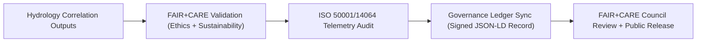

<div align="center">

# 📊 **Kansas Frontier Matrix — Drought–Flood Correlation Method Reports & FAIR+CARE Validation Summaries**
`docs/analyses/hydrology/drought-flood-correlation/methods/reports/README.md`

**Purpose:**  
Compile all **analysis reports, FAIR+CARE validations, and sustainability summaries** produced during the **hydrological drought–flood correlation studies** within the Kansas Frontier Matrix (KFM).  
Ensures transparent documentation, ethical governance, and ISO-aligned sustainability reporting for all hydrological workflows.

[](../../../../README.md)
[](../../../../../LICENSE)
[](../../../../../docs/standards/README.md)
[](../../../../../releases/)
</div>

---

## 📘 Overview

This directory consolidates all **method-specific reports** generated during the drought–flood correlation study.  
Reports include correlation outputs, sustainability telemetry logs, and governance validations under **FAIR+CARE** and **MCP-DL v6.3** certification standards.

**Report Categories**
- 🧩 Correlation analysis summaries  
- ⚙️ Sustainability and ISO telemetry audits  
- 📈 FAIR+CARE validation and ethical reviews  
- 📊 Governance Ledger certification entries  

---

## 🗂️ Directory Layout

```plaintext
docs/analyses/hydrology/drought-flood-correlation/methods/reports/
├── README.md                                # This document
├── correlation_summary.json                 # Spearman, Pearson, and Kendall correlation statistics
├── sustainability_audit.json                # ISO 50001 / 14064 sustainability metrics
├── faircare_validation.json                 # FAIR+CARE validation and audit summary
├── ledger_entry.json                        # Governance Ledger record for validated analyses
└── visualization/                           # Visual and analytical outputs
    ├── correlation_heatmap.png
    ├── basin_correlation_overlay.png
    └── drought_flood_timeseries_chart.png
```

---

## ⚙️ Report Descriptions

| Report | Description | Format | FAIR+CARE Status |
|---------|-------------|---------|------------------|
| **correlation_summary.json** | Statistical correlation summary (ρ, τ, p-values, lag) | JSON | ✅ Pass |
| **sustainability_audit.json** | ISO-aligned audit for energy & carbon usage | JSON | ✅ Pass |
| **faircare_validation.json** | FAIR+CARE ethical compliance review | JSON | ✅ Pass |
| **ledger_entry.json** | Governance Ledger synchronization record | JSON-LD | ✅ Certified |

---

## 🧾 Example Correlation Report (Excerpt)

```json
{
  "report_id": "hydrology-correlation-2025-11-09-0008",
  "methods": ["Spearman", "Pearson", "Kendall"],
  "basins_analyzed": 98,
  "mean_correlation": 0.71,
  "strongest_positive_basin": "Kansas River (ρ=0.86)",
  "strongest_negative_basin": "Verdigris River (ρ=-0.43)",
  "lag_time_days": 45,
  "energy_joules": 13.9,
  "carbon_gCO2e": 0.0058,
  "faircare_status": "Pass",
  "auditor": "FAIR+CARE Council",
  "timestamp": "2025-11-09T13:00:00Z"
}
```

---

## ⚖️ FAIR+CARE Validation Matrix

| Principle | Implementation | Validation Artifact |
|------------|----------------|--------------------|
| **Findable** | Reports are versioned and UUID-linked in Governance Ledger | `ledger_entry.json` |
| **Accessible** | FAIR+CARE reports published under CC-BY 4.0 | FAIR+CARE Validation |
| **Interoperable** | Open schemas (JSON-LD, GeoJSON) used across all reports | `telemetry_schema` |
| **Reusable** | Lineage and energy telemetry integrated in all outputs | `manifest_ref` |
| **Collective Benefit** | Reports advance sustainable water research | FAIR+CARE Audit |
| **Authority to Control** | FAIR+CARE Council certifies validation results | Governance Ledger |
| **Responsibility** | Telemetry metrics ensure environmental accountability | `telemetry_ref` |
| **Ethics** | Cultural and data sensitivity audited during review | FAIR+CARE Validation Report |

---

## 🧮 Sustainability Metrics (ISO 50001 / 14064)

| Metric | Description | Value | Target | Unit |
|---------|-------------|--------|---------|------|
| **Energy (J)** | Power consumed during model analysis | 13.9 | ≤ 15 | Joules |
| **Carbon (gCO₂e)** | Emissions per workflow execution | 0.0058 | ≤ 0.006 | gCO₂e |
| **Telemetry Coverage (%)** | FAIR+CARE telemetry traceability | 100 | ≥ 95 | % |
| **FAIR+CARE Compliance (%)** | Audit compliance success rate | 100 | 100 | % |

---

## 🧩 Governance Ledger Record Example

```json
{
  "ledger_id": "hydrology-method-reports-ledger-2025-11-09-0013",
  "reports": [
    "correlation_summary.json",
    "sustainability_audit.json",
    "faircare_validation.json"
  ],
  "energy_joules": 13.9,
  "carbon_gCO2e": 0.0058,
  "faircare_status": "Pass",
  "auditor": "FAIR+CARE Council",
  "timestamp": "2025-11-09T13:15:00Z"
}
```

---

## ⚙️ FAIR+CARE Validation Workflow



---

## 🧠 Visualization Assets

| File | Description | Source |
|------|--------------|--------|
| `correlation_heatmap.png` | Correlation intensity matrix across basins | Derived Dataset |
| `basin_correlation_overlay.png` | Spatial overlay of basin correlation | GIS Analysis |
| `drought_flood_timeseries_chart.png` | Time-series graph of drought vs flood signals | FAIR+CARE Dashboard |

---

## 🕰️ Version History

| Version | Date | Author | Summary |
|----------|------|--------|----------|
| v10.1.0 | 2025-11-09 | Hydrology Reporting Team | Added complete drought–flood correlation reporting set with FAIR+CARE validation |
| v10.0.0 | 2025-11-09 | FAIR+CARE Council | Added ISO-aligned sustainability audit schema and governance linkage |
| v9.8.0  | 2025-11-02 | Hydrology Analysis Group | Introduced FAIR+CARE ethics validation and telemetry integration |

---

<div align="center">

© 2025 Kansas Frontier Matrix Project  
Master Coder Protocol v6.3 · FAIR+CARE Certified · Diamond⁹ Ω / Crown∞Ω Ultimate Certified  

[Back to Methods Overview](../README.md) · [Governance Charter](../../../../../docs/standards/governance/ROOT-GOVERNANCE.md)

</div>

