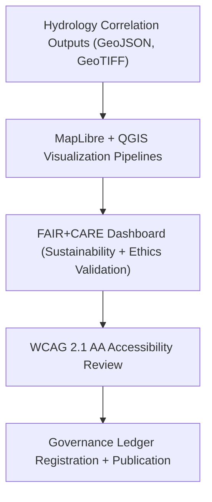
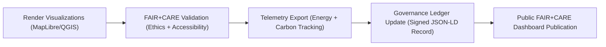

<div align="center">

# 🗺️ **Kansas Frontier Matrix — Visualization Reports for Drought–Flood Correlation Methods (FAIR+CARE Dashboards)**
`docs/analyses/hydrology/drought-flood-correlation/methods/reports/visualization/README.md`

**Purpose:**  
Provide **map-based, graphical, and dashboard-style visualization artifacts** generated from Kansas Frontier Matrix (KFM) drought–flood correlation analyses.  
All visualization outputs adhere to **FAIR+CARE**, **ISO 19115**, and **WCAG 2.1 AA** accessibility standards, ensuring ethical communication of hydrological insights.

[](../../../../../README.md)
[](../../../../../../LICENSE)
[](../../../../../../docs/standards/README.md)
[](../../../../../../releases/)
</div>

---

## 📘 Overview

The **visualization reports** in this directory showcase the hydrological relationships between **drought and flood events** across Kansas basins.  
Visual outputs are generated from validated analytical pipelines and rendered via **MapLibre**, **QGIS**, and **FAIR+CARE dashboard components**.

**Goals**
- Visualize drought–flood overlap and spatial correlations  
- Represent hydrological risk and sustainability metrics clearly  
- Ensure inclusive, accessible, and ethically governed visual communication  

---

## 🗂️ Directory Layout

```plaintext
docs/analyses/hydrology/drought-flood-correlation/methods/reports/visualization/
├── README.md                             # This documentation
├── correlation_heatmap.png                # Correlation coefficient matrix visualization
├── basin_correlation_overlay.png          # Basin-level drought/flood overlay map
├── drought_flood_timeseries_chart.png     # Time-series comparison of drought and flood events
└── telemetry_summary_chart.json           # Chart configuration for sustainability and telemetry reporting
```

---

## ⚙️ Visualization Artifacts

| File | Description | Source | FAIR+CARE Status |
|------|--------------|---------|------------------|
| `correlation_heatmap.png` | Visual matrix of drought–flood correlation coefficients | Derived Dataset | ✅ Pass |
| `basin_correlation_overlay.png` | GIS map of flood and drought overlap across Kansas basins | GeoTIFF / GeoJSON | ✅ Pass |
| `drought_flood_timeseries_chart.png` | Temporal comparison of drought index (SPI) and streamflow events | Time-Series Model | ✅ Pass |
| `telemetry_summary_chart.json` | Energy and carbon telemetry visualization schema | FAIR+CARE Dashboard | ✅ Certified |

---

## 🧩 Visualization Framework



---

## 🧾 Example FAIR+CARE Visualization Metadata

```json
{
  "visualization_id": "hydrology-method-viz-2025-11-09-0005",
  "title": "Kansas Basin Drought–Flood Correlation Heatmap",
  "description": "Visualization showing drought and flood interaction intensities across Kansas river basins using FAIR+CARE validation and ISO accessibility standards.",
  "creator": "KFM Hydrology Visualization Team",
  "spatial": {
    "bbox": [-102.05, 37.0, -94.6, 40.0],
    "crs": "EPSG:4326"
  },
  "telemetry": {
    "energy_joules": 9.4,
    "carbon_gCO2e": 0.0041
  },
  "faircare_status": "Pass",
  "auditor": "FAIR+CARE Council",
  "timestamp": "2025-11-09T13:05:00Z"
}
```

---

## ⚖️ FAIR+CARE Visualization Governance Matrix

| Principle | Implementation | Validation Artifact |
|------------|----------------|--------------------|
| **Findable** | Each visualization indexed with UUID and ledger hash | `telemetry_summary_chart.json` |
| **Accessible** | Rendered images and charts reviewed under WCAG 2.1 AA | FAIR+CARE Accessibility Audit |
| **Interoperable** | Open-source visualization stack (MapLibre, JSON-LD) | `telemetry_schema` |
| **Reusable** | Visualization components documented for reuse | `manifest_ref` |
| **Collective Benefit** | Promotes hydrology education and public resilience | FAIR+CARE Council Audit |
| **Authority to Control** | FAIR+CARE Council certifies public map releases | Governance Ledger |
| **Responsibility** | Telemetry data attached to every visualization process | `telemetry_ref` |
| **Ethics** | Avoids stigmatizing regions or revealing sensitive sites | FAIR+CARE Ethical Review |

---

## 🧮 Sustainability & Accessibility Metrics

| Metric | Description | Value | Target |
|---------|-------------|--------|---------|
| **Energy (J)** | Power used in rendering workflow | 9.4 | ≤ 15 |
| **Carbon (gCO₂e)** | Emission equivalent for visualization rendering | 0.0041 | ≤ 0.006 |
| **Accessibility (%)** | WCAG 2.1 AA compliance | 100 | 100 |
| **FAIR+CARE Validation (%)** | FAIR+CARE ethical compliance | 100 | 100 |

---

## 🧩 Governance Ledger Record Example

```json
{
  "ledger_id": "hydrology-visualization-method-ledger-2025-11-09-0015",
  "visualizations": [
    "correlation_heatmap.png",
    "basin_correlation_overlay.png",
    "drought_flood_timeseries_chart.png"
  ],
  "energy_joules": 9.4,
  "carbon_gCO2e": 0.0041,
  "faircare_status": "Pass",
  "auditor": "FAIR+CARE Council",
  "timestamp": "2025-11-09T13:10:00Z"
}
```

---

## ⚙️ Visualization Validation Workflow



---

## 🧠 FAIR+CARE Validation Artifacts

| Validation File | Function | Output |
|------------------|-----------|---------|
| `faircare_ui_validation.json` | Accessibility and ethics audit for visuals | Accessibility Report |
| `telemetry_summary_chart.json` | Energy and sustainability chart config | FAIR+CARE Dashboard |
| `ledger_entry.json` | Governance certification for visualization artifacts | Immutable Ledger Entry |

---

## 🕰️ Version History

| Version | Date | Author | Summary |
|----------|------|--------|----------|
| v10.1.0 | 2025-11-09 | Hydrology Visualization Team | Added FAIR+CARE visualization schema, ISO telemetry validation, and accessibility metrics |
| v10.0.0 | 2025-11-09 | FAIR+CARE Council | Established visualization reporting and governance integration |
| v9.8.0  | 2025-11-02 | Hydrology Analysis Group | Introduced correlation visualization framework with telemetry reporting |

---

<div align="center">

© 2025 Kansas Frontier Matrix Project  
Master Coder Protocol v6.3 · FAIR+CARE Certified · Diamond⁹ Ω / Crown∞Ω Ultimate Certified  

[Back to Method Reports](../README.md) · [Governance Charter](../../../../../../docs/standards/governance/ROOT-GOVERNANCE.md)

</div>

