<div align="center">

# 💧 **Kansas Frontier Matrix — Drought–Flood Spatial Modeling Methods**
`docs/analyses/hydrology/drought-flood-correlation/methods/spatial-modeling.md`

**Purpose:**  
Describe the **spatial statistical**, **GIS-based**, and **machine learning** procedures that map drought–flood interactions across Kansas watersheds.  
This document ensures reproducibility and sustainability under **FAIR+CARE** and **MCP-DL v6.3** by detailing model inputs, algorithms, outputs, and governance tracking.

[](../../../../README.md)
[](../../../../../LICENSE)
[](../../../../../docs/standards/README.md)
[](../../../../../releases/)
</div>

---

## 📘 Overview

The spatial modeling component translates tabular correlation results into **geographically explicit representations** at basin and raster scales.  
Models are computed for each HUC-8 watershed and aggregated into GeoTIFF, GeoPackage, and vector overlays for visualization in the Kansas Frontier Matrix (KFM) interactive map.  
All computations follow open spatial analysis standards (PySAL, GeoPandas, GDAL) and log sustainability metrics via telemetry.

---

## 🗂️ Directory Layout

```plaintext
docs/analyses/hydrology/drought-flood-correlation/methods/
├── README.md                                 # Overview
├── preprocessing.md                          # Preprocessing and QC
├── correlation-analysis.md                   # Correlation computation
├── temporal-alignment.md                     # Lag analysis and resampling
├── spatial-modeling.md                       # This document
├── validation.md                             # FAIR+CARE + ISO validation
└── datasets/
    ├── derived/                              # Correlation and lag outputs
    ├── processed/                            # Basin and raster datasets
    └── metadata/                             # STAC/DCAT spatial metadata
```

---

## 🧭 Spatial Modeling Framework

```mermaid
flowchart TD
  A["Basin-Level Correlation Tables"] --> B["Spatial Join (HUC-8 Geometry)"]
  B --> C["Spatial Autocorrelation Analysis (Moran’s I / Gi*)"]
  C --> D["Interpolation & Rasterization (IDW / Kriging)"]
  D --> E["Map Generation (GeoTIFF / COG / GeoJSON)"]
  E --> F["Validation + FAIR+CARE Telemetry"]
```



---

## ⚙️ Spatial Data Inputs

| Dataset | Role | Resolution | CRS |
|----------|------|-------------|-----|
| **NOAA / USGS / Daymet Derived Metrics** | SPI/SPEI, Qpeak, duration | Basin-aggregated / 1 km | EPSG:4326 |
| **Hydrologic Unit Boundaries (HUC-8)** | Spatial aggregation zones | Polygon (1:100,000) | EPSG:4269 (reprojected to 4326) |
| **Digital Elevation Model (DEM)** | Terrain & flow direction | 30 m (SRTM) | EPSG:4326 |
| **Land Use / Land Cover (NLCD)** | Contextual variables | 30 m | EPSG:4326 |
| **Soil Data (SSURGO/STATSGO)** | Hydrologic soil groups | Polygon / 1 km grid | EPSG:4326 |

---

## 🧮 Modeling Procedures

### 1️⃣ Basin-Level Spatial Correlation
1. Join correlation outputs (`r`, `p`, `lag_mo`) from `correlation-analysis.md` to HUC-8 geometries using `GeoPandas.sjoin`.
2. Apply **Local Indicators of Spatial Association (LISA)** via **PySAL**:
   ```python
   from esda.moran import Moran
   moran_r = Moran(df['r'], w)
   ```
3. Compute:
   - **Global Moran’s I** – overall clustering of correlation intensity.
   - **Local Moran’s I** – identify hotspots and coldspots of high/low correlation.
   - **Getis–Ord Gi\*** – statistical significance of clustered high values.

Outputs:
- `moran_global.csv`  
- `moran_local.geojson`  
- `gi_star.geojson`

---

### 2️⃣ Raster Interpolation

Interpolations transform basin-level values into continuous surfaces:
| Method | Description | Library |
|--------|--------------|----------|
| **Inverse Distance Weighting (IDW)** | Weighted average by distance; good for dense observations. | `PyKrige`, `scipy.interpolate` |
| **Ordinary Kriging** | Geostatistical interpolation with variogram fitting. | `PyKrige.kriging` |
| **Spline / RBF** | Smooth surfaces for visualization. | `scipy.interpolate.Rbf` |

Example snippet:
```python
from pykrige.ok import OrdinaryKriging
OK = OrdinaryKriging(x, y, z, variogram_model='spherical')
z_interp, ss = OK.execute('grid', gridx, gridy)
```

Results exported as GeoTIFF/COG and indexed in STAC (`data/processed/hydrology/spatial_models/`).

---

### 3️⃣ Terrain and Contextual Factors

Spatial models incorporate covariates to explain drought–flood spatial variance:
- **Slope / Aspect (DEM-derived):** Influence on runoff concentration.  
- **Soil Permeability:** Derived from SSURGO Ksat; indicates infiltration capacity.  
- **Land Cover Fraction:** % impervious surface (NLCD).  
- **Rainfall Gradient:** Spatial gradient computed from Daymet.  

Regression models (OLS, GWR, or Random Forest) quantify how these features modulate correlation strength:
```python
import mgwr.gwr as gwr
model = gwr.GWR(coords, y, X, bw=bw).fit()
```

---

## 🗺️ Map Layer Generation

| Output Layer | Type | Description |
|---------------|------|-------------|
| `correlation_raster.tif` | Raster (COG) | Continuous field of correlation coefficient (r). |
| `lag_surface.tif` | Raster (COG) | Surface of lag months derived from CCF analysis. |
| `hotspots.geojson` | Vector | Local Moran’s I and Gi* significance clusters. |
| `terrain_overlay.tif` | Raster | Shaded relief for visualization. |
| `composite_map.gpkg` | Vector package | Consolidated product for MapLibre / QGIS. |

All maps validated with visual QA and stored in `/reports/visualization/`.

---

## ⚖️ FAIR+CARE & Sustainability Integration

| Principle | Implementation |
|------------|----------------|
| **Findable** | All spatial outputs cataloged via STAC/DCAT with UUIDs. |
| **Accessible** | COG and GeoJSON accessible via API & GitHub Releases. |
| **Interoperable** | EPSG:4326 CRS; open geospatial formats. |
| **Reusable** | Provenance JSON + STAC metadata. |
| **CARE** | Sensitive site data generalized to ≥1 km; reviewed by FAIR+CARE Council. |
| **Sustainability** | Energy & carbon telemetry recorded for each spatial computation. |

---

## 🧮 Telemetry Example (ISO 50001 / 14064)

```json
{
  "process_id": "spatial-modeling-2025-11-09-005",
  "datasets": ["HUC-8 Boundaries", "DEM", "NLCD", "Correlation Results"],
  "energy_joules": 15.2,
  "carbon_gCO2e": 0.0061,
  "validation_status": "Pass",
  "telemetry_coverage": 100,
  "auditor": "FAIR+CARE Council",
  "timestamp": "2025-11-09T13:25:00Z"
}
```

---

## 🧾 Governance Ledger Record

```json
{
  "ledger_id": "spatial-modeling-ledger-2025-11-09-003",
  "analyst": "Hydrology Spatial Modeling Group",
  "outputs": [
    "correlation_raster.tif",
    "lag_surface.tif",
    "hotspots.geojson"
  ],
  "energy_joules": 15.2,
  "carbon_gCO2e": 0.0061,
  "faircare_status": "Pass",
  "governance_ref": "ROOT-GOVERNANCE.md",
  "timestamp": "2025-11-09T13:30:00Z"
}
```

---

## 🕰️ Version History

| Version | Date | Author | Summary |
|----------|------|--------|----------|
| v10.2.2 | 2025-11-09 | Hydrology Spatial Group | Published spatial modeling workflow with FAIR+CARE telemetry and governance examples. |
| v10.2.1 | 2025-11-09 | FAIR+CARE Council | Added regression integration and contextual covariates. |
| v10.2.0 | 2025-11-09 | Hydrology Analysis Team | Initial creation of spatial modeling framework and mapping pipeline. |

---

<div align="center">

© 2025 Kansas Frontier Matrix Project  
Master Coder Protocol v6.3 · FAIR+CARE Certified · Diamond⁹ Ω / Crown∞Ω Ultimate Certified  

[Back to Hydrology Correlation Methods](./README.md) · [Governance Charter](../../../../../docs/standards/governance/ROOT-GOVERNANCE.md)

</div>

