<div align="center">

# 💧 **Kansas Frontier Matrix — Drought–Flood Temporal Alignment Methods**
`docs/analyses/hydrology/drought-flood-correlation/methods/temporal-alignment.md`

**Purpose:**  
Describe the **time-domain synchronization, lag correction, and sampling alignment** methodologies used to align drought indices with flood metrics for correlation and predictive analyses within the Kansas Frontier Matrix (KFM).  
This ensures accurate detection of **lead–lag patterns**, robust **temporal interpolation**, and FAIR+CARE-compliant reproducibility of hydrologic time-series analyses.

[](../../../../README.md)
[](../../../../../LICENSE)
[](../../../../../docs/standards/README.md)
[](../../../../../releases/)
</div>

---

## 📘 Overview

Temporal alignment establishes a consistent time basis between drought indices (e.g., SPI, SPEI, PDSI) and hydrologic flood indicators (e.g., discharge peaks, duration, volume).  
Because droughts can **precede or follow** floods depending on soil saturation, basin response, and climatic oscillations, correct lag estimation is critical for understanding cause–effect relationships.  

This module implements lag estimation, rolling-window normalization, and water-year alignment, governed by FAIR+CARE transparency and ISO 14064 telemetry logging.

---

## 🗂️ Directory Layout

```plaintext
docs/analyses/hydrology/drought-flood-correlation/methods/
├── README.md                                 # Methods overview
├── preprocessing.md                          # Data QC and resampling
├── correlation-analysis.md                   # Correlation and coherence methods
├── spatial-modeling.md                       # Basin-scale spatial models
├── temporal-alignment.md                     # This document (lag and alignment methods)
├── validation.md                             # FAIR+CARE and ISO validation pipeline
└── datasets/
    ├── processed/                            # Cleaned and aggregated time-series
    ├── derived/                              # Lag tables and aligned series
    └── metadata/                             # STAC/DCAT metadata for time alignment
```

---

## 🧩 Temporal Alignment Framework

```mermaid
flowchart TD
  A["Raw Time-Series (SPI/SPEI, Streamflow)"] --> B["Water-Year Adjustment (Oct–Sep)"]
  B --> C["Temporal Resampling (Daily → Monthly Aggregates)"]
  C --> D["Cross-Correlation & Lag Detection (±24 mo)"]
  D --> E["Lag Correction & Index Alignment"]
  E --> F["Validation + FAIR+CARE Telemetry Logging"]
```



---

## ⚙️ Stepwise Methodology

### 1️⃣ Water-Year Normalization

All series are re-indexed to the **Water Year (Oct–Sep)** to align hydrologic and climatic baselines:
```python
df['water_year'] = df['date'].apply(lambda d: d.year + 1 if d.month >= 10 else d.year)
```
Benefits:
- Synchronizes drought metrics and floods that cross calendar years.  
- Maintains consistency with NOAA and USGS hydrology conventions.  
- Facilitates cumulative precipitation/flood totals per hydrologic cycle.

---

### 2️⃣ Temporal Resampling & Aggregation

Drought and flow data are aggregated to a **monthly timestep**:
| Variable | Aggregation | Description |
|-----------|-------------|-------------|
| Precipitation | Sum | Monthly total precipitation |
| Temperature | Mean | Monthly average air temperature |
| Discharge | Max / Mean | Monthly peak and mean flow |
| SPEI/SPI | Provided | Computed monthly index |

Interpolation:
- **Linear Interpolation** for missing daily → monthly transitions.  
- **LOCF (Last Observation Carried Forward)** for small gaps (<3 months).  
- **Spline smoothing** applied to fill extended gaps if climatology is known.

---

### 3️⃣ Lag Detection via Cross-Correlation Function (CCF)

| Parameter | Description |
|------------|--------------|
| `max_lag` | ±24 months (two years) |
| `method` | Pearson correlation coefficient |
| `significance` | p < 0.05 (FDR-adjusted) |

Example Python pseudocode:
```python
from statsmodels.tsa.stattools import ccf
lags = range(-24, 25)
corr_values = [ccf(spi_series, flood_series, adjusted=False)[lag] for lag in lags]
best_lag = lags[np.argmax(np.abs(corr_values))]
```

Outputs:
- `lag_optimal.csv` with basin, lag (months), r, and p-values.  
- `lag_confidence.json` capturing uncertainty intervals from bootstrap resampling.

---

### 4️⃣ Rolling-Window Normalization

To account for **non-stationarity**, rolling normalization is applied:

```python
window = 36  # 3-year rolling normalization
spi_norm = (spi - spi.rolling(window).mean()) / spi.rolling(window).std()
```

This ensures each series is centered and scaled within its local climatological context.

---

### 5️⃣ Lag Correction and Alignment

Once lag values are derived, drought and flood series are shifted accordingly:

```python
aligned_spi = spi.shift(lag_optimal)
aligned_df = pd.concat([aligned_spi, flood], axis=1).dropna()
```

Corrections:
- Positive lag → drought leads flood.  
- Negative lag → flood leads drought.  
- Zero lag → synchronous events.

Aligned data stored in `datasets/derived/aligned_timeseries.csv` and ingested by correlation and spatial models.

---

## 📊 Validation Metrics

| Metric | Description | Target |
|---------|-------------|--------|
| **Lag Precision (months)** | Mean uncertainty of detected lag | ≤ ±2 |
| **FDR-Corrected Significance** | % significant lags (p < 0.05) | ≥ 80% |
| **Continuity Index** | % series with complete alignment | ≥ 95% |
| **Telemetry Coverage** | Steps logged with metadata | 100% |

FAIR+CARE validation ensures transparent parameter recording and replicable lag outcomes.

---

## ⚖️ FAIR+CARE Implementation

| Principle | Implementation |
|------------|----------------|
| **Findable** | Lag and alignment products indexed in STAC/DCAT catalogs. |
| **Accessible** | Results accessible via public API and `data/derived/`. |
| **Interoperable** | Time fields follow ISO 8601; metadata in JSON-LD. |
| **Reusable** | All algorithms versioned under MCP-DL v6.3. |
| **CARE** | Lag biases or site anomalies flagged in FAIR+CARE Ledger. |

---

## 🧮 Telemetry Example (ISO 50001 / 14064)

```json
{
  "process_id": "temporal-alignment-2025-11-09-004",
  "datasets": ["SPI", "SPEI", "PDSI", "Streamflow"],
  "energy_joules": 10.9,
  "carbon_gCO2e": 0.0045,
  "validation_status": "Pass",
  "telemetry_coverage": 100,
  "auditor": "FAIR+CARE Council",
  "timestamp": "2025-11-09T13:20:00Z"
}
```

---

## 🧾 Governance Ledger Record Example

```json
{
  "ledger_id": "temporal-alignment-ledger-2025-11-09-003",
  "analyst": "Hydrology Temporal Analysis Team",
  "steps": ["Water-Year Reindexing", "Resampling", "CCF Lag Detection"],
  "energy_joules": 10.9,
  "carbon_gCO2e": 0.0045,
  "faircare_status": "Pass",
  "governance_ref": "ROOT-GOVERNANCE.md",
  "timestamp": "2025-11-09T13:23:00Z"
}
```

---

## 🕰️ Version History

| Version | Date | Author | Summary |
|----------|------|--------|----------|
| v10.2.2 | 2025-11-09 | Hydrology Temporal Team | Created certified temporal-alignment guide with FAIR+CARE telemetry and governance ledger examples. |
| v10.2.1 | 2025-11-09 | FAIR+CARE Council | Added lag detection logic and rolling normalization description. |
| v10.2.0 | 2025-11-09 | Hydrology Analysis Group | Initial publication of temporal synchronization and water-year alignment methodology. |

---

<div align="center">

© 2025 Kansas Frontier Matrix Project  
Master Coder Protocol v6.3 · FAIR+CARE Certified · Diamond⁹ Ω / Crown∞Ω Ultimate Certified  

[Back to Hydrology Correlation Methods](./README.md) · [Governance Charter](../../../../../docs/standards/governance/ROOT-GOVERNANCE.md)

</div>

