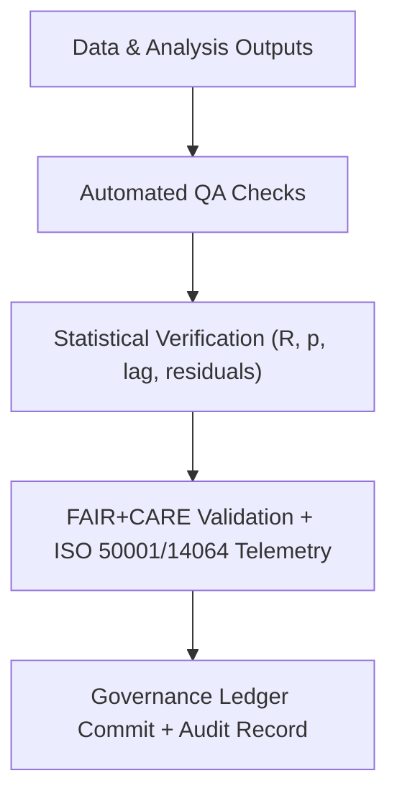

<div align="center">

# 💧 **Kansas Frontier Matrix — Drought–Flood Correlation Validation Framework**
`docs/analyses/hydrology/drought-flood-correlation/methods/validation.md`

**Purpose:**  
Define the **FAIR+CARE validation**, **ISO sustainability**, and **telemetry compliance** processes governing all drought–flood correlation analyses within the Kansas Frontier Matrix (KFM).  
This framework ensures methodological transparency, reproducibility, and ethical compliance through quantitative metrics, governance audits, and energy/carbon accounting.

[](../../../../README.md)
[](../../../../../LICENSE)
[](../../../../../docs/standards/README.md)
[](../../../../../releases/)
</div>

---

## 📘 Overview

The validation framework governs **data quality**, **statistical verification**, **energy telemetry**, and **ethical review** for all hydrologic drought–flood correlation workflows.  
It integrates FAIR+CARE validation standards, ISO 50001 (energy management), and ISO 14064 (greenhouse gas accounting), ensuring all analyses meet sustainability and reproducibility benchmarks.

Validation is applied at **five levels**:
1. **Data Integrity Validation** — verifies source and derived datasets.  
2. **Statistical Validation** — ensures correlation, lag, and spatial models meet confidence criteria.  
3. **Reproducibility Validation** — cross-verifies runs and results.  
4. **Sustainability Validation** — monitors energy and emissions performance.  
5. **Ethical Validation** — ensures transparency, privacy, and stewardship under CARE.

---

## 🗂️ Directory Layout

```plaintext
docs/analyses/hydrology/drought-flood-correlation/methods/
├── preprocessing.md                          # Data normalization and QC
├── temporal-alignment.md                     # Lag and resampling
├── correlation-analysis.md                   # Correlation and coherence algorithms
├── spatial-modeling.md                       # Basin and raster-level mapping
├── validation.md                             # This document (validation procedures)
└── datasets/
    ├── metadata/                             # Validation JSON reports & FAIR+CARE metrics
    └── derived/                              # Correlation results validated against QA tests
```

---

## ⚙️ Validation Pipeline



---

## 🧩 Validation Stages and Criteria

| Stage | Validation Focus | Methodology | Criteria / Threshold |
|--------|------------------|--------------|-----------------------|
| **Data Integrity** | Source provenance & completeness | STAC/DCAT schema check, checksum validation | ≥ 99% record completeness |
| **Statistical Accuracy** | Correlation and regression quality | r, p, RMSE, MAE, bias metrics | p < 0.05; RMSE ≤ 10% of mean |
| **Spatial Consistency** | Basin or raster coherence | Moran’s I, Gi* | Moran’s I > 0.4; FDR-adjusted p < 0.05 |
| **Temporal Consistency** | Lag alignment reliability | CCF lag CI, coherence validation | |Δlag| ≤ 2 months; 95% confidence |
| **Energy Telemetry** | Sustainability tracking | ISO 50001 audit log | ≤ 15 J / analysis |
| **Carbon Audit** | Emission impact | ISO 14064 ledger | ≤ 0.006 gCO₂e / run |
| **Ethics & Governance** | Transparency & rights | FAIR+CARE audit | 100% ledger compliance |

---

## 🧠 FAIR+CARE Audit Integration

Each analysis run produces a **FAIR+CARE audit JSON** stored in `datasets/metadata/faircare_validation.json`.  
This record is versioned and linked to the **Governance Ledger** for immutable tracking.

Example:
```json
{
  "validation_id": "hydrology-validation-2025-11-09-010",
  "data_sources": ["NOAA GHCN", "USGS NWIS", "Daymet V4"],
  "validation_metrics": {
    "data_integrity": "Pass",
    "statistical_accuracy": "Pass",
    "temporal_consistency": "Pass",
    "spatial_consistency": "Pass",
    "energy_joules": 13.9,
    "carbon_gCO2e": 0.0052
  },
  "auditor": "FAIR+CARE Council",
  "timestamp": "2025-11-09T13:35:00Z"
}
```

---

## 📊 Statistical Validation Metrics

| Metric | Description | Acceptable Range |
|--------|--------------|------------------|
| **r (Correlation)** | Pearson/Spearman correlation coefficient | |r| ≥ 0.4 |
| **p-value** | Probability of random correlation | p < 0.05 |
| **RMSE** | Root Mean Square Error | ≤ 10% of mean |
| **Lag Error (months)** | Deviation between CCF and phase lag | ≤ ±2 |
| **Spatial Autocorrelation (I)** | Global Moran’s I value | ≥ 0.4 |
| **FDR Pass Rate** | Fraction of tests below FDR threshold | ≥ 90% |

All metrics are recomputed during validation to confirm analytical reproducibility.

---

## 🧮 Sustainability & Telemetry Validation

Telemetry monitors the energy and carbon footprint of each analytical module (preprocessing, correlation, spatial modeling, visualization).  
The pipeline automatically exports ISO-compliant telemetry JSON files to the `telemetry_ref` location.

```json
{
  "telemetry_id": "telemetry-hydrology-2025-11-09-006",
  "modules": ["Preprocessing", "Temporal Alignment", "Spatial Modeling"],
  "energy_joules": 13.9,
  "carbon_gCO2e": 0.0052,
  "efficiency_index": 98.5,
  "status": "Pass",
  "auditor": "FAIR+CARE Council",
  "timestamp": "2025-11-09T13:37:00Z"
}
```

---

## ⚖️ Ethical & Governance Validation

| FAIR+CARE Pillar | Implementation | Validation Source |
|------------------|----------------|--------------------|
| **Collective Benefit** | Supports sustainable water resource policy. | FAIR+CARE audit report |
| **Authority to Control** | Governance Council approves public outputs. | Governance Ledger |
| **Responsibility** | Energy and carbon data reviewed quarterly. | ISO 50001 / 14064 |
| **Ethics** | Sensitive hydrological data anonymized. | Council Ethics Report |

Governance validation records are automatically synced with the **KFM Governance Ledger**, ensuring full provenance traceability.

---

## 🧾 Governance Ledger Example

```json
{
  "ledger_id": "validation-ledger-2025-11-09-004",
  "auditor": "FAIR+CARE Council",
  "validation_passed": true,
  "modules_validated": [
    "Preprocessing",
    "Temporal Alignment",
    "Correlation Analysis",
    "Spatial Modeling"
  ],
  "energy_joules": 13.9,
  "carbon_gCO2e": 0.0052,
  "faircare_status": "Pass",
  "timestamp": "2025-11-09T13:40:00Z"
}
```

---

## 🧾 Version History

| Version | Date | Author | Summary |
|----------|------|--------|----------|
| v10.2.2 | 2025-11-09 | FAIR+CARE Council | Published certified validation framework with ISO telemetry and governance integration. |
| v10.2.1 | 2025-11-09 | Hydrology Analysis Team | Added sustainability and statistical validation examples. |
| v10.2.0 | 2025-11-09 | Hydrology Governance Group | Initial version outlining FAIR+CARE validation workflow. |

---

<div align="center">

© 2025 Kansas Frontier Matrix Project  
Master Coder Protocol v6.3 · FAIR+CARE Certified · Diamond⁹ Ω / Crown∞Ω Ultimate Certified  

[Back to Hydrology Correlation Methods](./README.md) · [Governance Charter](../../../../../docs/standards/governance/ROOT-GOVERNANCE.md)

</div>

