<div align="center">

# 💧 **Kansas Frontier Matrix — Drought–Flood Correlation Pipelines**  
`docs/analyses/hydrology/drought-flood-correlation/pipelines/README.md`

**Purpose:**  
Define and document the **ETL, analytical, and visualization pipelines** used in the Drought–Flood Correlation analysis module of the Kansas Frontier Matrix (KFM).  
These pipelines automate data ingestion, correlation modeling, temporal decomposition, and figure generation within a FAIR+CARE-compliant workflow under **MCP-DL v6.3** reproducibility standards.

[](../../../../../README.md)  
[](../../../../../../LICENSE)  
[](../../../../../../docs/standards/faircare.md)  
[](../../../../../../releases/)
</div>

---

## 📘 Overview

The *Drought–Flood Correlation Pipelines* orchestrate the data-processing and analytical workflow that quantifies statistical and temporal relationships between drought and flood events across Kansas.  
Each pipeline is modular, parameterized, and monitored through telemetry logs that ensure reproducibility, performance benchmarking, and ethical governance.

Pipeline functions include:
- **Data Extraction** from hydrologic archives (USGS, NOAA, NRCS, FEMA)  
- **Transformation and Normalization** of drought and flood indicators (SPI, SPEI, flood frequency)  
- **Correlation Modeling** (Pearson, Spearman, ML regression, or cross-correlation lag analysis)  
- **Result Generation** (tables, correlation matrices, and visualizations)  
- **FAIR+CARE Auditing** and telemetry tracking of each workflow run  

---

## 🗂️ Directory Layout

```bash
docs/analyses/hydrology/drought-flood-correlation/pipelines/
├── README.md
├── extract_transform_load.py             # ETL pipeline for hydrological datasets
├── correlation_model_runner.py           # Executes correlation models (statistical / ML)
├── generate_visuals.py                   # Produces drought–flood correlation plots
├── validate_results.py                   # Performs QA/QC and FAIR+CARE validation
├── pipeline_manifest.json                # Index and provenance record for all pipeline runs
└── logs/
    ├── pipeline_execution_log.json
    ├── faircare_audit_log.json
    └── telemetry_summary.csv
```

Each script and manifest is version-controlled, validated by schema checks, and indexed in telemetry for transparent lineage tracking.

---

## ⚙️ Pipeline Architecture

```mermaid
flowchart TD
    A["Raw Hydrological Datasets (Precipitation · Streamflow · Soil Moisture)"]
    --> B["ETL Pipeline (Cleaning · Normalization · Aggregation)"]
    B --> C["Correlation Modeling (Statistical + ML Methods)"]
    C --> D["Result Generation (Tables · Figures)"]
    D --> E["FAIR+CARE Audit + Telemetry Logging"]
    E --> F["Validated Outputs (Results + Ledger Registration)"]
```



The pipeline integrates with the **Hydrology Methods** directory models for correlation and temporal analysis, enabling synchronized, end-to-end automation.

---

## 🧩 Core Pipeline Components

| Component | Description | Framework / Tool | Output |
|------------|-------------|------------------|---------|
| **ETL Module** | Extracts and standardizes multi-source hydrology data | `pandas`, `GDAL`, `xarray` | Cleaned time-series datasets |
| **Model Runner** | Executes statistical (Pearson, Spearman) and ML (XGBoost, RF) correlation models | `scikit-learn`, `SciPy`, `PyTorch` | Correlation matrices, regression models |
| **Visualization Engine** | Generates hydrographs and drought–flood plots | `Matplotlib`, `Plotly` | PNG/SVG figures |
| **Validation Layer** | Performs schema validation, checksum verification, and audit export | `jsonschema`, `frictionless` | FAIR+CARE validation reports |
| **Telemetry Logger** | Records performance, energy, and FAIR+CARE audit data | `MCP Telemetry CLI` | JSON / CSV logs |

---

## 🧮 Performance & Sustainability Metrics

| Metric | Description | Target | Unit |
|---------|-------------|---------|------|
| **Pipeline Runtime (s)** | Average runtime per full ETL–Model–Export cycle | ≤ 1800 | Seconds |
| **Energy Consumption (J)** | Mean energy used per full pipeline run | ≤ 15 | Joules |
| **Carbon (gCO₂e)** | CO₂ equivalent emissions per run | ≤ 0.006 | gCO₂e |
| **FAIR+CARE Pass Rate (%)** | Audits successfully validated | 100 | % |
| **Telemetry Coverage (%)** | Executions logged with full provenance | 100 | % |

---

## ⚖️ FAIR+CARE Governance Matrix

| Principle | Implementation |
|------------|----------------|
| **Findable** | Pipeline manifest and logs indexed in STAC/DCAT metadata for discovery. |
| **Accessible** | Code, configurations, and outputs released under CC-BY 4.0. |
| **Interoperable** | Data formats adhere to OGC/ISO standards; metadata in JSON-LD. |
| **Reusable** | Pipelines containerized and reproducible with parameter files. |
| **CARE – Collective Benefit** | Promotes community-accessible, sustainable hydrology modeling. |
| **CARE – Responsibility** | Discloses computational resources and environmental footprint. |

---

## 🧾 Example Manifest Record

```json
{
  "pipeline_id": "drought_flood_corr_pipeline_2025_v2",
  "datasets": ["noaa_precipitation", "usgs_streamflow", "nrcs_soil_moisture"],
  "model_used": "Pearson + XGBoost Hybrid",
  "run_parameters": {
    "temporal_window": "1900-2025",
    "lag_months": 2,
    "confidence_interval": 0.95
  },
  "results": {
    "correlation_coefficient": 0.78,
    "rmse": 3.1,
    "r2": 0.87
  },
  "energy_joules": 13.5,
  "carbon_gCO2e": 0.0051,
  "faircare_status": "PASS",
  "timestamp": "2025-11-11T19:10:00Z"
}
```

---

## 🕰️ Version History

| Version | Date | Author | Summary |
|----------|------|---------|----------|
| **v10.2.2** | 2025-11-11 | FAIR+CARE Hydrology Council | Published drought–flood correlation pipeline README; added architecture and manifest schema. |
| **v10.2.1** | 2025-11-09 | Hydrology Automation Team | Added sustainability metrics and validation schema integration. |
| **v10.2.0** | 2025-11-07 | KFM Hydrology Team | Established pipeline documentation and FAIR+CARE audit workflow. |

---

<div align="center">

© 2025 Kansas Frontier Matrix Project  
Master Coder Protocol v6.3 · FAIR+CARE Certified · Diamond⁹ Ω / Crown∞Ω Ultimate Certified  

[⬅ Back to Drought–Flood Correlation Overview](../README.md) · [Governance Charter](../../../../../../docs/standards/governance/ROOT-GOVERNANCE.md)

</div>

