<div align="center">

# 💧 **Kansas Frontier Matrix — Drought–Flood Correlation Pipelines · Logs**  
`docs/analyses/hydrology/drought-flood-correlation/pipelines/logs/README.md`

**Purpose:**  
Maintain comprehensive **execution and telemetry logs** for all Drought–Flood Correlation pipelines within the Kansas Frontier Matrix (KFM).  
These logs document the lifecycle of each pipeline run — from ETL extraction to model correlation analysis and visualization — providing full reproducibility, auditability, and sustainability tracking under **FAIR+CARE** and **MCP-DL v6.3** governance.

[](../../../../../../README.md)  
[](../../../../../../../LICENSE)  
[](../../../../../../../docs/standards/faircare.md)  
[](../../../../../../../releases/)
</div>

---

## 📘 Overview

The *Pipelines Logs* directory ensures transparent record-keeping for all automated drought–flood correlation workflows.  
Every pipeline run generates JSON and CSV logs capturing key metadata: execution timing, datasets used, modeling parameters, validation outcomes, energy usage, and FAIR+CARE audit results.  
These logs are automatically indexed in the pipeline manifest and cross-referenced with the FAIR+CARE governance ledger for compliance review.

---

## 🗂️ Directory Layout

```bash
docs/analyses/hydrology/drought-flood-correlation/pipelines/logs/
├── README.md                             # This file
├── pipeline_execution_log.json            # End-to-end record of pipeline runs
├── performance_metrics.csv                # Runtime, CPU, memory, and I/O statistics
├── energy_carbon_audit.csv                # Sustainability and efficiency audit
├── faircare_validation_report.json        # FAIR+CARE audit results for pipeline operations
└── telemetry_summary.json                 # Aggregated telemetry logs for all executions
```

---

## ⚙️ Logging Workflow Integration

```mermaid
flowchart TD
    A["Pipeline Execution (ETL → Correlation → Visualization)"]
    --> B["Telemetry Collector (Runtime · Resources · Energy)"]
    B --> C["FAIR+CARE Validator (Ethics · Provenance · Compliance)"]
    C --> D["Logs Generated (JSON / CSV)"]
    D --> E["Governance Ledger Commit & Archive"]
```



---

## 🧾 Log Schema Example

```json
{
  "run_id": "dfc_pipeline_run_2025_11_11_001",
  "pipeline_id": "drought_flood_corr_pipeline_v10_2",
  "timestamp_start": "2025-11-11T18:00:00Z",
  "timestamp_end": "2025-11-11T18:45:00Z",
  "runtime_seconds": 2700,
  "datasets_used": ["usgs_streamflow_daily", "noaa_precipitation", "nrcs_soil_moisture"],
  "model_type": "Pearson + XGBoost Hybrid",
  "correlation_coefficient": 0.81,
  "rmse": 3.0,
  "r2": 0.89,
  "energy_joules": 13.9,
  "carbon_gCO2e": 0.0053,
  "faircare_status": "PASS",
  "auditor": "FAIR+CARE Hydrology Council",
  "outputs": [
    "correlation_matrix.csv",
    "drought_flood_corr_plot.svg"
  ]
}
```

---

## ⚖️ FAIR+CARE Governance Matrix

| Principle | Implementation |
|------------|----------------|
| **Findable** | All logs indexed in manifest with run IDs and linked telemetry. |
| **Accessible** | Logs stored in open JSON/CSV under CC-BY license. |
| **Interoperable** | Schema compatible with MCP telemetry and ISO 14064. |
| **Reusable** | Complete with provenance metadata for reproducible validation. |
| **CARE – Collective Benefit** | Promotes transparency and sustainability in hydrologic modeling. |
| **CARE – Responsibility** | Carbon and energy disclosures ensure ethical research accountability. |

---

## 🧮 Sustainability Metrics

| Metric | Description | Value | Target | Unit |
|---------|-------------|--------|---------|------|
| **Energy (J)** | Energy consumption per pipeline run | 13.9 | ≤ 15 | Joules |
| **Carbon (gCO₂e)** | CO₂ equivalent per run | 0.0053 | ≤ 0.006 | gCO₂e |
| **Telemetry Coverage (%)** | Logged runs with complete metadata | 100 | ≥ 95 | % |
| **FAIR+CARE Pass Rate (%)** | Audit validation success | 100 | 100 | % |

---

## 🕰️ Version History

| Version | Date | Author | Summary |
|----------|------|---------|----------|
| **v10.2.2** | 2025-11-11 | FAIR+CARE Hydrology Council | Published pipeline logs README with schema examples and sustainability metrics. |
| **v10.2.1** | 2025-11-09 | Hydrology Integration Team | Added FAIR+CARE audit and telemetry linkage for pipeline validation. |
| **v10.2.0** | 2025-11-07 | KFM Hydrology Team | Created base logs directory for drought–flood correlation pipelines. |

---

<div align="center">

© 2025 Kansas Frontier Matrix Project  
Master Coder Protocol v6.3 · FAIR+CARE Certified · Diamond⁹ Ω / Crown∞Ω Ultimate Certified  

[⬅ Back to Drought–Flood Correlation Pipelines](../README.md) · [Governance Charter](../../../../../../../docs/standards/governance/ROOT-GOVERNANCE.md)

</div>

