<div align="center">

# 💧 **Kansas Frontier Matrix — Drought–Flood Correlation Results · Telemetry Logs**  
`docs/analyses/hydrology/drought-flood-correlation/results/telemetry-logs/README.md`

**Purpose:**  
This directory houses the **execution telemetry and sustainability logs** associated with the Drought–Flood Correlation (DFC) results module of the Kansas Frontier Matrix (KFM).  
Telemetry logs capture workflow runtime performance, resource and energy usage, carbon footprint, provenance linkage, and FAIR+CARE audit metadata — aligning with reproducibility, governance, and ethical transparency.  
Best-practice guidelines emphasise structured, context-rich logs, linking trace IDs and spans, and controlling verbosity for clarity and sustainable operation. :contentReference[oaicite:0]{index=0}

---

## 📘 Overview

Telemetry within this context tracks:
- Each DFC workflow run (ETL → correlation model → visualization)  
- Execution start/end times, runtime seconds, CPU/memory usage, I/O stats  
- Energy consumption (Joules) and CO₂-equivalent emissions (gCO₂e) per run  
- FAIR+CARE audit outcomes (PASS/WARN/FAIL) and provenance links  
- Output artefacts generated (tables, figures) and their checksums  

This aids in thorough auditability, reproducibility, and governance compliance — key tenants of the FAIR+CARE framework.

---

## 🗂️ Directory Layout

```bash
docs/analyses/hydrology/drought-flood-correlation/results/telemetry-logs/
├── README.md                                 # This file
├── execution_log_dfc.json                     # Records each pipeline run and parameters
├── energy_carbon_summary_dfc.csv              # Energy and carbon metrics per run
├── performance_metrics_dfc.csv                # Runtime & resource usage per run
└── faircare_audit_dfc.json                     # FAIR+CARE audit results for each execution
```

---

## ⚙️ Logging Workflow Integration

```mermaid
flowchart TD
    A["DFC Workflow Execution (ETL → Model → Export)"]
    --> B["Telemetry Capture (Runtime / Resources / Energy)"]
    B --> C["Governance Audit (FAIR+CARE / Provenance)"]
    C --> D["Telemetry Logs Archived in Telemetry-Logs Directory"]
```



Telemetry should follow structured logging principles — using JSON, integrating resource attributes (e.g., service name, environment), and correlating with unique run identifiers for traceability. :contentReference[oaicite:1]{index=1}

---

## 🧾 Telemetry Schema Example

```json
{
  "run_id": "dfc_pipeline_run_2025_11_11_001",
  "pipeline_id": "drought_flood_corr_pipeline_v10_2",
  "timestamp_start": "2025-11-11T18:00:00Z",
  "timestamp_end": "2025-11-11T18:45:00Z",
  "runtime_seconds": 2700,
  "cpu_usage_percent": 82.3,
  "memory_usage_mb": 5400,
  "energy_joules": 13.9,
  "carbon_gCO2e": 0.0053,
  "faircare_status": "PASS",
  "audit_id": "faircare_dfc_audit_2025_11_11_v1",
  "outputs": [
    "correlation_matrix.csv",
    "drought_to_flood_lag_heatmap.png"
  ]
}
```

---

## ⚖️ FAIR+CARE Governance Matrix

| Principle        | Implementation                                                   |
|------------------|-------------------------------------------------------------------|
| **Findable**      | Each telemetry record has a unique `run_id` and is indexed.      |
| **Accessible**    | Logs are produced in open formats (JSON/CSV) under CC-BY 4.0.    |
| **Interoperable** | Schema uses JSON-LD conventions; naming follows project standards.|
| **Reusable**      | Provenance, parameters, and outputs included enabling full reproduction.|
| **CARE – Collective Benefit** | Supports transparent, ethical hydrology-workflow governance. |
| **CARE – Responsibility**        | Discloses resource and energy use, supports sustainability tracking. |

---

## 🧮 Sustainability Metrics & Targets

| Metric                   | Description                                    | Target          |
|--------------------------|-----------------------------------------------|-----------------|
| Energy consumption (J)   | Mean energy used per DFC run                   | ≤ 15 J          |
| Carbon footprint (gCO₂e) | CO₂-equivalent emissions per run                | ≤ 0.006 gCO₂e   |
| Telemetry coverage (%)   | % of runs with full telemetry logs              | 100%            |
| Audit pass rate (%)      | % of runs with `faircare_status = "PASS"`      | 100%            |

---

## 🕰️ Version History

| Version | Date       | Author                      | Summary                                                |
|---------|------------|-----------------------------|---------------------------------------------------------|
| **v10.2.2** | 2025-11-11 | FAIR+CARE Hydrology Council  | Published Telemetry-Logs README aligned with v10.2 release. |
| v10.2.1 | 2025-11-09 | Hydrology DFC Analysis Team  | Added logging workflow and governance matrix details.   |
| v10.2.0 | 2025-11-07 | KFM Hydrology Team           | Created base Telemetry-Logs directory documentation.     |

---

<div align="center">

© 2025 Kansas Frontier Matrix Project  
Master Coder Protocol v6.3 · FAIR+CARE Certified · Diamond⁹ Ω / Crown∞Ω Ultimate Certified  

[⬅ Back to Drought–Flood Correlation Results](../README.md) · [Governance Charter](../../../../../../docs/standards/governance/ROOT-GOVERNANCE.md)

</div>

