<div align="center">

# 💧 **Kansas Frontier Matrix — Drought–Flood Correlation Results · Telemetry Logs**  
`docs/analyses/hydrology/drought-flood-correlation/results/telemetry-logs/README.md`

**Purpose:**  
Serve as the repository for all **execution telemetry, sustainability, and audit logs** produced during the Drought–Flood Correlation (DFC) workflows of the Kansas Frontier Matrix (KFM).  
Telemetry ensures transparency in workflow execution, recording runtime performance, resource efficiency, FAIR+CARE audit compliance, and reproducibility under **MCP-DL v6.3** data governance.

[](../../../../../README.md)  
[](../../../../../../docs/standards/faircare.md)  
[](../../../../../../LICENSE)  
[](../../../../../../releases/)
</div>

---

## 📘 Overview

Telemetry logs within this directory record the performance, sustainability, and audit trail of every pipeline and analytical run executed for the drought–flood correlation studies.  
Each file includes metrics for CPU/memory usage, energy, carbon footprint, FAIR+CARE validation, and linkage to generated artefacts (tables, figures, models).

---

## 🗂️ Directory Layout

```bash
docs/analyses/hydrology/drought-flood-correlation/results/telemetry-logs/
├── README.md                        # This file
├── execution_log_dfc.json            # Detailed record of workflow executions
├── performance_metrics_dfc.csv       # CPU, memory, and runtime performance data
├── energy_carbon_summary_dfc.csv     # Sustainability report (energy + carbon metrics)
└── faircare_audit_dfc.json           # FAIR+CARE audit validation results
```

Each telemetry file provides standardized fields such as timestamps, resource utilization metrics, and governance identifiers.  
The logs are automatically aggregated into the project-wide telemetry manifest for FAIR+CARE certification review.

---

## ⚙️ Logging Workflow Integration

```mermaid
flowchart TD
    A["DFC Workflow Execution (ETL → Model → Output)"]
    --> B["Telemetry Collection (Runtime · Resources · Energy)"]
    B --> C["Sustainability Accounting (Energy · Carbon)"]
    C --> D["FAIR+CARE Validation & Provenance Logging"]
    D --> E["Archive Logs under Results/Telemetry-Logs"]
```



---

## 🧾 Telemetry Record Schema

```json
{
  "run_id": "dfc_pipeline_run_2025_11_11_001",
  "workflow_name": "drought_flood_corr_model",
  "timestamp_start": "2025-11-11T18:00:00Z",
  "timestamp_end": "2025-11-11T18:45:00Z",
  "runtime_seconds": 2700,
  "cpu_usage_percent": 82.3,
  "memory_usage_mb": 5400,
  "energy_joules": 13.9,
  "carbon_gCO2e": 0.0053,
  "faircare_status": "PASS",
  "audit_id": "faircare_dfc_audit_2025_11_11_v1",
  "outputs": [
    "correlation_matrix.csv",
    "drought_to_flood_lag_heatmap.png"
  ]
}
```

---

## ⚖️ FAIR+CARE Governance Matrix

| Principle | Implementation |
|------------|----------------|
| **Findable** | Each telemetry run is indexed in the STAC/DCAT manifest by `run_id`. |
| **Accessible** | Logs are stored as open JSON/CSV under CC-BY 4.0. |
| **Interoperable** | Schema follows MCP telemetry standards and ISO 14064 metrics. |
| **Reusable** | Provenance data and audit metadata support complete workflow reproduction. |
| **CARE – Collective Benefit** | Promotes transparency and sustainability in hydrology analytics. |
| **CARE – Responsibility** | Discloses computational resource use and carbon impact ethically. |

---

## 🧮 Sustainability Metrics

| Metric | Description | Value | Target | Unit |
|---------|-------------|--------|---------|------|
| **Energy (J)** | Average energy per workflow run | 13.9 | ≤ 15 | Joules |
| **Carbon (gCO₂e)** | CO₂ equivalent per workflow | 0.0053 | ≤ 0.006 | gCO₂e |
| **Telemetry Coverage (%)** | Logged runs with complete metadata | 100 | ≥ 95 | % |
| **Audit Pass Rate (%)** | FAIR+CARE validation compliance | 100 | 100 | % |

---

## 🕰️ Version History

| Version | Date | Author | Summary |
|----------|------|---------|----------|
| **v10.2.2** | 2025-11-11 | FAIR+CARE Hydrology Results Council | Fixed directory layout alignment and finalized telemetry documentation. |
| **v10.2.1** | 2025-11-09 | Hydrology DFC Analysis Team | Added sustainability metrics and schema examples. |
| **v10.2.0** | 2025-11-07 | KFM Hydrology Team | Created telemetry-logs documentation for DFC results. |

---

<div align="center">

© 2025 Kansas Frontier Matrix Project  
Master Coder Protocol v6.3 · FAIR+CARE Certified · Diamond⁹ Ω / Crown∞Ω Ultimate Certified  

[⬅ Back to Drought–Flood Correlation Results](../README.md) · [Governance Charter](../../../../../../docs/standards/governance/ROOT-GOVERNANCE.md)

</div>
