<div align="center">

# 🛰️ **Kansas Frontier Matrix — Drought–Flood Correlation Interactive Viewer**  
`docs/analyses/hydrology/drought-flood-correlation/viewer/README.md`

**Purpose:**  
Define and document the **interactive visualization interface** for the Drought–Flood Correlation (DFC) analysis module of the Kansas Frontier Matrix (KFM).  
The viewer enables researchers and stakeholders to explore **spatial-temporal relationships between drought indices and flood events** using the KFM geospatial knowledge graph and FAIR+CARE-compliant metadata layers.

[](../../../../../README.md)  
[](../../../../../../docs/standards/faircare.md)  
[](../../../../../../LICENSE)  
[](../../../../../../releases/)
</div>

---

## 📘 Overview

The *Drought–Flood Correlation Interactive Viewer* is a **MapLibre- and React-based web visualization** built into the Kansas Frontier Matrix platform.  
It allows users to view dynamic drought–flood linkages, lag correlation maps, and temporal evolution of hydrologic anomalies across Kansas, drawing data directly from FAIR+CARE-registered STAC assets and the Neo4j knowledge graph.

Core capabilities:
- 🌎 Geospatial visualization of drought severity (SPI/SPEI) and flood recurrence intensity  
- 🕰️ Time slider control for drought–flood lag simulation (1–3 months offset)  
- 🔍 Query interface for basin-level analysis and cross-domain context  
- 🧭 FAIR+CARE metadata overlay with dataset provenance and audit transparency  
- ⚡ Performance telemetry integration to monitor rendering energy and CO₂e footprint  

---

## 🗂️ Directory Layout

```bash
docs/analyses/hydrology/drought-flood-correlation/viewer/
├── README.md                             # This file
├── ui_design_spec.md                     # Design specification and component layout
├── map_layers.json                       # Configuration of base maps and data overlays
├── viewer_config.json                    # Viewer settings, telemetry endpoints, and defaults
├── accessibility_report.md               # WCAG 2.1 AA compliance and FAIR+CARE inclusion review
└── changelog_viewer_v10.2.2.md           # Revision history for the interactive viewer
```

---

## 🧩 System Architecture

```mermaid
flowchart TD
    A["KFM Knowledge Graph (Neo4j)"]
    --> B["STAC Catalog API (Hydrology Datasets)"]
    B --> C["Viewer Engine (React + MapLibre + D3)"]
    C --> D["User Interface (Timeline · Layers · Panels)"]
    D --> E["Telemetry + FAIR+CARE Metadata Overlay"]
```



The viewer retrieves hydrological datasets from the STAC catalog, streams them into the MapLibre engine, and overlays correlation results (e.g., lag maps, significance heatmaps) with audit metadata from FAIR+CARE validation reports.

---

## ⚙️ Configuration Schema Example

```json
{
  "viewer_version": "v10.2.2",
  "default_basemap": "MapLibre Streets",
  "available_layers": [
    "drought_spi_anomaly",
    "flood_recurring_intensity",
    "correlation_lag_heatmap"
  ],
  "time_slider_range": ["1900", "2025"],
  "telemetry_endpoint": "https://kfm-hydro.telemetry/v10/api",
  "accessibility_mode": true,
  "energy_tracking_enabled": true
}
```

---

## 🧭 FAIR+CARE Alignment Matrix

| Principle | Implementation |
|------------|----------------|
| **Findable** | Viewer layers and datasets reference persistent STAC/DCAT entries. |
| **Accessible** | Open web client accessible via FAIR+CARE-certified data portal. |
| **Interoperable** | JSON and GeoJSON APIs conform to OGC standards. |
| **Reusable** | Viewer configuration and data endpoints documented under CC-BY 4.0. |
| **CARE – Collective Benefit** | Promotes water literacy and accessibility for all Kansas stakeholders. |
| **CARE – Responsibility** | Transparency in energy telemetry and inclusion auditing. |

---

## ♿ Accessibility & Inclusion Review

The viewer complies with **WCAG 2.1 AA** and FAIR+CARE inclusion criteria:
- High-contrast color schemes with adjustable basemap brightness.  
- Keyboard navigation and ARIA landmark support.  
- Screen-reader tested using NVDA and VoiceOver.  
- Ethical visual framing avoiding bias or misinterpretation of hydrologic data.

Audit reference: `accessibility_report.md`

---

## 🧮 Performance & Sustainability Metrics

| Metric | Description | Target | Unit |
|---------|-------------|---------|------|
| **Frame Rate Stability** | Viewer frame rate consistency | ≥ 55 | FPS |
| **Energy per Render Cycle** | Power consumption per map update | ≤ 0.05 | Joules |
| **Carbon Footprint** | CO₂e per user session | ≤ 0.002 | gCO₂e |
| **FAIR+CARE Compliance** | Validation of metadata integrity | 100 | % |

---

## 🕰️ Version History

| Version | Date | Author | Summary |
|----------|------|---------|----------|
| **v10.2.2** | 2025-11-11 | FAIR+CARE Hydrology Visualization Team | Published interactive viewer README; added accessibility and telemetry schema alignment. |
| **v10.2.1** | 2025-11-09 | KFM UI Development Group | Added MapLibre configuration and design specification documentation. |
| **v10.2.0** | 2025-11-07 | KFM Hydrology Team | Created initial viewer directory and metadata schema documentation. |

---

<div align="center">

© 2025 Kansas Frontier Matrix Project  
Master Coder Protocol v6.3 · FAIR+CARE Certified · Diamond⁹ Ω / Crown∞Ω Ultimate Certified  

[⬅ Back to Drought–Flood Correlation Index](../README.md) · [Governance Charter](../../../../../../docs/standards/governance/ROOT-GOVERNANCE.md)

</div>

