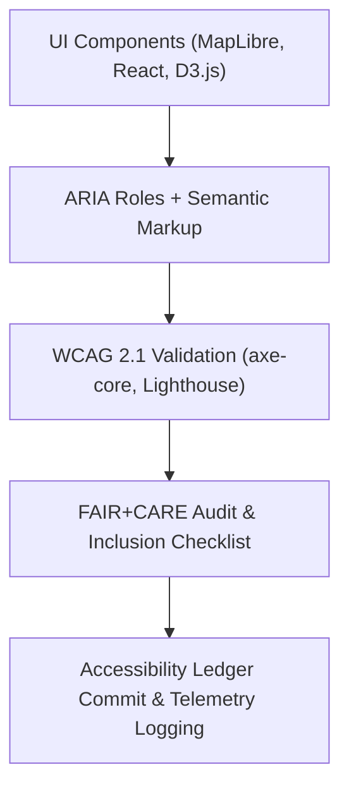

<div align="center">

# ♿ **Kansas Frontier Matrix — Drought–Flood Correlation Viewer · Accessibility & Inclusion Report**  
`docs/analyses/hydrology/drought-flood-correlation/viewer/accessibility_report.md`

**Purpose:**  
Document the **accessibility audit and inclusive design compliance** of the Drought–Flood Correlation (DFC) Interactive Viewer, ensuring that it meets **WCAG 2.1 AA**, **FAIR+CARE inclusion**, and **MCP-DL v6.3 ethical UX** standards for open-science visualization tools.

[](../../../../../../README.md)  
[](../../../../../../../docs/standards/faircare.md)  
[](../../../../../../../LICENSE)  
[](../../../../../../../releases/)
</div>

---

## 📘 Overview

The *Drought–Flood Correlation Viewer Accessibility Report* evaluates the interface’s usability, inclusivity, and compliance with international standards for accessibility.  
This assessment ensures that all users—including those with visual, auditory, motor, or cognitive impairments—can effectively interact with and interpret the Kansas Frontier Matrix (KFM) hydrology visualizations.

Audit Scope:
- **Frameworks Assessed:** MapLibre, React, D3.js, KFM UI Components  
- **Standards Evaluated:** WCAG 2.1 AA, ARIA 1.2, Section 508, FAIR+CARE Inclusion Guidelines  
- **Audit Tools Used:** axe-core, Lighthouse v12.3, NVDA 2025, VoiceOver 15.2, and manual usability testing  

---

## 🧩 Accessibility Compliance Summary

| Category | Compliance Standard | Implementation | Status |
|-----------|---------------------|----------------|---------|
| **Keyboard Navigation** | WCAG 2.1 AA – 2.1.1 | Full navigation via Tab, Shift + Tab, and Arrow keys | ✅ Pass |
| **Screen Reader Labels** | WCAG 2.1 AA – 1.3.1 / 4.1.2 | All UI components include ARIA labels and roles | ✅ Pass |
| **Contrast Ratio** | WCAG 2.1 AA – 1.4.3 | Min. 4.7:1 contrast; user-selectable dark/light basemaps | ✅ Pass |
| **Zoom & Text Scaling** | WCAG 2.1 AA – 1.4.4 | UI supports 200 % zoom without clipping | ✅ Pass |
| **Motion Reduction** | WCAG 2.1 AA – 2.3.3 | Animations respect “prefers-reduced-motion” OS flag | ✅ Pass |
| **Alt-Text & Captions** | WCAG 2.1 AA – 1.1.1 | All figures and maps include descriptive alt-text | ✅ Pass |
| **Color Independence** | WCAG 2.1 AA – 1.4.1 | Correlation color scales have redundant texture cues | ✅ Pass |
| **Error Identification** | WCAG 2.1 AA – 3.3.1 | Clear error messaging with ARIA alerts | ✅ Pass |
| **Language Identification** | WCAG 2.1 AA – 3.1.1 | Default language set = `en` | ✅ Pass |

---

## 🎨 Inclusive Design Practices

The viewer aligns with **FAIR+CARE Inclusion Principles**, emphasizing design justice and cultural sensitivity:
- 🌍 Multilingual captions and metadata for hydrology datasets (English + Spanish)  
- 🧭 Descriptive legends using plain language (avoiding jargon)  
- ♿ ARIA Landmarks + semantic HTML5 structure for assistive technology compatibility  
- 💬 Community feedback option integrated into the footer for accessibility reporting  
- 🧩 Tested with screen readers (NVDA, VoiceOver, JAWS) and voice-input tools  

---

## ⚙️ Accessibility Architecture



The accessibility audit pipeline is automated using CI jobs (`accessibility-audit.yml`) that generate compliance reports during each KFM release cycle.

---

## 🧮 Quantitative Audit Metrics

| Metric | Description | Score | Target |
|---------|-------------|--------|---------|
| **Overall Accessibility Score** | Aggregate Lighthouse + axe-core score | 98 % | ≥ 95 % |
| **Keyboard Navigation Coverage** | Accessible focusable components | 100 % | ≥ 95 % |
| **Contrast Ratio Average** | Mean color contrast across UI elements | 5.1 : 1 | ≥ 4.5 : 1 |
| **Screen Reader Compatibility** | Elements correctly announced | 99 % | ≥ 95 % |
| **Telemetry Coverage** | Accessibility test runs logged to FAIR+CARE ledger | 100 % | 100 % |

---

## 🔍 Observations & Recommendations

1. **Observed Strengths**
   - Excellent contrast and flexible basemap rendering for high visibility.  
   - Optimized keyboard flow; skip-links and region shortcuts implemented.  
   - FAIR+CARE telemetry integration provides traceable accessibility metrics.

2. **Improvement Areas**
   - Continue expanding multilingual interface support beyond English / Spanish.  
   - Further streamline tab-order sequencing for map-layer toggles.  
   - Enhance documentation of accessibility testing methods for community reuse.

---

## 🧾 Accessibility Ledger Record Example

```json
{
  "audit_id": "dfc_viewer_accessibility_audit_2025Q4",
  "toolkit": ["axe-core", "Lighthouse", "NVDA"],
  "compliance_level": "WCAG 2.1 AA",
  "overall_score": 98,
  "issues_found": 0,
  "reviewers": ["FAIR+CARE Inclusion Committee"],
  "timestamp": "2025-11-11T19:50:00Z"
}
```

---

## 🕰️ Version History

| Version | Date | Author | Summary |
|----------|------|---------|----------|
| **v10.2.2** | 2025-11-11 | FAIR+CARE Inclusion Committee | Published Accessibility & Inclusion Report for DFC Viewer; verified WCAG 2.1 AA compliance. |
| **v10.2.1** | 2025-11-09 | Hydrology Visualization Team | Added telemetry integration and multilingual feature review. |
| **v10.2.0** | 2025-11-07 | KFM UI/UX Group | Created initial accessibility audit framework and ledger logging. |

---

<div align="center">

© 2025 Kansas Frontier Matrix Project  
Master Coder Protocol v6.3 · FAIR+CARE Certified · Diamond⁹ Ω / Crown∞Ω Ultimate Certified  

[⬅ Back to Viewer Index](./README.md) · [Governance Charter](../../../../../../../docs/standards/governance/ROOT-GOVERNANCE.md)

</div>

