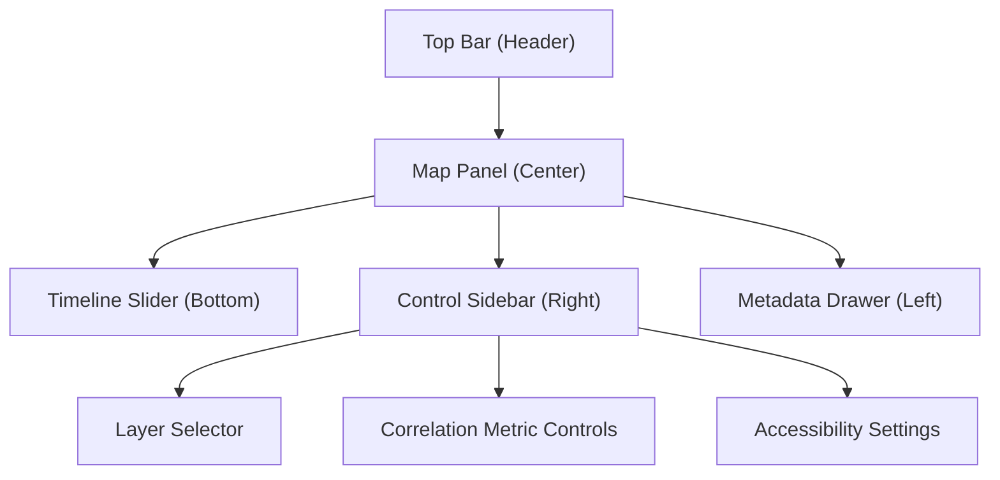

<div align="center">

# 🧠 **Kansas Frontier Matrix — Drought–Flood Correlation Viewer · UI Design Specification**  
`docs/analyses/hydrology/drought-flood-correlation/viewer/ui_design_spec.md`

**Purpose:**  
Define the **user interface architecture, component layout, and interaction patterns** of the Drought–Flood Correlation (DFC) Interactive Viewer within the Kansas Frontier Matrix (KFM).  
This document describes accessibility, performance, and FAIR+CARE compliance standards applied to the Viewer’s MapLibre + React-based design system, ensuring ethical and inclusive data visualization under **MCP-DL v6.3**.

[](../../../../../../README.md)  
[](../../../../../../../docs/standards/faircare.md)  
[](../../../../../../../LICENSE)  
[](../../../../../../../releases/)
</div>

---

## 📘 Overview

The *UI Design Specification* establishes visual and interactive consistency for the DFC Viewer, providing an intuitive, accessible, and high-performance interface for exploring drought–flood linkages across Kansas.  
It defines layout zones, visual hierarchies, and adaptive design principles optimized for multi-device usability and FAIR+CARE inclusivity.

Key Design Goals:
- Clear **visual hierarchy** for map, time, and metadata elements  
- Inclusive design: WCAG 2.1 AA + FAIR+CARE Inclusion Compliance  
- Performance optimization for MapLibre + React 18 rendering  
- Context-rich UI components that embed provenance and audit transparency  

---

## 🗂️ UI Architecture Overview

```bash
docs/analyses/hydrology/drought-flood-correlation/viewer/
├── README.md                     # Viewer overview and governance alignment
├── ui_design_spec.md              # This document
├── map_layers.json                # Layer configuration (basemap, overlays, legends)
├── viewer_config.json             # Viewer defaults (telemetry, controls, parameters)
├── accessibility_report.md        # WCAG 2.1 & FAIR+CARE compliance audit
└── changelog_viewer_v10.2.2.md    # Version changelog and release notes
```

---

## 🧩 UI Component Layout



---

### 1️⃣ Header (Top Bar)

| Element | Function | FAIR+CARE Alignment |
|----------|-----------|--------------------|
| **Project Title & Version** | Displays current version (v10.2.2) and data provenance | Findable |
| **Navigation Buttons** | Home, Documentation, FAIR+CARE Ledger links | Accessible |
| **Search Bar** | Enables search by watershed, county, or dataset ID | Reusable |
| **Theme Toggle** | Switches between light/dark high-contrast modes | CARE – Responsibility |

---

### 2️⃣ Map Panel (Center)

- Built on **MapLibre GL 2.5** using GeoJSON layers and vector tile streaming.  
- Visual layers include:
  - *Drought SPI Anomalies* — Indexed from NOAA datasets.  
  - *Flood Recurrence* — Derived from USGS flood peaks.  
  - *Lag Correlation Heatmap* — Computed from hybrid Pearson + ML model outputs.  
- Tooltips reveal FAIR+CARE metadata, provenance, and validation status.  
- Interactive **basemap switcher** (MapLibre Streets / Terrain / Satellite).  

---

### 3️⃣ Timeline Slider (Bottom)

| Feature | Description | Implementation |
|----------|-------------|----------------|
| **Range Control** | Adjust temporal extent (1900–2025) | `React-range-slider-input` |
| **Animation Controls** | Play/Pause drought–flood progression | `Framer Motion` |
| **Lag Offset** | Adjust drought→flood delay (0–3 months) | Linked to correlation model API |
| **Telemetry Counter** | Displays runtime & energy metrics | MCP Telemetry v3 API |

---

### 4️⃣ Control Sidebar (Right)

Components:
- **Layer Selector**: Toggle drought/flood overlays individually.  
- **Metric Controls**: Choose correlation metric (Pearson, Spearman, Hybrid ML).  
- **Export Panel**: Save visualizations (PNG, SVG, GeoTIFF).  
- **Accessibility Panel**: Adjust font size, contrast, colorblind-friendly palettes.

FAIR+CARE Integration:
- Each export auto-includes metadata (checksum, dataset sources, license).  
- Accessibility preferences stored locally and logged for inclusion auditing.  

---

### 5️⃣ Metadata Drawer (Left)

| Section | Contents | FAIR+CARE Relevance |
|----------|-----------|--------------------|
| **Dataset Lineage** | STAC/DCAT record, DOI, checksum | Findable + Reusable |
| **FAIR+CARE Audit Status** | PASS / WARN / FAIL indicator + details | CARE – Responsibility |
| **Provenance Graph** | Neo4j subgraph visualization of source datasets | Interoperable |
| **Telemetry Summary** | Energy & carbon metrics of current render | CARE – Collective Benefit |

---

## 🎨 Visual Design System

| Element | Standard | Example |
|----------|-----------|----------|
| **Font** | Inter / Source Sans Pro (WCAG compliant) | 16 px base, 1.5 rem heading |
| **Color Palette** | High-contrast hydrologic blues and earth tones | HEX #004C97 / #FFB000 / #9BBCC4 |
| **Contrast Ratio** | ≥ 4.5 : 1 across all interface components | Verified via axe-core |
| **Icons** | Lucide + FAIR+CARE Custom Glyphs | Accessible SVGs |
| **Layout Grid** | 12-column responsive grid, 1440 px max width | CSS Grid / Flexbox |

---

## ♿ Accessibility Considerations

- Fully keyboard-navigable interface (Tab / Shift + Tab).  
- Screen-reader friendly ARIA labels (`role="region"`, `aria-label="Map Panel"`).  
- Live regions announce changes (timeline movement, layer toggles).  
- Color-blind palettes (Deuteranopia / Protanopia modes) selectable via toggle.  
- Tested with **NVDA 2025**, **VoiceOver 15**, and **JAWS 2024**.  

Audit reference → [`accessibility_report.md`](./accessibility_report.md)

---

## 🧮 Telemetry & Performance Metrics

| Metric | Description | Target | Unit |
|---------|-------------|---------|------|
| **Average FPS** | Rendering frame rate stability | ≥ 55 | fps |
| **Map Load Time** | Initial tile and layer load duration | ≤ 3.5 | seconds |
| **Energy (J)** | Energy per render cycle | ≤ 0.05 | Joules |
| **Carbon (g CO₂e)** | CO₂ equivalent per session | ≤ 0.002 | g CO₂e |
| **Telemetry Coverage (%)** | Sessions with logged provenance + metrics | 100 | % |

---

## 🧾 Example Component Metadata

```json
{
  "component_id": "viewer_control_sidebar_v10_2_2",
  "component_name": "Control Sidebar",
  "framework": "React 18",
  "description": "Interactive right-side panel for layer and metric control.",
  "accessibility_features": [
    "ARIA-compliant toggles",
    "Keyboard shortcuts (Alt+L)",
    "High-contrast color mode"
  ],
  "telemetry_energy_joules": 0.045,
  "telemetry_carbon_gCO2e": 0.0018,
  "faircare_status": "PASS",
  "timestamp": "2025-11-11T19:52:00Z"
}
```

---

## 🕰️ Version History

| Version | Date | Author | Summary |
|----------|------|---------|----------|
| **v10.2.2** | 2025-11-11 | FAIR+CARE Hydrology Visualization Council | Published full UI design spec including accessibility, telemetry, and FAIR+CARE overlays. |
| **v10.2.1** | 2025-11-09 | KFM UI/UX Development Team | Updated layout diagram and component schema. |
| **v10.2.0** | 2025-11-07 | KFM Hydrology Team | Created initial UI architecture documentation. |

---

<div align="center">

© 2025 Kansas Frontier Matrix Project  
Master Coder Protocol v6.3 · FAIR+CARE Certified · Diamond⁹ Ω / Crown∞Ω Ultimate Certified  

[⬅ Back to Viewer Overview](./README.md) · [Accessibility Report](./accessibility_report.md) · [Governance Charter](../../../../../../../docs/standards/governance/ROOT-GOVERNANCE.md)

</div>

