<div align="center">

# 💧 **Kansas Frontier Matrix — Hydrology Methods Directory**  
`docs/analyses/hydrology/methods/README.md`

**Purpose:**  
Define, document, and validate the **analytical workflows, models, and data processing methodologies** used in the hydrological analyses of the Kansas Frontier Matrix (KFM).  
These methods support drought–flood correlation, streamflow forecasting, and hydroclimatic pattern recognition while adhering to **FAIR+CARE**, **ISO 14064**, and **MCP-DL v6.3** standards for reproducibility and ethical data handling.

[](../../../../README.md)  
[](../../../../../LICENSE)  
[](../../../../../docs/standards/faircare.md)  
[](../../../../../releases/)
</div>

---

## 📘 Overview

The *Hydrology Methods Directory* hosts documented workflows and algorithms used to transform hydrologic datasets into validated analyses and models.  
These methodologies encompass **statistical, physical, and AI-based hydrologic modeling approaches**—each traceable through telemetry and governed by FAIR+CARE reproducibility criteria.

Key research themes include:
- Drought and flood correlation modeling  
- Temporal and spatial hydrologic variability analysis  
- Water balance and runoff computation  
- Predictive modeling using AI/ML  
- Climate–hydrology coupling assessments  

---

## 🗂️ Directory Layout

```bash
docs/analyses/hydrology/methods/
├── README.md
├── correlation-models.md                 # Statistical and ML-based drought–flood correlation
├── temporal-analysis.md                  # Time-series decomposition and seasonal modeling
├── water-balance.md                      # Hydrologic balance & evapotranspiration computation
├── figures/                              # Visualization outputs (validated & versioned)
│   ├── README.md
│   ├── correlation_schematic.png
│   ├── flood_return_period_chart.svg
│   └── drought_anomaly_trend.png
├── tables/                               # Parameter tables and calibration metrics
│   ├── README.md
│   ├── model_coefficients.csv
│   └── validation_statistics.csv
└── telemetry-logs/                       # Runtime logs for reproducibility
    ├── README.md
    ├── execution_summary.json
    └── method_energy_audit.csv
```

---

## ⚙️ Analytical Framework

```mermaid
flowchart TD
    A["Hydrological Datasets (Raw → Processed → Derived)"]
    --> B["Model Preparation (Data Cleaning & Normalization)"]
    B --> C["Analytical Models (Correlation / Regression / PCA / ML)"]
    C --> D["Simulation & Validation (Flood / Drought / Runoff Models)"]
    D --> E["Results Export (Figures · Tables · Telemetry Logs)"]
    E --> F["FAIR+CARE Audit & Governance Ledger Commit"]
```



Each workflow is parameterized, version-controlled, and automatically logged through telemetry to ensure complete methodological transparency.

---

## 🧩 Methodological Standards

| Category | Description | Example Tools / Frameworks |
|-----------|-------------|-----------------------------|
| **Correlation Models** | Assess statistical relationships between precipitation, streamflow, and drought indices | `pandas`, `scipy.stats`, `sklearn.linear_model` |
| **Time-Series Analysis** | Analyze temporal trends and seasonal patterns in hydrologic signals | `statsmodels`, `Prophet`, `xarray` |
| **Hydrologic Modeling** | Compute surface runoff, infiltration, and water balance | `PyHydro`, `MODFLOW`, `SWAT+` |
| **Machine Learning Models** | Predict flood/drought likelihoods using supervised learning | `TensorFlow`, `XGBoost`, `PyTorch` |
| **Visualization** | Plot hydrographs, anomaly maps, and correlation matrices | `Matplotlib`, `Seaborn`, `Plotly` |

---

## ⚖️ FAIR+CARE Governance Matrix

| Principle | Implementation | Verification |
|------------|----------------|---------------|
| **Findable** | Each method documented and indexed in `methods/` with telemetry reference. | `manifest_ref` |
| **Accessible** | Open-access scripts, parameter tables, and notebooks under CC-BY 4.0. | FAIR+CARE Audit |
| **Interoperable** | Metadata captured in JSON-LD; output conforming to STAC schema. | `telemetry_schema` |
| **Reusable** | Workflows reproducible with documented parameters and seeds. | `telemetry_ref` |
| **CARE – Collective Benefit** | Models promote equitable access to water knowledge for Kansas communities. | FAIR+CARE Council |
| **CARE – Responsibility** | Sensitive hydrologic data anonymized and ethically sourced. | FAIR+CARE Governance Review |

---

## 🧮 Sustainability & Performance Metrics

| Metric | Description | Value | Target | Unit |
|---------|-------------|--------|---------|------|
| **Reproducibility Score (%)** | Validated re-run accuracy | 99.7 | ≥ 95 | % |
| **Energy (J)** | Avg. energy consumption per model run | 14.2 | ≤ 15 | Joules |
| **Carbon (gCO₂e)** | CO₂ equivalent per modeling task | 0.0052 | ≤ 0.006 | gCO₂e |
| **Telemetry Coverage (%)** | Logged executions with complete metadata | 100 | ≥ 95 | % |

---

## 🕰️ Version History

| Version | Date | Author | Summary |
|----------|------|---------|----------|
| **v10.2.2** | 2025-11-11 | FAIR+CARE Council | Published hydrology methods README; added analytical framework and sustainability metrics. |
| **v10.2.1** | 2025-11-09 | Hydrology Analysis Team | Added telemetry linkage and methodological workflow details. |
| **v10.2.0** | 2025-11-07 | KFM Hydrology Team | Created methods directory structure aligned with FAIR+CARE reproducibility standards. |

---

<div align="center">

© 2025 Kansas Frontier Matrix Project  
Master Coder Protocol v6.3 · FAIR+CARE Certified · Diamond⁹ Ω / Crown∞Ω Ultimate Certified  

[Back to Hydrology Overview](../README.md) · [Governance Charter](../../../../../docs/standards/governance/ROOT-GOVERNANCE.md)

</div>

