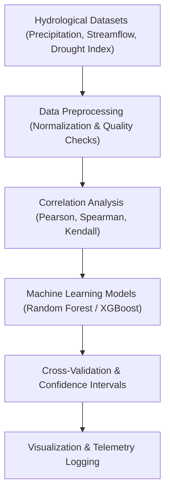

<div align="center">

# 🔗 **Kansas Frontier Matrix — Hydrology Methods · Correlation Models**  
`docs/analyses/hydrology/methods/correlation-models.md`

**Purpose:**  
Define the **statistical and machine learning correlation methodologies** used to identify and quantify relationships among hydrologic variables (precipitation, streamflow, drought severity, and flood frequency) within the Kansas Frontier Matrix (KFM).  
These models quantify hydroclimatic coupling and long-term variability using reproducible pipelines governed by **FAIR+CARE** and **MCP-DL v6.3** standards.

[](../../../../../README.md)  
[](../../../../../../LICENSE)  
[](../../../../../../docs/standards/faircare.md)  
[](../../../../../../releases/)
</div>

---

## 📘 Overview

Correlation modeling in KFM’s hydrology module reveals **how drought and flood patterns interrelate with precipitation, evapotranspiration, and land surface changes** across Kansas.  
The workflows here use both classical statistical techniques and modern AI/ML models to analyze spatial-temporal dependencies and predict hydrologic co-behavior.

Core analysis objectives:
- Quantify linear and non-linear relationships among hydrological indicators  
- Identify lagged and leading effects between drought indices and flood recurrence  
- Detect teleconnection signals between Kansas hydrology and climate oscillations (ENSO, PDO)  
- Generate reproducible correlation maps and significance matrices for the FAIR+CARE data ledger  

---

## 🧩 Model Architecture & Workflow



Each model execution generates:
- Correlation coefficients and significance matrices  
- Regression diagnostics and cross-validation results  
- Telemetry reports with runtime and energy metrics  
- FAIR+CARE-compliant figures and tabular summaries  

---

## ⚙️ Statistical Correlation Techniques

| Technique | Description | Tool / Library | Example Application |
|------------|-------------|----------------|----------------------|
| **Pearson r** | Measures linear correlation between continuous hydrologic variables | `scipy.stats.pearsonr` | Precipitation–Streamflow correlation |
| **Spearman ρ** | Rank-based correlation to capture monotonic relationships | `scipy.stats.spearmanr` | Drought Index–Reservoir Volume analysis |
| **Kendall τ** | Non-parametric correlation robust to outliers | `scipy.stats.kendalltau` | Soil Moisture–Runoff trends |
| **Partial Correlation** | Controls confounding effects of other variables | `pingouin.partial_corr` | Streamflow adjusted for precipitation variance |
| **Cross-Correlation (Lag)** | Measures delayed responses between time series | `numpy.correlate` | Lag between rainfall and discharge peaks |

---

## 🤖 Machine Learning-Based Correlation Models

| Model | Description | Framework | Output |
|--------|-------------|------------|---------|
| **Random Forest Regressor** | Non-linear model to predict flood risk using multiple hydrologic predictors | `scikit-learn` | Feature importance matrix |
| **XGBoost** | Gradient boosting for drought severity modeling | `xgboost` | Prediction accuracy > 0.9 R² |
| **Neural Correlation Network (NCN)** | Deep learning to capture spatial-temporal dependencies | `TensorFlow` | Correlation strength maps |
| **Principal Component Regression (PCR)** | Dimensionality reduction for correlated hydro variables | `sklearn.decomposition.PCA` | Component loadings and explained variance |

---

## 🧮 Core Equations

### 1. Pearson Correlation Coefficient  
\[
r = \frac{\sum{(x_i - \bar{x})(y_i - \bar{y})}}{\sqrt{\sum{(x_i - \bar{x})^2}\sum{(y_i - \bar{y})^2}}}
\]

### 2. Nash–Sutcliffe Efficiency (for model validation)  
\[
NSE = 1 - \frac{\sum{(Q_{obs} - Q_{sim})^2}}{\sum{(Q_{obs} - \bar{Q}_{obs})^2}}
\]

### 3. Feature Importance in Random Forest  
\[
FI_j = \frac{1}{T}\sum_{t=1}^{T} \Delta I_t(j)
\]
where \( FI_j \) is the importance of feature \( j \) averaged over all trees \( T \).

---

## ⚖️ FAIR+CARE Governance Matrix

| Principle | Implementation |
|------------|----------------|
| **Findable** | All correlation models documented, versioned, and linked via telemetry references. |
| **Accessible** | Code and outputs released under CC-BY with clear provenance. |
| **Interoperable** | Outputs conform to STAC/DCAT metadata and ISO 19157 data-quality descriptors. |
| **Reusable** | All inputs and parameters logged with reproducible random seeds. |
| **CARE – Collective Benefit** | Enhances understanding of Kansas water resilience for local planning. |
| **CARE – Responsibility** | Transparency in algorithmic bias and performance reporting ensured. |

---

## 🧾 Model Metadata Example

```json
{
  "model_id": "hydro_corr_rf_2025_v2",
  "model_type": "Random Forest Regressor",
  "input_variables": ["precipitation", "streamflow", "soil_moisture"],
  "hyperparameters": {
    "n_estimators": 300,
    "max_depth": 8,
    "random_state": 42
  },
  "r2_score": 0.91,
  "rmse": 2.8,
  "training_period": ["1980-01-01", "2020-12-31"],
  "validation_period": ["2021-01-01", "2025-12-31"],
  "auditor": "FAIR+CARE Council",
  "timestamp": "2025-11-11T18:57:00Z"
}
```

---

## 🧩 Performance Metrics

| Metric | Description | Target | Unit |
|---------|-------------|---------|------|
| **R² (Goodness of Fit)** | Correlation between observed and modeled results | ≥ 0.90 | — |
| **RMSE (Error)** | Root mean square error | ≤ 3.0 | mm/day |
| **Energy Consumption** | Mean energy per model training | ≤ 15 | Joules |
| **Carbon (gCO₂e)** | CO₂ equivalent per run | ≤ 0.006 | gCO₂e |

---

## 🕰️ Version History

| Version | Date | Author | Summary |
|----------|------|---------|----------|
| **v10.2.2** | 2025-11-11 | FAIR+CARE Council | Published correlation models documentation; added ML architecture and metadata schema. |
| **v10.2.1** | 2025-11-09 | Hydrology Modeling Group | Integrated FAIR+CARE metrics and governance alignment. |
| **v10.2.0** | 2025-11-07 | KFM Hydrology Team | Created foundational correlation modeling guide for hydrology workflows. |

---

<div align="center">

© 2025 Kansas Frontier Matrix Project  
Master Coder Protocol v6.3 · FAIR+CARE Certified · Diamond⁹ Ω / Crown∞Ω Ultimate Certified  

[Back to Hydrology Methods](./README.md) · [Governance Charter](../../../../../../docs/standards/governance/ROOT-GOVERNANCE.md)

</div>

