<div align="center">

# 🌊 **Kansas Frontier Matrix — Hydrology Methods · Figures Directory**  
`docs/analyses/hydrology/methods/figures/README.md`

**Purpose:**  
Host all **visual outputs and analytical figures** generated as part of the hydrological methods in the Kansas Frontier Matrix (KFM).  
These figures demonstrate model performance, correlation analyses, and temporal–spatial water dynamics, each produced under **FAIR+CARE** and **MCP-DL v6.3** documentation-first standards.

[](../../../../../README.md)  
[](../../../../../../LICENSE)  
[](../../../../../../docs/standards/faircare.md)  
[](../../../../../../releases/)
</div>

---

## 📘 Overview

The *Figures Directory* contains all hydrological visualization artifacts created during analytical workflows.  
Each figure is traceable to the model, dataset, and script that generated it and validated through embedded metadata.  
Visuals include hydrographs, drought–flood correlation plots, anomaly maps, and water balance diagrams — all meeting **FAIR+CARE** visualization ethics and reproducibility requirements.

---

## 🗂️ Directory Layout

```bash
docs/analyses/hydrology/methods/figures/
├── README.md
├── correlation_schematic.png
├── flood_return_period_chart.svg
├── drought_anomaly_trend.png
├── hydro_balance_diagram.pdf
├── model_performance_plot.png
└── figure_manifest.json
```

---

## ⚙️ Figure Generation Workflow

```mermaid
flowchart TD
    A["Processed Hydrological Data"]
    --> B["Analytical Methods (Correlation / Regression / ML Models)"]
    B --> C["Visualization Engine (Matplotlib · Seaborn · Plotly)"]
    C --> D["FAIR+CARE Annotation (Captions · Metadata · Provenance)"]
    D --> E["Figures Exported to Methods/Figures Directory"]
```



Each figure is generated through parameterized scripts or notebooks.  
Metadata includes dataset references, processing date, figure checksum, and ethical citation data, all logged automatically.

---

## 🧾 Figure Metadata Schema

| Field | Description | Example |
|-------|-------------|----------|
| **figure_id** | Unique identifier | `hydro_drought_flood_corr_2025_v1` |
| **title** | Caption or title | “Drought–Flood Correlation across Kansas Basins (1900–2025)” |
| **source_datasets** | Input datasets | `[noaa_precipitation, usgs_streamflow]` |
| **analysis_method** | Model or technique used | `Pearson r + Linear Regression` |
| **visualization_tool** | Tool/library used | `Matplotlib 3.8.0` |
| **created_by** | Author or pipeline module | `hydro_model_pipeline_v2` |
| **date_generated** | ISO 8601 UTC timestamp | `2025-11-11T18:55:00Z` |
| **checksum_sha256** | File hash | `5fae1c4db13a...8b27` |
| **license** | License for figure | `CC-BY 4.0` |

---

## ⚖️ FAIR+CARE Compliance Matrix

| Principle | Implementation |
|------------|----------------|
| **Findable** | Figures indexed in `figure_manifest.json` with STAC item links. |
| **Accessible** | Stored as open image formats (PNG, SVG, PDF). |
| **Interoperable** | Metadata aligns with JSON-LD + STAC schema. |
| **Reusable** | Captions, provenance, and model metadata embedded. |
| **CARE – Collective Benefit** | Visualizations enhance understanding of Kansas water resilience and public education. |
| **CARE – Responsibility** | Figures provide uncertainty disclosure and avoid misrepresentation of sensitive data. |

---

## 🧮 Visualization Quality Metrics

| Metric | Description | Value | Target | Unit |
|---------|-------------|--------|---------|------|
| **Reproducibility (%)** | Regeneration match between runs | 99.6 | ≥ 95 | % |
| **Accessibility (%)** | Figures passing FAIR+CARE metadata checks | 100 | ≥ 95 | % |
| **Energy (J)** | Energy cost per figure render | 8.7 | ≤ 15 | Joules |
| **Carbon (gCO₂e)** | CO₂ equivalent per render | 0.0038 | ≤ 0.006 | gCO₂e |

---

## 🕰️ Version History

| Version | Date | Author | Summary |
|----------|------|---------|----------|
| **v10.2.2** | 2025-11-11 | FAIR+CARE Council | Published hydrology methods figures README; added metadata schema and sustainability metrics. |
| **v10.2.1** | 2025-11-09 | Hydrology Visualization Team | Integrated FAIR+CARE captions and manifest linkage. |
| **v10.2.0** | 2025-11-07 | KFM Hydrology Team | Created baseline figure documentation and structure. |

---

<div align="center">

© 2025 Kansas Frontier Matrix Project  
Master Coder Protocol v6.3 · FAIR+CARE Certified · Diamond⁹ Ω / Crown∞Ω Ultimate Certified  

[Back to Hydrology Methods](../README.md) · [Governance Charter](../../../../../../docs/standards/governance/ROOT-GOVERNANCE.md)

</div>

