<div align="center">

# 📊 **Kansas Frontier Matrix — Hydrology Methods · Tables Directory**  
`docs/analyses/hydrology/methods/tables/README.md`

**Purpose:**  
Store **quantitative tabular outputs and calibration results** derived from hydrologic analyses in the Kansas Frontier Matrix (KFM).  
These tables contain numerical results from model simulations, parameter optimization, validation metrics, and sustainability summaries, all documented under **FAIR+CARE** and **MCP-DL v6.3** governance for reproducibility and ethical transparency.

[](../../../../../README.md)  
[](../../../../../../LICENSE)  
[](../../../../../../docs/standards/faircare.md)  
[](../../../../../../releases/)
</div>

---

## 📘 Overview

The *Tables Directory* contains validated numerical outputs from hydrological modeling workflows, including:
- Model calibration and parameter coefficients  
- Statistical validation metrics (R², RMSE, NSE, etc.)  
- Correlation and regression coefficients  
- Water balance summaries and mass-balance checks  
- FAIR+CARE audit results for tabular reproducibility  

Each table is **linked to its source script, model, and telemetry record**, ensuring full data lineage.

---

## 🗂️ Directory Layout

```bash
docs/analyses/hydrology/methods/tables/
├── README.md
├── model_coefficients.csv
├── correlation_matrix.csv
├── validation_statistics.csv
├── water_balance_summary.csv
├── sustainability_metrics.csv
└── faircare_table_audit.json
```

---

## ⚙️ Workflow Integration

```mermaid
flowchart TD
    A["Hydrological Model Execution (ETL / Analysis)"]
    --> B["Numerical Output Capture (CSV / JSON)"]
    B --> C["Statistical Validation (R² / RMSE / NSE)"]
    C --> D["FAIR+CARE Audit and Telemetry Linkage"]
    D --> E["Archival in Tables Directory"]
```



All tabular outputs are validated using schema conformance checks and FAIR+CARE audits to verify unit consistency, completeness, and data ethics.

---

## 🧾 Table Schema Standards

| Field | Description | Example |
|-------|-------------|----------|
| **table_id** | Unique table identifier | `hydro-correlation-matrix-v10.2` |
| **source_model** | Model or script of origin | `drought_flood_correlation.py` |
| **variables** | Columns represented in table | `[precipitation, streamflow, drought_index]` |
| **units** | Measurement units | `mm/day`, `m³/s`, `index` |
| **statistical_method** | Calculation method | `Pearson correlation`, `Ordinary Least Squares` |
| **records** | Number of entries | `352` |
| **checksum_sha256** | File hash for reproducibility | `f2a9b74e3d...8a0f` |
| **auditor** | FAIR+CARE audit source | `FAIR+CARE Data QA Bot` |
| **timestamp** | Validation time | `2025-11-11T18:45:00Z` |

---

## ⚖️ FAIR+CARE Governance Matrix

| Principle | Implementation |
|------------|----------------|
| **Findable** | Tables indexed with dataset identifiers and telemetry links. |
| **Accessible** | Published in CSV/JSON formats under CC-BY 4.0. |
| **Interoperable** | Schema fields standardized across all analytical modules. |
| **Reusable** | Embedded provenance, units, and checksum verification. |
| **CARE – Collective Benefit** | Promotes accessible water science for public and educational use. |
| **CARE – Responsibility** | Ensures numerical outputs are validated, unbiased, and ethically documented. |

---

## 🧮 Statistical Validation Metrics

| Metric | Description | Formula / Unit | Example |
|---------|-------------|----------------|----------|
| **R²** | Coefficient of Determination | — | 0.93 |
| **RMSE** | Root Mean Square Error | mm/day | 2.4 |
| **NSE** | Nash–Sutcliffe Efficiency | — | 0.91 |
| **PBIAS** | Percent Bias | % | -3.2 |
| **MAE** | Mean Absolute Error | mm/day | 1.7 |

---

## 🕰️ Version History

| Version | Date | Author | Summary |
|----------|------|---------|----------|
| **v10.2.2** | 2025-11-11 | FAIR+CARE Council | Published hydrology methods tables README with schema, metrics, and FAIR+CARE alignment. |
| **v10.2.1** | 2025-11-09 | Hydrology Modeling Team | Added validation metrics and sustainability audit table. |
| **v10.2.0** | 2025-11-07 | KFM Hydrology Team | Established tables directory with FAIR+CARE audit structure. |

---

<div align="center">

© 2025 Kansas Frontier Matrix Project  
Master Coder Protocol v6.3 · FAIR+CARE Certified · Diamond⁹ Ω / Crown∞Ω Ultimate Certified  

[Back to Hydrology Methods](../README.md) · [Governance Charter](../../../../../../docs/standards/governance/ROOT-GOVERNANCE.md)

</div>

