<div align="center">

# 📜 **Kansas Frontier Matrix — Hydrology Methods · Telemetry Logs**  
`docs/analyses/hydrology/methods/telemetry-logs/README.md`

**Purpose:**  
Archive **execution telemetry, performance metrics, and sustainability reports** generated during the hydrology analytical workflows of the Kansas Frontier Matrix (KFM).  
This directory supports transparency and reproducibility by linking runtime metadata, energy usage, and validation outputs under **FAIR+CARE** and **MCP-DL v6.3** governance.

[](../../../../../README.md)  
[](../../../../../../LICENSE)  
[](../../../../../../docs/standards/faircare.md)  
[](../../../../../../releases/)
</div>

---

## 📘 Overview

Telemetry logs provide a **machine-verifiable record** of each hydrologic method execution—capturing parameters, energy footprint, version control references, and compliance indicators.  
These logs ensure that all analytical runs (e.g., drought–flood correlation models, time-series decompositions, or water balance computations) can be **reproduced exactly** with verified environmental accountability.

**Telemetry Records Include:**
- Start and end timestamps of workflow runs  
- Computational resource usage (CPU, memory, GPU)  
- Energy consumption and estimated CO₂ emissions  
- FAIR+CARE validation results and governance linkage  
- Script hash and Git commit metadata for provenance  

---

## 🗂️ Directory Layout

```bash
docs/analyses/hydrology/methods/telemetry-logs/
├── README.md
├── execution_summary.json
├── runtime_performance.csv
├── energy_audit.csv
├── faircare_validation.json
├── reproducibility_report.json
└── telemetry_manifest.json
```

Each file contributes to full-lifecycle traceability of analytical workflows from initiation through validation and governance registration.

---

## ⚙️ Telemetry Workflow Integration

```mermaid
flowchart TD
    A["Hydrology Analytical Methods (Correlation / Modeling)"]
    --> B["Telemetry Collection (Runtime · Energy · FAIR+CARE)"]
    B --> C["Audit and Validation Reports (JSON / CSV)"]
    C --> D["Governance Ledger Commit"]
    D --> E["FAIR+CARE Dashboard & STAC/DCAT Indexing"]
```



Telemetry data are collected automatically during workflow execution and stored in JSON/CSV format for ingestion into dashboards and STAC/DCAT catalogs.

---

## 🧾 Telemetry Record Schema

| Field | Description | Example |
|-------|-------------|----------|
| **run_id** | Unique execution identifier | `hydro_method_run_2025_11_11_001` |
| **method_name** | Workflow or notebook name | `drought_flood_correlation.ipynb` |
| **timestamp_start** | Start time (ISO 8601) | `2025-11-11T17:42:00Z` |
| **timestamp_end** | End time (ISO 8601) | `2025-11-11T18:15:00Z` |
| **runtime_seconds** | Total runtime duration | `1980` |
| **energy_joules** | Estimated energy consumed | `14.3` |
| **carbon_gCO2e** | CO₂ equivalent | `0.0054` |
| **cpu_usage (%)** | Average CPU utilization | `84.7` |
| **memory_usage_mb** | Average memory use | `6120` |
| **script_hash** | SHA-256 of executed script | `e0b5c7a...ff9d` |
| **faircare_status** | Ethical validation outcome | `PASS` |
| **auditor** | Validator or CI system | `Hydrology-Telemetry-Audit-CI` |

---

## ⚖️ FAIR+CARE Compliance Matrix

| Principle | Implementation |
|------------|----------------|
| **Findable** | Telemetry records indexed and cross-referenced in governance manifest. |
| **Accessible** | Stored as open JSON/CSV and publicly visible in KFM dashboards. |
| **Interoperable** | Uses MCP telemetry schema and ISO 14064 sustainability metrics. |
| **Reusable** | Contains all parameters for rerunning hydrology analyses. |
| **CARE – Collective Benefit** | Transparency supports shared understanding of environmental impact. |
| **CARE – Responsibility** | Carbon and energy data encourage sustainable hydrologic research. |

---

## 🧮 Sustainability Metrics

| Metric | Description | Value | Target | Unit |
|---------|-------------|--------|---------|------|
| **Energy (J)** | Avg. energy used per analytical workflow | 14.3 | ≤ 15 | Joules |
| **Carbon (gCO₂e)** | Mean CO₂ equivalent per workflow | 0.0054 | ≤ 0.006 | gCO₂e |
| **Telemetry Coverage (%)** | Logged executions with full metadata | 100 | ≥ 95 | % |
| **FAIR+CARE Pass Rate (%)** | Telemetry validations passing ethical audit | 100 | 100 | % |

---

## 🕰️ Version History

| Version | Date | Author | Summary |
|----------|------|---------|----------|
| **v10.2.2** | 2025-11-11 | FAIR+CARE Council | Published hydrology methods telemetry logs README with schema and compliance metrics. |
| **v10.2.1** | 2025-11-09 | Hydrology Methods QA Team | Added sustainability metrics and governance linkage to FAIR+CARE ledger. |
| **v10.2.0** | 2025-11-07 | KFM Hydrology Team | Established telemetry-logs directory and JSON schema for workflow traceability. |

---

<div align="center">

© 2025 Kansas Frontier Matrix Project  
Master Coder Protocol v6.3 · FAIR+CARE Certified · Diamond⁹ Ω / Crown∞Ω Ultimate Certified  

[Back to Hydrology Methods](../README.md) · [Governance Charter](../../../../../../docs/standards/governance/ROOT-GOVERNANCE.md)

</div>

