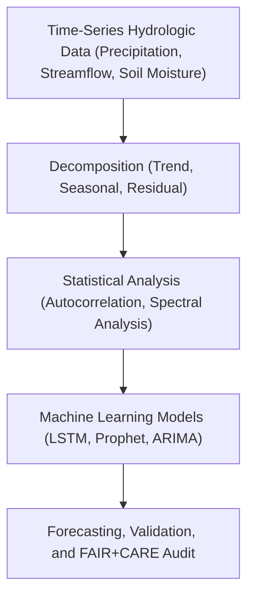

<div align="center">

# ⏳ **Kansas Frontier Matrix — Hydrology Methods · Temporal Analysis**  
`docs/analyses/hydrology/methods/temporal-analysis.md`

**Purpose:**  
Describe the **temporal modeling and time-series analytical frameworks** used to study drought–flood dynamics, hydrological variability, and climate-hydrology interactions in Kansas.  
These methods allow detection of **seasonal trends, anomalies, recurrence intervals, and long-term persistence** in water-related phenomena, conforming to **FAIR+CARE** and **MCP-DL v6.3** reproducibility governance.

[](../../../../../README.md)  
[](../../../../../../LICENSE)  
[](../../../../../../docs/standards/faircare.md)  
[](../../../../../../releases/)
</div>

---

## 📘 Overview

Temporal analysis in the Kansas Frontier Matrix (KFM) investigates **how hydrological variables evolve through time**, capturing shifts in flood frequency, drought duration, and precipitation intensity.  
This methodology integrates **classical time-series decomposition**, **frequency-domain analysis**, and **modern AI-driven sequence modeling** to identify and forecast hydrologic behavior.

Key goals:
- Quantify temporal patterns and anomalies in hydroclimatic variables.  
- Detect non-stationarity in drought and flood cycles.  
- Reconstruct historical hydrologic variability and predict near-term scenarios.  
- Link observed trends to climate drivers (ENSO, PDO, AMO).  

---

## 🧩 Analytical Framework



Temporal modeling operates in two parallel branches:
1. **Deterministic statistical methods** for periodicity, variance, and trend detection.  
2. **Machine learning sequence models** for adaptive prediction and anomaly detection.

---

## ⚙️ Temporal Analysis Techniques

| Category | Method | Purpose | Framework / Tool |
|-----------|---------|----------|------------------|
| **Classical Time-Series** | ARIMA / SARIMA | Identify seasonality and long-term persistence | `statsmodels` |
| **Decomposition** | STL / LOESS | Separate trend and cyclical components | `pandas`, `Prophet` |
| **Spectral Analysis** | FFT / Wavelet Transform | Examine dominant hydrological frequencies | `scipy.fft`, `pywavelets` |
| **Autocorrelation Functions** | ACF / PACF | Identify lags in streamflow or precipitation | `statsmodels.tsa.stattools` |
| **Machine Learning** | LSTM, GRU | Model complex, non-linear temporal dependencies | `TensorFlow`, `PyTorch` |
| **Hybrid Models** | ARIMA-LSTM / Prophet-Ensemble | Combine statistical and AI strengths | Custom KFM pipelines |

---

## 🧮 Core Equations

### 1. Autocorrelation Function (ACF)
\[
r_k = \frac{\sum_{t=1}^{N-k}(x_t - \bar{x})(x_{t+k} - \bar{x})}{\sum_{t=1}^N(x_t - \bar{x})^2}
\]

### 2. Seasonal Decomposition Model
\[
Y_t = T_t + S_t + R_t
\]
where \(Y_t\) is the observed value, \(T_t\) the trend, \(S_t\) the seasonal component, and \(R_t\) the residual.

### 3. Root Mean Square Error (RMSE)
\[
RMSE = \sqrt{\frac{1}{n}\sum_{i=1}^n (Q_{obs,i} - Q_{pred,i})^2}
\]

---

## 🤖 AI-Driven Sequence Modeling

| Model | Description | Input Features | Output |
|--------|-------------|----------------|---------|
| **LSTM (Long Short-Term Memory)** | Captures long-term temporal dependencies for hydrologic prediction | Precipitation, Temperature, Streamflow | Forecasted water levels or discharge |
| **Prophet** | Robust trend and seasonality modeling with uncertainty intervals | Time-series (daily/monthly) | Forecast + confidence bounds |
| **ARIMA-LSTM Hybrid** | Combines linear and non-linear learning for improved drought prediction | Historical Drought Index | SPI forecast and probability curves |
| **Autoencoder** | Detects anomalies in hydrologic behavior | Multivariate hydrological features | Anomaly scores |

---

## 🧾 Model Metadata Example

```json
{
  "model_id": "hydro_temporal_lstm_v3",
  "model_type": "LSTM Sequence Model",
  "training_period": ["1980-01-01", "2020-12-31"],
  "validation_period": ["2021-01-01", "2025-12-31"],
  "input_features": ["precipitation", "streamflow", "soil_moisture"],
  "metrics": {
    "r2": 0.89,
    "rmse": 3.2,
    "nse": 0.91
  },
  "energy_joules": 13.8,
  "carbon_gCO2e": 0.0052,
  "auditor": "FAIR+CARE Council",
  "timestamp": "2025-11-11T18:59:00Z"
}
```

---

## ⚖️ FAIR+CARE Governance Matrix

| Principle | Implementation |
|------------|----------------|
| **Findable** | Temporal model scripts and metadata indexed in `methods/temporal-analysis.md`. |
| **Accessible** | Training data, hyperparameters, and outputs shared under CC-BY. |
| **Interoperable** | JSON-LD metadata maps to STAC & DCAT schema for model discovery. |
| **Reusable** | Model weights, seeds, and validation data archived for full replication. |
| **CARE – Collective Benefit** | Supports drought and flood preparedness through open forecasting models. |
| **CARE – Responsibility** | Discloses uncertainty and avoids deterministic claims of hydrologic predictability. |

---

## 🧮 Validation & Sustainability Metrics

| Metric | Description | Value | Target | Unit |
|---------|-------------|--------|---------|------|
| **R²** | Model fit for validation period | 0.89 | ≥ 0.85 | — |
| **RMSE** | Prediction error | 3.2 | ≤ 4.0 | mm/day |
| **Energy (J)** | Average energy per model run | 13.8 | ≤ 15 | Joules |
| **Carbon (gCO₂e)** | CO₂ emissions per temporal analysis | 0.0052 | ≤ 0.006 | gCO₂e |
| **Telemetry Coverage (%)** | Logged runs with provenance data | 100 | ≥ 95 | % |

---

## 🕰️ Version History

| Version | Date | Author | Summary |
|----------|------|---------|----------|
| **v10.2.2** | 2025-11-11 | FAIR+CARE Council | Published temporal analysis guide with AI/ML integration and governance matrix. |
| **v10.2.1** | 2025-11-09 | Hydrology Analysis Group | Added LSTM hybrid and spectral modeling workflow documentation. |
| **v10.2.0** | 2025-11-07 | KFM Hydrology Team | Created initial temporal analysis methodology guide aligned with FAIR+CARE. |

---

<div align="center">

© 2025 Kansas Frontier Matrix Project  
Master Coder Protocol v6.3 · FAIR+CARE Certified · Diamond⁹ Ω / Crown∞Ω Ultimate Certified  

[Back to Hydrology Methods](./README.md) · [Governance Charter](../../../../../../docs/standards/governance/ROOT-GOVERNANCE.md)

</div>

