<div align="center">

# ⏳ **Kansas Frontier Matrix — Hydrology Methods · Temporal Analysis**  
`docs/analyses/hydrology/methods/temporal-analysis.md`

**Purpose**  
Describe the **temporal modeling and time-series analytical frameworks** used to study drought–flood dynamics, hydrological variability, and climate–hydrology interactions in Kansas.  
These methods enable detection of **seasonal trends, anomalies, recurrence intervals, and long-term persistence** in water-related phenomena, conforming to **FAIR+CARE**, **KFM-MDP v11.2.5**, and **MCP-DL v6.3** reproducibility governance.

[](../../../../README.md)  
[](../../../../LICENSE)  
[](../../../standards/faircare.md)  
[](../../../../releases/)

</div>

---

## 📘 Overview

Temporal analysis in the Kansas Frontier Matrix (KFM) investigates **how hydrological variables evolve through time**, including:

- Flood frequency and magnitude  
- Drought duration and severity  
- Precipitation intensity and persistence  
- Soil moisture and groundwater dynamics  

The methodology integrates:

- **Classical time-series decomposition** and statistical modeling  
- **Frequency-domain analysis** (spectral and wavelet methods)  
- **AI-driven sequence models** for anomaly detection and forecasting  

Primary objectives:

- Quantify temporal patterns and anomalies in hydroclimatic variables.  
- Detect non-stationarity in drought and flood cycles across Kansas.  
- Reconstruct historical hydrologic variability and predict near-term scenarios.  
- Link observed trends to climate drivers (e.g., ENSO, PDO, AMO).  
- Ensure all analyses are **reproducible, cataloged, and provenance-traceable** within KFM.

---

## 🗂️ Directory Layout

Temporal hydrology methods interact with documentation, data, and pipelines in the following layout (emoji profile: `immediate-one-branch-with-descriptions-and-emojis`):

```text
📁 Kansas-Frontier-Matrix/
├── 📁 docs/
│   ├── 📁 analyses/
│   │   └── 📁 hydrology/
│   │       ├── 📄 README.md                     # Hydrology analyses overview (required)
│   │       └── 📁 methods/
│   │           ├── 📄 README.md                 # Methods index (temporal, spatial, extremes)
│   │           └── 📄 temporal-analysis.md      # This methods document
│   └── 📁 standards/
│       └── 📄 kfm_markdown_protocol_v11.2.5.md  # Markdown authoring protocol (normative)
├── 📁 src/
│   └── 📁 pipelines/
│       └── 📁 hydrology/
│           ├── 📄 temporal_pipeline.py          # Deterministic ETL + modeling orchestration
│           └── 📄 config_temporal.yml           # Config-driven time-window, models, features
├── 📁 data/
│   ├── 📁 raw/
│   │   └── 📁 hydrology/
│   │       └── 📁 timeseries/                   # Raw precipitation, streamflow, soil moisture
│   ├── 📁 processed/
│   │   └── 📁 hydrology/
│   │       └── 📁 temporal/                     # Cleaned & gap-filled time-series
│   └── 📁 stac/
│       └── 📁 hydrology/
│           └── 📁 temporal/                     # STAC Items & Collections for temporal outputs
└── 📁 dist/
    └── 📁 hydrology/
        └── 📁 temporal/
            ├── 🧾 model-metadata.json           # Model cards & metrics for temporal models
            └── 🧾 provenance/                   # PROV-O bundles for temporal analyses
```

**Directory layout rules (normative):**

- Each directory shown above **MUST** have a `README.md` (or be covered by a higher-level README) explaining purpose and key artefacts.  
- Temporal pipelines under `src/pipelines/hydrology/` **MUST** be config-driven and reference this document as their methods standard.  
- All canonical temporal outputs **MUST** be discoverable via STAC Items under `data/stac/hydrology/temporal/`.

---

## 🧭 Context

Temporal hydrology methods connect to other KFM components:

- **Spatial hydrology analyses** (`docs/analyses/hydrology/methods/spatial-analysis.md`)  
  - Temporal outputs feed spatial risk maps (e.g., flood frequency surfaces, drought hotspot maps).  

- **Climate & atmospheric datasets**  
  - ENSO indices, drought indices (SPI, SPEI), and reanalysis products are used as covariates.  

- **Historical analyses & archaeology**  
  - Hydrological timelines provide context for historical narratives (e.g., drought-linked migration, flood impacts on settlements).  

- **OpenLineage & CI**  
  - Temporal pipelines must emit lineage according to the OpenLineage CI Integration Standard so that each model run and dataset can be traced via `runId` and PROV bundles.

This document should be treated as the **single methods reference** whenever new hydrology temporal pipelines or Story Nodes are added.

---

## 🗺️ Diagrams

### Temporal Analysis Workflow (Conceptual)

```mermaid
flowchart TD
    A["Input Hydrologic Time Series<br/>(Precipitation, Streamflow, Soil Moisture)"]
        --> B["Preprocessing<br/>QC · Gap-Filling · Resampling"]
    B --> C["Decomposition<br/>Trend · Seasonal · Residual"]
    C --> D["Statistical Analysis<br/>ACF/PACF · Spectral · Wavelet"]
    D --> E["Sequence Models<br/>ARIMA · LSTM · Prophet · Hybrids"]
    E --> F["Evaluation & Telemetry<br/>Metrics · Energy · Carbon"]
    F --> G["Catalog & Provenance<br/>STAC/DCAT · PROV-O · OpenLineage"]
    G --> H["Story Nodes & Focus Mode<br/>Temporal Narratives · Scenario Views"]
```



This flow is implemented via deterministic pipelines with configuration stored in `src/pipelines/hydrology/config_temporal.yml` (or equivalent), and all artefacts cataloged under `data/stac/hydrology/temporal/` and `dist/hydrology/temporal/`.

---

## 🧱 Architecture

### Analytical Framework

Temporal modeling operates in two complementary branches:

1. **Deterministic statistical methods**  
   - Capture periodicity, variance, and long-term trends.  
   - Provide interpretable baselines and confidence intervals.  

2. **AI/ML sequence models**  
   - Capture non-linear interactions and regime changes.  
   - Provide flexible multi-step forecasts and anomaly scores.

### Temporal Analysis Techniques

| Category                  | Method                | Purpose                                           | Framework / Tool                    |
|---------------------------|----------------------|---------------------------------------------------|-------------------------------------|
| **Classical Time-Series** | ARIMA / SARIMA       | Identify seasonality & long-term persistence      | `statsmodels`                       |
| **Decomposition**         | STL / LOESS          | Separate trend, seasonal, and residual components | `pandas`, `Prophet`                 |
| **Spectral Analysis**     | FFT / Wavelet        | Examine dominant hydrologic frequencies           | `scipy.fft`, `pywavelets`           |
| **Autocorrelation**       | ACF / PACF           | Identify lags in streamflow or precipitation      | `statsmodels.tsa.stattools`         |
| **Machine Learning**      | LSTM / GRU           | Capture complex, non-linear temporal dependencies | `TensorFlow`, `PyTorch`             |
| **Hybrid Models**         | ARIMA–LSTM / Prophet-Ensemble | Combine linear + non-linear strengths         | Custom KFM pipelines (Python)       |

### Core Equations

**1. Autocorrelation Function (ACF)**  

\[
r_k = \frac{\sum_{t=1}^{N-k}(x_t - \bar{x})(x_{t+k} - \bar{x})}{\sum_{t=1}^N(x_t - \bar{x})^2}
\]

**2. Seasonal Decomposition Model**  

\[
Y_t = T_t + S_t + R_t
\]

Where:

- \(Y_t\) – observed time-series value  
- \(T_t\) – trend component  
- \(S_t\) – seasonal component  
- \(R_t\) – residual / irregular component  

**3. Root Mean Square Error (RMSE)**  

\[
RMSE = \sqrt{\frac{1}{n}\sum_{i=1}^n (Q_{obs,i} - Q_{pred,i})^2}
\]

### AI-Driven Sequence Modeling

| Model                  | Description                                            | Input Features                                        | Output                                |
|------------------------|--------------------------------------------------------|--------------------------------------------------------|----------------------------------------|
| **LSTM**               | Captures long-term temporal dependencies               | Precipitation, temperature, streamflow, soil moisture  | Forecasted discharge or water levels   |
| **Prophet**            | Trend + seasonality model with uncertainty bounds      | Daily / monthly hydrologic indices                    | Forecast with confidence intervals     |
| **ARIMA–LSTM Hybrid**  | Linear + non-linear ensemble for drought/flood cycles | Historical drought indices (SPI/SPEI), flows          | SPI forecasts, exceedance probabilities|
| **Autoencoder**        | Learns normal temporal patterns for anomaly detection  | Multivariate hydrologic features                      | Anomaly scores per time step           |

---

## 🧠 Story Node & Focus Mode Integration

Temporal hydrology outputs are a core input to **Story Nodes** and **Focus Mode**:

- **Story Nodes**  
  - Represent narratives such as “Multi-year Droughts in Southwest Kansas” or “Flood Regimes along the Arkansas River”.  
  - Each Story Node should reference:
    - One or more STAC Items from `data/stac/hydrology/temporal/`.  
    - The temporal analysis method (this document) and model metadata in `dist/hydrology/temporal/model-metadata.json`.  

- **Focus Mode**  
  - When a user focuses on a river reach or county, Focus Mode may:
    - Show recent and historical hydrologic time-series.  
    - Surface method notes from this document (e.g., decomposition type, forecast model).  
    - Indicate uncertainty bands and model version IDs.  

Constraints:

- Focus Mode **may summarize** methods and metrics.  
- Focus Mode **must not** invent new methods or claim stronger predictive certainty than documented.  
- Story Nodes referencing hydrology temporal analysis must link back to this file’s `semantic_document_id` and relevant model IDs.

---

## 📦 Data & Metadata

### Data Inputs

Typical temporal hydrology inputs include:

- Daily / sub-daily **precipitation** (gauge + gridded)  
- **Streamflow** at gauging stations (cfs or m³/s)  
- **Soil moisture** indices and groundwater levels  
- Climate indices (ENSO, PDO, AMO, PDSI, SPI, SPEI)

Each input time-series should have:

- Clear **spatiotemporal extent** (e.g., HUC, county, basin)  
- Data quality flags (e.g., missing, estimated, corrected)  
- STAC/DCAT entries linking to source providers and licenses  

### Model Metadata Example

```json
{
  "model_id": "hydro_temporal_lstm_v3",
  "model_type": "LSTM Sequence Model",
  "training_period": ["1980-01-01", "2020-12-31"],
  "validation_period": ["2021-01-01", "2025-12-31"],
  "spatial_scope": "Kansas statewide",
  "input_features": ["precipitation", "streamflow", "soil_moisture"],
  "target_variable": "daily_discharge",
  "hyperparameters": {
    "hidden_units": 128,
    "num_layers": 2,
    "dropout": 0.2,
    "learning_rate": 0.0005,
    "batch_size": 64,
    "random_seed": 4242
  },
  "metrics": {
    "r2": 0.89,
    "rmse": 3.2,
    "nse": 0.91
  },
  "energy_joules": 13.8,
  "carbon_gCO2e": 0.0052,
  "telemetry_ref": "releases/v11.2.4/focus-telemetry.json",
  "provenance_bundle": "dist/hydrology/temporal/provenance/prov-<sha>.jsonld",
  "auditor": "FAIR+CARE Council",
  "timestamp": "2025-11-11T18:59:00Z"
}
```

Model metadata **MUST** be stored in machine-readable form under `dist/hydrology/temporal/model-metadata.json` (or partitioned equivalents) and cross-referenced from STAC Items and Story Nodes.

---

## 🌐 STAC, DCAT & PROV Alignment

Temporal analysis outputs must be **catalog-ready**:

- **STAC**  
  - Temporal products (e.g., drought index time-series, flood recurrence curves) appear as Items in `data/stac/hydrology/temporal/`.  
  - Recommended properties:
    - `kfm:method_ref`: `"docs/analyses/hydrology/methods/temporal-analysis.md@v11.2.4"`  
    - `kfm:model_id`: `"hydro_temporal_lstm_v3"` (or list)  
    - `kfm:prov_bundle_ref`: `"dist/hydrology/temporal/provenance/prov-<sha>.jsonld"`

- **DCAT**  
  - Temporal datasets appear as `dcat:Dataset` records in the global catalog, with:
    - `dct:title`, `dct:description`, `dct:license`, `dct:temporal`, `dct:spatial`  
    - `dct:provenance` pointing at PROV bundles and OpenLineage run IDs.

- **PROV-O**  
  - Each temporal pipeline run is a `prov:Activity`.  
  - Inputs (time-series, climate indices) are `prov:Entity` with `prov:used`.  
  - Outputs (forecasts, anomalies, Story Node-ready datasets) are `prov:Entity` with `prov:wasGeneratedBy`.  
  - CI agents and pipelines are `prov:Agent` linked via `prov:wasAssociatedWith`.

Temporal analyses **must also** integrate with the OpenLineage CI Integration Standard so that PROV bundles and STAC/DCAT entries share the same `runId` and `KFM_RUN_SHA`.

---

## 🧪 Validation & CI/CD

Temporal hydrology methods must be **deterministic and reproducible** under CI:

- **Reproducibility rules**

  - Time-series transformations (resampling, detrending, decomposition) must be:
    - Configured via YAML (e.g., window sizes, decomposition method).  
    - Logged alongside model metadata.  
  - All stochastic models (e.g., neural nets) must:
    - Fix random seeds (framework + numpy).  
    - Record dataset splits and seeds in metadata.

- **Metric expectations (example)**

  | Metric                     | Description                            | Value | Target | Unit     |
  |----------------------------|----------------------------------------|:-----:|:------:|----------|
  | **R²**                     | Model fit (validation period)         | 0.89  | ≥ 0.85 | —        |
  | **RMSE**                   | Forecast error                        | 3.2   | ≤ 4.0  | mm/day   |
  | **Nash–Sutcliffe (NSE)**  | Efficiency coefficient                 | 0.91  | ≥ 0.75 | —        |
  | **Energy (J)**             | Avg. energy per model run             | 13.8  | ≤ 15   | Joules   |
  | **Carbon (gCO₂e)**         | CO₂ equivalent per analysis           | 0.0052| ≤ 0.006| gCO₂e    |
  | **Telemetry Coverage (%)** | Runs with telemetry + provenance      | 100   | ≥ 95   | %        |

- **CI hooks**

  - Temporal pipelines must be covered by:
    - `.github/workflows/lineage.yml` (lineage + provenance).  
    - Docs lint for this file (Markdown + schema-lint).  
  - CI must **fail** if:
    - Required metadata fields are missing.  
    - R²/RMSE/NSE thresholds are not met for declared “production” models (unless explicitly marked as experimental).  
    - Provenance or telemetry artefacts are missing.

---

## ⚖ FAIR+CARE & Governance

### FAIR+CARE Governance Matrix

| Principle                     | Implementation                                                                                           |
|------------------------------|----------------------------------------------------------------------------------------------------------|
| **Findable**                 | Methods documented here; temporal datasets indexed via STAC/DCAT with `kfm:method_ref` links.           |
| **Accessible**               | Model cards and methods under CC-BY; data access aligned with source licenses and sovereignty policies. |
| **Interoperable**            | JSON-LD metadata and STAC/DCAT mappings for model discovery; PROV-O for lineage.                        |
| **Reusable**                 | Model weights, seeds, configs, and validation data archived; detailed method descriptions in this doc.  |
| **CARE – Collective Benefit**| Supports drought/flood preparedness, infrastructure planning, and climate resilience.                    |
| **CARE – Authority to Control** | Respects tribal and local governance over sensitive wells, infrastructure, or community water data. |
| **CARE – Responsibility**    | Discloses uncertainty; avoids deterministic claims; flags areas with low data quality.                  |
| **CARE – Ethics**            | Prohibits using models to overstate precision or to justify harmful interventions without context.      |

Sensitive infrastructure or community datasets:

- Must be **generalized** or aggregated in public-facing outputs.  
- Must be documented with masking strategies in PROV/telemetry if redacted.

Authors must consult `governance_ref`, `ethics_ref`, and `sovereignty_policy` when designing new temporal analyses or Story Nodes.

---

## 🕰️ Version History

| Version   | Date       | Author / Steward           | Summary                                                                                             |
|----------:|-----------:|----------------------------|-----------------------------------------------------------------------------------------------------|
| **v11.2.4** | 2025-12-07 | FAIR+CARE Council · KFM Hydrology | Aligned with KFM-MDP v11.2.5; added emoji directory layout; introduced Story Node & Focus Mode integration; expanded STAC/DCAT/PROV alignment and validation/CI guidance; updated release/telemetry refs. |
| v10.2.2  | 2025-11-11 | FAIR+CARE Council          | Published temporal analysis guide with AI/ML integration and governance matrix.                     |
| v10.2.1  | 2025-11-09 | Hydrology Analysis Group   | Added LSTM hybrid and spectral modeling workflow documentation.                                     |
| v10.2.0  | 2025-11-07 | KFM Hydrology Team         | Created initial temporal analysis methodology guide aligned with FAIR+CARE.                         |

---

<div align="center">

© 2025 Kansas Frontier Matrix Project  
Master Coder Protocol v6.3 · FAIR+CARE Certified · Diamond⁹ Ω / Crown∞Ω Ultimate Certified  

[🔙 Back to Hydrology Methods](./README.md) · [⚖ Governance Charter](../../../standards/governance/ROOT-GOVERNANCE.md) · [📘 Markdown Protocol v11.2.5](../../../standards/kfm_markdown_protocol_v11.2.5.md)

</div>
