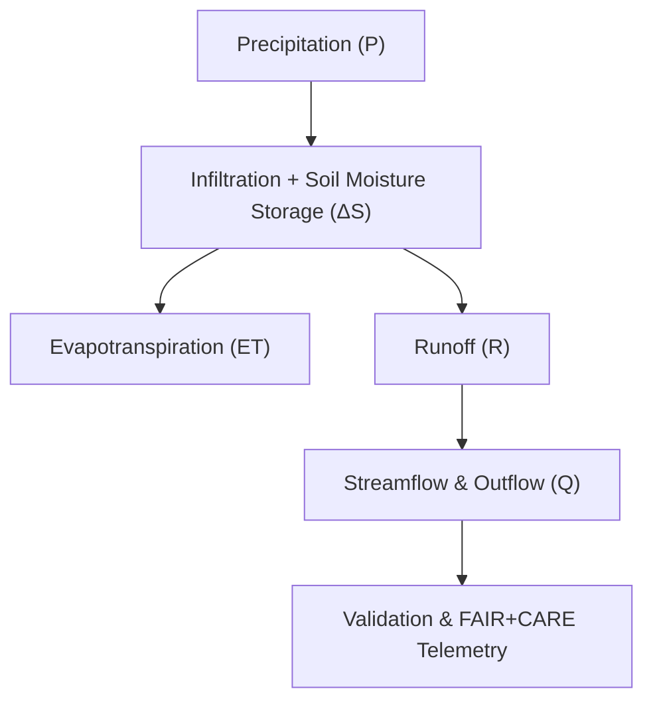

<div align="center">

# 💧 **Kansas Frontier Matrix — Hydrology Methods · Water Balance Modeling**  
`docs/analyses/hydrology/methods/water-balance.md`

**Purpose:**  
Describe the **conceptual framework, data inputs, and analytical methods** used for water balance modeling within the Kansas Frontier Matrix (KFM).  
This document defines the mathematical relationships and workflows used to quantify **precipitation, evapotranspiration, infiltration, runoff, and storage** at regional and basin scales under **FAIR+CARE** and **MCP-DL v6.3** reproducibility principles.

[](../../../../../README.md)  
[](../../../../../../LICENSE)  
[](../../../../../../docs/standards/faircare.md)  
[](../../../../../../releases/)
</div>

---

## 📘 Overview

Water balance modeling quantifies how water enters, moves through, and exits the Kansas hydrologic system.  
These methods integrate **precipitation, evapotranspiration, runoff, and storage** datasets to derive basin-wide and temporal estimates of hydrologic fluxes.  
Each computation follows transparent, reproducible workflows with telemetry logging of inputs, parameters, and results for scientific verification.

**Objectives:**
- Calculate basin-level and statewide water balance using historical and modern records  
- Model long-term changes in water storage and runoff generation  
- Support drought and flood assessment models through hydrologic consistency checks  
- Evaluate the sustainability of water resource use under climate variability  

---

## 🧩 Conceptual Water Balance Framework



The general water balance equation is represented as:

\[
P = ET + R + ΔS
\]

where:  
- \( P \): Precipitation input  
- \( ET \): Evapotranspiration losses  
- \( R \): Surface runoff and groundwater discharge  
- \( ΔS \): Change in storage (soil, aquifer, or reservoir)

---

## ⚙️ Modeling Workflow

| Step | Description | Tools / Frameworks | Output |
|------|--------------|--------------------|---------|
| **1. Data Acquisition** | Collect precipitation, ET, and runoff data (NOAA, USGS, NRCS) | `pandas`, `xarray`, `GDAL` | Standardized hydrologic datasets |
| **2. Unit Conversion & QC** | Convert all inputs to mm/day, check missing data | `NumPy`, `pandas` | Clean time-series tables |
| **3. Computation** | Calculate P, ET, R, and ΔS using mass balance relationships | `HydroBalance`, `SciPy` | Monthly / annual water balance CSV |
| **4. Validation** | Cross-validate modeled R with observed streamflow | `statsmodels`, `scikit-learn` | R², RMSE, NSE metrics |
| **5. FAIR+CARE Logging** | Store telemetry (energy, carbon, provenance, ethics audit) | `KFM Telemetry CLI` | JSON logs and sustainability summary |

---

## 🧮 Core Equations

### 1. Water Balance Equation
\[
P - ET - R = ΔS
\]

### 2. Runoff Coefficient
\[
C_r = \frac{R}{P}
\]

### 3. Actual Evapotranspiration (using Budyko-type relation)
\[
ET = P \left[\frac{ϕ}{(1 + ϕ^ω)^{1/ω}}\right]
\]
where \( ϕ = \frac{PET}{P} \) and \( ω \) is an empirical parameter describing landscape characteristics.

### 4. Nash–Sutcliffe Efficiency (Validation)
\[
NSE = 1 - \frac{\sum{(Q_{obs} - Q_{sim})^2}}{\sum{(Q_{obs} - \bar{Q}_{obs})^2}}
\]

---

## 📊 Input / Output Data Structure

| Variable | Description | Unit | Source |
|-----------|-------------|------|--------|
| **precipitation** | Mean daily precipitation | mm/day | NOAA / NCEI |
| **evapotranspiration** | Modeled actual ET | mm/day | NRCS / MODIS |
| **runoff** | Surface runoff or streamflow | mm/day | USGS NWIS |
| **storage_change** | Soil or reservoir water storage change | mm | GRACE satellite data |
| **water_balance_total** | Net water surplus or deficit | mm | Derived |

---

## ⚖️ FAIR+CARE Governance Matrix

| Principle | Implementation |
|------------|----------------|
| **Findable** | Metadata indexed under STAC/DCAT with telemetry linkage. |
| **Accessible** | Water balance data openly published as CSV/GeoJSON. |
| **Interoperable** | JSON-LD and OGC WMS integration for map visualization. |
| **Reusable** | Provenance and parameter configuration included in manifests. |
| **CARE – Collective Benefit** | Supports drought mitigation, water planning, and education. |
| **CARE – Responsibility** | Transparent disclosure of model uncertainty and energy footprint. |

---

## 🧾 Example Output Metadata

```json
{
  "model_id": "hydro_water_balance_ks_v10_2025",
  "region": "Kansas Statewide",
  "period": ["1900-01-01", "2025-12-31"],
  "parameters": {
    "time_step": "monthly",
    "unit": "mm",
    "model": "Mass Balance",
    "validation_metric": "NSE = 0.91"
  },
  "outputs": {
    "mean_precipitation_mm": 735.2,
    "mean_runoff_mm": 146.5,
    "mean_evapotranspiration_mm": 563.7,
    "mean_storage_change_mm": 25.0
  },
  "energy_joules": 12.6,
  "carbon_gCO2e": 0.0050,
  "faircare_status": "PASS",
  "auditor": "FAIR+CARE Hydrology Council",
  "timestamp": "2025-11-11T19:05:00Z"
}
```

---

## 🧮 Sustainability Metrics

| Metric | Description | Value | Target | Unit |
|---------|-------------|--------|---------|------|
| **Energy (J)** | Energy per model simulation | 12.6 | ≤ 15 | Joules |
| **Carbon (gCO₂e)** | CO₂ equivalent per model run | 0.0050 | ≤ 0.006 | gCO₂e |
| **Telemetry Coverage (%)** | Logged runs with metadata linkage | 100 | ≥ 95 | % |
| **Validation Pass Rate (%)** | Models passing QC / FAIR+CARE checks | 100 | 100 | % |

---

## 🕰️ Version History

| Version | Date | Author | Summary |
|----------|------|---------|----------|
| **v10.2.2** | 2025-11-11 | FAIR+CARE Council | Published water balance modeling guide; added Budyko equation and telemetry integration. |
| **v10.2.1** | 2025-11-09 | Hydrology Modeling Team | Enhanced validation metrics and GRACE data linkage. |
| **v10.2.0** | 2025-11-07 | KFM Hydrology Team | Created base methodology for water balance computations. |

---

<div align="center">

© 2025 Kansas Frontier Matrix Project  
Master Coder Protocol v6.3 · FAIR+CARE Certified · Diamond⁹ Ω / Crown∞Ω Ultimate Certified  

[Back to Hydrology Methods](./README.md) · [Governance Charter](../../../../../../docs/standards/governance/ROOT-GOVERNANCE.md)

</div>

