<div align="center">

# 💧 **Kansas Frontier Matrix — Hydrology Analyses Overview**

`docs/analyses/hydrology/README.md`

**Purpose:**  
Provide an integrated overview of all **hydrology-focused analytical frameworks**, **datasets**, and **validation mechanisms** within the Kansas Frontier Matrix (KFM).  
This document unifies **drought–flood correlation**, **spatial hydrology modeling**, and **telemetry governance** under **FAIR+CARE**, **ISO 19115**, and **MCP-DL v6.3** standards.

[](../../../README.md)
[](../../../LICENSE)
[](../../standards/README.md)
[](../../../releases/)
</div>

---

## 📘 Overview

The **Hydrology Analysis Suite** integrates environmental datasets to measure hydrologic balance, drought–flood dynamics, and watershed resilience throughout Kansas.  
Each analysis follows **FAIR+CARE** data ethics, ISO-compliant sustainability tracking, and governance-linked telemetry logging.

**Core objectives**

- Quantify **drought–flood coupling** using temporal and spatial analyses.  
- Integrate **FAIR+CARE and ISO** ethics into every hydrologic model run.  
- Maintain transparent **provenance and telemetry** via governance-linked schemas.  

This README provides the **entry point** for:

- Navigating hydrology analysis docs and datasets.  
- Understanding the **ETL → catalog → graph → Story Node** path for hydrology.  
- Locating validation, sustainability, and governance artifacts for this domain.

---

## 🗂️ Directory Layout

### Documentation layout

```text
📁 docs/
└── 📁 analyses/
    └── 📁 hydrology/
        ├── 📄 README.md                         # This overview (Hydrology Analyses Guide)
        ├── 📁 drought-flood-correlation/        # Drought–flood correlation & methods
        │   ├── 📄 README.md                     # Correlation module overview
        │   └── 📁 methods/                      # Core hydrological methods
        │       ├── 📄 README.md                 # Method suite introduction
        │       ├── 📄 preprocessing.md          # Data normalization and QC
        │       ├── 📄 temporal-alignment.md     # Lag correction and synchronization
        │       ├── 📄 correlation-analysis.md   # Correlation and coherence analysis
        │       ├── 📄 spatial-modeling.md       # Basin-level and raster spatial analysis
        │       ├── 📄 validation.md             # FAIR+CARE + ISO validation framework
        │       └── 📁 datasets/                 # Data and metadata resources (docs layer)
        │           ├── 📄 README.md
        │           ├── 📁 raw/                  # Notes on NOAA / USGS / Daymet / PRISM inputs
        │           ├── 📁 processed/            # Notes for standardized FAIR+CARE data
        │           ├── 📁 derived/              # Notes for analytical outputs & indices
        │           └── 📁 metadata/             # STAC/DCAT 3.0 + PROV registry notes
        └── 📁 reports/                          # Summary dashboards and sustainability outputs
            ├── 📄 README.md                     # How hydrology reports & Story Nodes are generated
            ├── 🧾 correlation_summary.json      # Machine-readable summary bundle
            ├── 🧾 sustainability_audit.json     # Energy, carbon, FAIR+CARE audits
            ├── 🧾 faircare_validation.json      # FAIR+CARE validation bundle
            └── 📁 visualization/
                ├── 🖼️ drought_overlay_map.png
                ├── 🖼️ flood_risk_index_map.png
                └── 🖼️ hydrology_dashboard_snapshot.png
```

### Data & catalogs (conceptual)

```text
📁 data/
├── 📁 raw/
│   └── 📁 external/
│       ├── 📁 noaa/         # NCEI climate and precipitation
│       ├── 📁 usgs/         # NWIS streamflow and discharge
│       ├── 📁 prism/        # Gridded climate & drought indices
│       └── 📁 nrcs/         # SSURGO / STATSGO soil and hydrologic groups
├── 📁 processed/
│   └── 📁 hydrology/
│       ├── 📁 basin_timeseries/   # Canonical basin-level time series
│       ├── 📁 gridded/            # Gridded hydrology rasters
│       └── 📁 indices/            # Drought–flood correlation indices
└── 📁 stac/
    └── 📁 hydrology/
        ├── 🛰️ basins/             # STAC Collections for basin-based series
        ├── 🛰️ grids/              # STAC Collections for gridded rasters
        └── 🛰️ indices/            # STAC Collections for derived indices
```

### Graph, API, and Story Nodes (conceptual)

```text
📁 src/
├── 📁 pipelines/
│   └── 📁 hydrology/               # Hydrology ETL, preprocessing, correlation workflows
├── 📁 graph/
│   └── 📁 hydrology/               # Neo4j schema for basins, reaches, series, indices
├── 📁 api/
│   └── 📁 hydrology/               # API endpoints exposing hydrology series & indices
└── 📁 web/
    └── 📁 story-nodes/
        └── 📁 hydrology/           # Story Nodes & UI for hydrology narratives
```

---

## 🧭 Context

Hydrology is a **cross-cutting backbone** for KFM:

- It mediates between **climate drivers** (precipitation, temperature) and **impacts** (drought, flooding, soil moisture).
- It ties together:
  - Surface water and groundwater.
  - Basin topology and land cover.
  - Infrastructure and policy responses.

Within KFM, hydrology analyses support:

- **Risk assessment** — basin-level drought and flood risk, including compounding hazards.  
- **Adaptation planning** — where water stress intersects agriculture, infrastructure, and communities.  
- **Energy and climate narratives** — hydropower, cooling water, and extreme-event impacts on energy systems.  

This README ensures that **any new hydrology work** can be:

- Located in a predictable place.  
- Tied into STAC/DCAT catalogs and Neo4j graphs.  
- Governed under FAIR+CARE and sustainability metrics.

---

## 🧱 Architecture

### Analytical framework


Key stages:

1. **Ingestion & preprocessing**
   - Harmonize spatial/temporal resolutions.
   - Run QC and gap-filling where appropriate (logged as transformations).

2. **Temporal correlation**
   - Link drought indices (e.g., SPI/SPEI) to streamflow and discharge.
   - Explore lags, persistence, and compound event windows.

3. **Spatial modeling**
   - Propagate signals across basins using DEMs, soil groups, and land cover.
   - Estimate runoff, infiltration, and routing under various scenarios.

4. **Sustainability & governance**
   - Compute energy and carbon footprints of analytical workflows.
   - Log results in Governance Ledger and FAIR+CARE validation bundles.

### Hydrology lifecycle

```mermaid
flowchart LR
  A["Dataset Ingestion (Raw)"]
    --> B["Preprocessing (QC + Validation)"]
  B --> C["Analysis (Drought–Flood Correlation + Spatial Modeling)"]
  C --> D["FAIR+CARE Validation (Ethics + Energy + Carbon)"]
  D --> E["Governance Ledger Commit"]
  E --> F["FAIR+CARE Dashboard + Public Reporting"]
```



---

## 📦 Data & Metadata

### Core data sources

| Source         | Dataset                                | Format                  | FAIR+CARE Status |
|----------------|----------------------------------------|-------------------------|------------------|
| **NOAA NCEI**  | Historical precipitation & temperature | CSV / NetCDF            | ✅ Pass          |
| **USGS NWIS**  | Streamflow & discharge records         | CSV / GeoPackage        | ✅ Pass          |
| **PRISM**      | Climate grids & drought indices        | NetCDF                  | ✅ Pass          |
| **NRCS SSURGO / STATSGO** | Soils & hydrologic groups   | GeoPackage              | ✅ Pass          |
| **FAIR+CARE Ledger** | Provenance, energy, ethical metadata | JSON-LD            | ✅ Certified     |

Hydrology analyses should:

- Use **canonical, versioned copies** from `data/raw/external/*`.  
- Derive **processed layers** in `data/processed/hydrology/*`.  
- Emit **catalog-ready artifacts** in `data/stac/hydrology/*`.  

### Governance Ledger example (hydrology)

```json
{
  "ledger_id": "hydrology-ledger-2025-11-09-0005",
  "component": "Hydrology Drought–Flood Correlation Module",
  "datasets": [
    "NOAA Precipitation",
    "USGS Streamflow",
    "PRISM Drought Index",
    "NRCS Soil Data"
  ],
  "energy_joules": 14.3,
  "carbon_gCO2e": 0.0058,
  "faircare_status": "Pass",
  "auditor": "FAIR+CARE Council",
  "timestamp": "2025-11-09T13:00:00Z"
}
```

Ledger entries should be **machine-readable** and link back to:

- STAC/DCAT identifiers.  
- ETL run IDs and parameter sets.  
- Relevant FAIR+CARE audits.

---

## 🌐 STAC, DCAT & PROV Alignment

Hydrology datasets must be **catalog-ready**:

- **STAC**
  - Collections for:
    - Basins (`hydrology-basins`),
    - Grids (`hydrology-grids`),
    - Derived indices (`hydrology-indices`).
  - Items for:
    - Specific basins, time windows, and resolutions.
    - Raster tiles and time slices.

- **DCAT**
  - Datasets for:
    - Canonical basin time series.
    - Gridded climate/hydrology products.
    - Drought–flood correlation indices.
  - Distributions in:
    - NetCDF, GeoTIFF, GeoPackage, CSV.

- **PROV-O**
  - Entities:
    - Raw datasets, processed layers, indices, reports.
  - Activities:
    - Ingestion, preprocessing, correlation analysis, spatial modeling.
  - Agents:
    - Hydrology pipelines, governance councils, auditors.

Every major hydrology output should have:

- A **STAC Item** (for geospatial/temporal discoverability).  
- A **DCAT Distribution** (for access & licensing).  
- A **PROV chain** linking it back to sources and processes.

---

## 🧪 Validation & CI/CD

### Sustainability metrics

| Metric                     | Description                               | Target  | Unit   |
|----------------------------|-------------------------------------------|---------|--------|
| **Energy (J)**             | Average analysis energy consumption       | ≤ 15    | Joules |
| **Carbon (gCO₂e)**         | CO₂ equivalent per complete run           | ≤ 0.006 | gCO₂e  |
| **Telemetry Coverage (%)** | FAIR+CARE trace coverage                  | ≥ 95    | %      |
| **Audit Pass Rate (%)**    | FAIR+CARE & ISO validation compliance     | 100     | %      |

### Validation workflows (conceptual)

| Workflow              | Function                                      | Output                                 |
|-----------------------|-----------------------------------------------|----------------------------------------|
| `hydrology-ingest.yml`   | Collects & normalizes hydrologic datasets     | `reports/data_ingest_log.json`         |
| `hydrology-validate.yml` | Runs FAIR+CARE + ISO validation routines      | `reports/validation_audit.json`        |
| `ledger-sync.yml`        | Commits validated outputs to Governance Ledger | `governance/LEDGER/hydrology-ledger.json` |

### Validation record example

```json
{
  "validation_id": "hydrology-validation-2025-11-09-011",
  "modules": [
    "Preprocessing",
    "Temporal Alignment",
    "Correlation Analysis"
  ],
  "energy_joules": 14.3,
  "carbon_gCO2e": 0.0058,
  "validation_status": "Pass",
  "auditor": "FAIR+CARE Council",
  "timestamp": "2025-11-09T13:15:00Z"
}
```

All workflows should:

- Be **config-driven** (YAML/JSON configs committed to the repo).  
- Log seeds, parameters, dataset versions, and checksums.  
- Be re-runnable via a documented CLI or workflow invocation.

---

## 🧠 Story Node & Focus Mode Integration

Hydrology analyses should **feed Story Nodes directly**, not just produce static reports.

Example Story Node themes:

- **“Drought–Flood Whiplash in Kansas Basins”**
  - Temporal extent: multi-decade analysis windows.
  - Spatial extent: selected HUC-level basins.
  - Links:
    - Drought indices (SPI/SPEI),
    - Streamflow anomalies,
    - Land-use and infrastructure layers.

- **“Hydrology and Climate Adaptation Corridors”**
  - Temporal extent: recent decades + future scenario overlays.
  - Spatial extent: corridors where water stress, agriculture, and infrastructure intersect.
  - Links:
    - Hydrology indices,
    - Policy instruments,
    - Adaptation projects.

In **Focus Mode**, hydrology nodes should:

- Allow interactive filtering by:
  - Basin, watershed, or grid cell.
  - Time window and event type (drought, flood, compound).  
- Surface:
  - Provenance links (source datasets, ETL runs, audits).
  - FAIR+CARE and sustainability indicators for each Story Node.

---

## ⚖ FAIR+CARE & Governance

### FAIR+CARE governance matrix

| Principle               | Implementation                                               | Validation Source              |
|-------------------------|--------------------------------------------------------------|--------------------------------|
| **Findable**            | STAC/DCAT 3.0 metadata with UUIDs & version tags            | `datasets/metadata/`           |
| **Accessible**          | Public FAIR+CARE datasets and dashboards                    | Governance Ledger              |
| **Interoperable**       | Uses GeoPackage, NetCDF, GeoTIFF, CSV                       | `telemetry_schema`             |
| **Reusable**            | Metadata includes lineage, license, & parameters            | `manifest_ref`                 |
| **Collective Benefit**  | Hydrology results support climate adaptation policy         | FAIR+CARE Audit                |
| **Authority to Control**| FAIR+CARE Council approval before dataset release           | Governance Charter             |
| **Responsibility**      | ISO 50001 telemetry ensures carbon & energy logging         | `telemetry_ref`                |
| **Ethics**              | Sensitive site data generalized to ≥1 km                    | FAIR+CARE Ethics Review        |

Hydrology teams must:

- Flag any datasets that intersect **sensitive locations** or communities.  
- Apply **aggregation / masking** where necessary.  
- Ensure that Policy and Story Node usage is **transparent and documented**.

---

## 🕰️ Version History

| Version   | Date       | Author               | Summary                                                                 |
|----------|------------|----------------------|-------------------------------------------------------------------------|
| v11.2.4  | 2025-12-07 | KFM AI Lead          | Aligned hydrology overview with KFM-MDP v11.2.4 structure & governance. |
| v10.2.2  | 2025-11-09 | FAIR+CARE Council    | Hydrology overview with v10.2 method standards & sustainability tracking. |
| v10.2.0  | 2025-11-09 | Hydrology Working Group | Refactored structure; added dashboards, FAIR+CARE lifecycle, ISO metrics. |
| v10.1.0  | 2025-11-09 | KFM Data Team        | Baseline hydrology documentation under MCP-DL v6.3.                     |

---

<div align="center">

**Kansas Frontier Matrix (KFM v11)**  

[🏠 Monorepo Root](/) · [📊 Analyses Overview](../README.md) · [⚖️ Root Governance](../../standards/governance/ROOT-GOVERNANCE.md)

</div>
