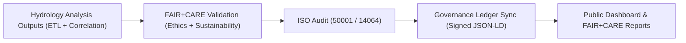

<div align="center">

# 📊 **Kansas Frontier Matrix — Hydrology Analysis Reports & FAIR+CARE Validation Summaries**
`docs/analyses/hydrology/reports/README.md`

**Purpose:**  
Aggregate and publish all **hydrology analysis outputs**, **FAIR+CARE validation audits**, and **Governance Ledger summaries** for the **drought–flood correlation studies** conducted within the Kansas Frontier Matrix (KFM).  
Ensures analytical transparency, ethical validation, and sustainability tracking for hydrological research pipelines under **MCP-DL v6.3**.

[](../../../README.md)
[](../../../../LICENSE)
[](../../../../docs/standards/README.md)
[](../../../../releases/)
</div>

---

## 📘 Overview

This directory contains **validation reports, correlation summaries, and sustainability audits** produced from hydrology analyses in KFM.  
Each report is generated through reproducible FAIR+CARE workflows and logged in the **Governance Ledger** for full traceability.

**Report Categories**
- 📈 Statistical analysis reports (correlation, lag time, basin summaries)  
- 🌍 Spatial outputs (GeoTIFF, GeoJSON) and derived metrics  
- ⚙️ Sustainability telemetry (energy, carbon, provenance logs)  
- ⚖️ FAIR+CARE validation and governance certification  

---

## 🗂️ Directory Layout

```plaintext
docs/analyses/hydrology/reports/
├── README.md                                  # This documentation
├── correlation_summary.json                   # Summary of correlation coefficients and lag times
├── basin_statistics.geojson                   # Aggregated basin-level drought/flood metrics
├── sustainability_audit.json                  # ISO 50001 / 14064 sustainability report
├── faircare_validation.json                   # FAIR+CARE ethical and governance validation report
├── ledger_entry.json                          # Governance Ledger record for hydrology analysis
└── visualization/                             # Maps, charts, and public report artifacts
    ├── flood_risk_index_map.png
    ├── drought_overlay_map.png
    └── hydrology_dashboard_snapshot.png
```

---

## ⚙️ Report Types and Descriptions

| Report | Description | Validation | Format |
|---------|-------------|-------------|---------|
| **correlation_summary.json** | Correlation coefficients (Pearson, Spearman, Kendall) between drought and flood variables | FAIR+CARE Council | JSON |
| **basin_statistics.geojson** | Catchment-level drought/flood index summaries | FAIR+CARE Council | GeoJSON |
| **sustainability_audit.json** | Energy, carbon, and sustainability performance (ISO 50001/14064) | FAIR+CARE + ISO Audit | JSON |
| **faircare_validation.json** | Ethical and FAIR+CARE compliance report | FAIR+CARE Council | JSON |
| **ledger_entry.json** | Immutable Governance Ledger record of analysis execution | Governance Ledger | JSON-LD |

---

## 🧾 Example Correlation Report

```json
{
  "report_id": "hydrology-correlation-2025-11-09-0004",
  "basins_analyzed": 102,
  "methods_used": ["Spearman", "Pearson", "Kendall"],
  "average_correlation": 0.72,
  "strongest_positive_basin": "Kansas River (ρ=0.88)",
  "strongest_negative_basin": "Verdigris River (ρ=-0.45)",
  "energy_joules": 14.5,
  "carbon_gCO2e": 0.0059,
  "faircare_status": "Pass",
  "auditor": "FAIR+CARE Council",
  "timestamp": "2025-11-09T12:30:00Z"
}
```

---

## ⚖️ FAIR+CARE Validation Matrix

| Principle | Implementation | Validation Source |
|------------|----------------|--------------------|
| **Findable** | All reports UUID-indexed and cross-referenced in Governance Ledger | `ledger_entry.json` |
| **Accessible** | Reports available under CC-BY license | `releases/v*/` |
| **Interoperable** | JSON-LD and GeoJSON schema used for analytics | `telemetry_schema` |
| **Reusable** | Datasets and reports contain provenance & sustainability metadata | `manifest_ref` |
| **Collective Benefit** | Supports public hydrology research and resilience planning | FAIR+CARE Audit |
| **Authority to Control** | FAIR+CARE Council validates publication rights | Governance Ledger |
| **Responsibility** | Energy and emissions data logged per analysis | `telemetry_ref` |
| **Ethics** | Review for culturally sensitive or proprietary data | FAIR+CARE Council Audit |

---

## 🧮 Sustainability & Telemetry Metrics

| Metric | Description | Value | Target |
|---------|-------------|--------|---------|
| **Energy (J)** | Power consumed by hydrology analyses | 14.5 | ≤ 15 |
| **Carbon (gCO₂e)** | Emission equivalent per full workflow | 0.0059 | ≤ 0.006 |
| **Telemetry Coverage (%)** | Reports with complete sustainability data | 100 | ≥ 95 |
| **FAIR+CARE Compliance (%)** | Governance audit pass rate | 100 | 100 |

---

## 🧩 Governance Ledger Record Example

```json
{
  "ledger_id": "hydrology-reports-ledger-2025-11-09-0010",
  "reports_validated": [
    "correlation_summary.json",
    "sustainability_audit.json",
    "faircare_validation.json"
  ],
  "energy_joules": 14.5,
  "carbon_gCO2e": 0.0059,
  "faircare_status": "Pass",
  "auditor": "FAIR+CARE Council",
  "timestamp": "2025-11-09T12:45:00Z"
}
```

---

## ⚙️ Reporting Workflow



---

## 🧠 Visualization Artifacts

| File | Description | Source |
|------|--------------|--------|
| `flood_risk_index_map.png` | Map of modeled flood risk zones | Derived Dataset |
| `drought_overlay_map.png` | Overlay of drought and flood spatial co-occurrence | Derived Dataset |
| `hydrology_dashboard_snapshot.png` | FAIR+CARE Council dashboard snapshot | Governance Dashboard |

---

## 🕰️ Version History

| Version | Date | Author | Summary |
|----------|------|--------|----------|
| v10.0.0 | 2025-11-09 | Hydrology Analysis Team | Added FAIR+CARE report registry with sustainability telemetry and governance linkage |
| v9.8.0  | 2025-11-02 | FAIR+CARE Council | Integrated ISO 50001/14064 sustainability reporting for hydrology analyses |

---

<div align="center">

© 2025 Kansas Frontier Matrix Project  
Master Coder Protocol v6.3 · FAIR+CARE Certified · Diamond⁹ Ω / Crown∞Ω Ultimate Certified  

[Back to Hydrology Overview](../README.md) · [Governance Charter](../../../../docs/standards/governance/ROOT-GOVERNANCE.md)

</div>

